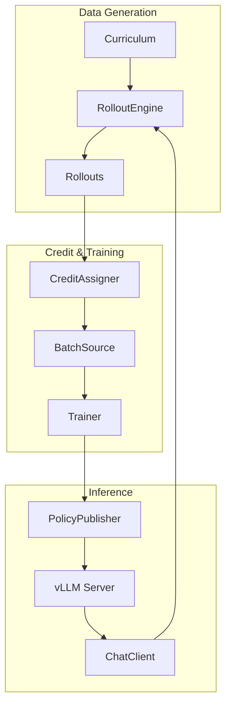

# Ludic Documentation

> Auto-generated documentation - Last updated: 2026-01-06

## Quick Start

**Ludic** is an LLM-RL library designed for agentic behavior training with classical policy-gradient reinforcement learning.

### Installation

```bash
git clone https://github.com/your-repo/ludic.git
cd ludic
uv sync
```

### Run Your First Training

```bash
# Terminal 1: Start inference server
CUDA_VISIBLE_DEVICES=0 PYTHONPATH=. uv run python -m ludic.inference.vllm_server \
  --model Qwen/Qwen2.5-7B-Instruct

# Terminal 2: Run training
CUDA_VISIBLE_DEVICES=1 PYTHONPATH=. uv run python examples/tic_tac_toe/train_tic_tac_toe.py \
  --micro-token-budget 8192
```

## Architecture Overview

Ludic separates concerns into loosely coupled components:



**Key Design Principles:**

- **LLM as policy**: The model is the learned policy
- **Environment provides rewards**: Verifiers, judges, parsers supply signals
- **Algorithm = Credit + Loss**: No monolithic trainers
- **Loose coupling**: Swap components without rewriting

## Project Structure

```
ludic/
├── src/ludic/
│   ├── types.py              # Core data types
│   ├── envs/                 # Environment implementations
│   ├── agents/               # Agent harnesses
│   ├── context/              # Memory strategies
│   ├── interaction/          # Protocols
│   ├── inference/            # vLLM integration
│   ├── training/             # Trainer & algorithms
│   └── distributed/          # Weight publishing
├── examples/                 # Reference implementations
└── tests/                    # Test suite
```

## Documentation Index

### Architecture
- [Overview](./architecture/overview.md) - System architecture and design
- [Data Flow](./architecture/data-flow.md) - Data models and flow
- [Dependencies](./architecture/dependencies.md) - External dependencies

### Components
- [Environments](./components/environments.md) - LudicEnv, SingleAgentEnv
- [Agents](./components/agents.md) - Agent, ToolAgent, ReActAgent
- [Training](./components/training.md) - Trainer, algorithms, losses
- [Inference](./components/inference.md) - ChatClient, vLLM integration

### API Reference
- [Endpoints](./api/endpoints.md) - vLLM server endpoints
- [Internal Interfaces](./api/internal-interfaces.md) - Core protocols

### Guides
- [Setup](./guides/setup.md) - Installation and development
- [Testing](./guides/testing.md) - Test strategy and commands
- [Deployment](./guides/deployment.md) - Production deployment

### Reference
- [Configuration](./reference/config.md) - All configuration options
- [Domain Glossary](./reference/domain-glossary.md) - Terminology

## Tech Stack

| Category | Technology |
|----------|------------|
| Language | Python 3.12+ |
| Framework | PyTorch >= 2.9.0 |
| Inference | vLLM >= 0.12.0 (Linux) |
| Types | jaxtyping + beartype |
| Data | HuggingFace datasets |
| LoRA | peft >= 0.18.0 |
| Logging | wandb, rich |

## Examples

| Example | Purpose | GPUs | Documentation |
|---------|---------|------|---------------|
| Tic-Tac-Toe | Game-playing RL | 2 | [examples/tic_tac_toe/](../../examples/tic_tac_toe/) |
| GSM8K | Math reasoning | 2+ | [examples/gsm8k/](../../examples/gsm8k/) |
| FSDP2 | Multi-GPU training | 4 | [examples/fsdp2_training/](../../examples/fsdp2_training/) |
| Pipeline RL | Async actor/learner | 2+ | [examples/pipeline_rl/](../../examples/pipeline_rl/) |
| Code Exec | Code generation | 2+ | [examples/code_exec/](../../examples/code_exec/) |

## Algorithm Support

| Algorithm | Factory | Description |
|-----------|---------|-------------|
| REINFORCE | `make_reinforce()` | Vanilla policy gradient |
| GRPO | `make_grpo()` | Group-normalized advantages |
| ScaleRL | `make_scalerl()` | Hybrid normalization + CISPO |
| SFT | `make_sft()` | Supervised fine-tuning |
| CISPO | `make_cispo()` | Clipped IS-weight |

## Contributing to Docs

This documentation was auto-generated using parallel exploration agents. To update:

1. **Full regeneration**: Re-run `/document-repo`
2. **Minor corrections**: Edit individual files directly

## See Also

- [CLAUDE.md](../../CLAUDE.md) - Detailed design philosophy
- [CONSIDERATIONS.md](../../CONSIDERATIONS.md) - Technical deep-dives
- [README.md](../../README.md) - Project overview
