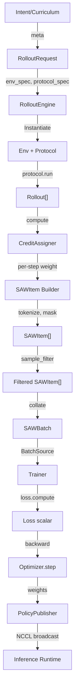
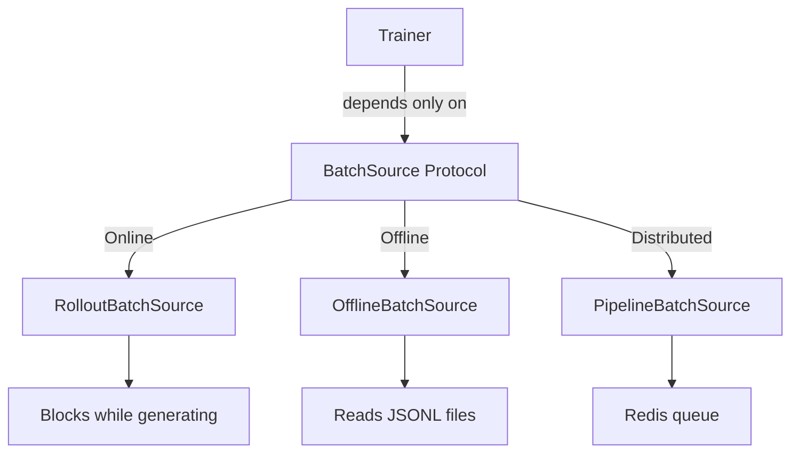
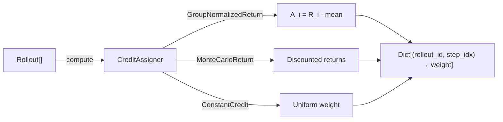
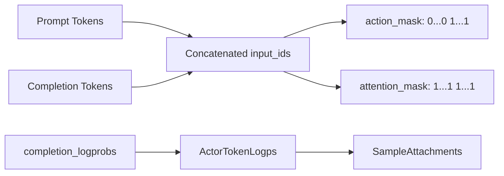
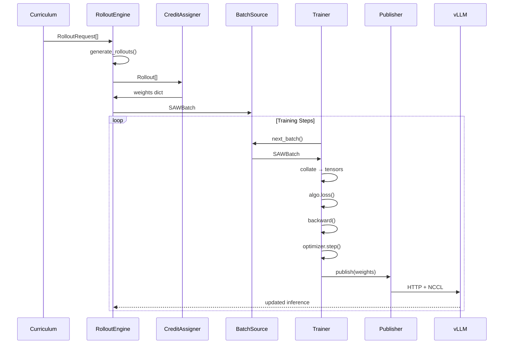

# Ludic Data Flow Architecture

> Auto-generated documentation - Last updated: 2026-01-06

## Overview

The data flow in Ludic follows a clear pipeline from high-level intent to training-ready samples:

```
Intent/Curriculum
      ↓
RolloutRequest (pure data)
      ↓
RolloutEngine (stateless orchestrator)
      ↓
Rollout[] (trajectory of Steps)
      ↓
CreditAssigner (per-step weights)
      ↓
SAWItem[] (State-Action-Weight samples)
      ↓
BatchSource (abstracts data provenance)
      ↓
SAWBatch (collated macro-batch)
      ↓
Trainer (optimization loop)
      ↓
PolicyPublisher (weight distribution)
```

## Core Data Types

### TokenTrace

Canonical token-in/token-out trace for a single model call:

```python
@dataclass(frozen=True)
class TokenTrace:
    prompt_token_ids: List[int]
    completion_token_ids: List[int]
    completion_logprobs: Optional[List[float]]
    finish_reason: Optional[str]
```

### Step

Single transition in a rollout:

```python
@dataclass
class Step:
    index: int
    prev_obs: str
    action: str
    next_obs: Optional[str]
    reward: float
    truncated: bool
    terminated: bool
    info: Dict[str, Any]
    trace: Optional[TokenTrace]
    ts_ns: int  # Nanosecond timestamp
```

### Rollout

Complete trajectory:

```python
@dataclass
class Rollout:
    id: str
    steps: List[Step]
    meta: Dict[str, Any]

    @property
    def total_reward(self) -> float: ...
    @property
    def length(self) -> int: ...
```

### SAWItem (State-Action-Weight)

Training-ready sample:

```python
@dataclass
class SAWItem:
    input_ids: List[int]        # [prompt_ids + completion_ids]
    attention_mask: List[int]   # 1/0 mask for padding
    action_mask: List[int]      # 0 on prompt, 1 on completion
    weight: float               # Credit assignment scalar
    meta: Dict[str, Any]        # Step/rollout metadata
    attachments: SampleAttachments  # Actor logprobs, etc.
```

## Data Flow Diagram



## RolloutEngine Pipeline

### generate_rollouts()

```python
async def generate_rollouts(
    requests: List[RolloutRequest],
    max_steps: int,
    concurrency: int = 8,
) -> List[Rollout]
```

Flow:
1. For each RolloutRequest:
   - Instantiate Env via `env_registry[request.env.kind]`
   - Instantiate Protocol via `protocol_registry[request.protocol.kind]`
   - Run `protocol.run()` for `num_episodes` independent rollouts
   - Attach metadata: episode_idx, request_meta, seeds
2. Run up to `concurrency` episodes concurrently
3. Return flattened list of all Rollouts

### generate_batch()

```python
async def generate_batch(
    requests: List[RolloutRequest],
    credit_assigner: CreditAssigner,
    sample_filter: Optional[SampleFilter] = None,
) -> SAWBatch
```

Flow:
1. Call `generate_rollouts()` → List[Rollout]
2. Call `credit_assigner.compute(rollouts)` → Dict[(rollout_id, step_index), weight]
3. For each step: build SAWItem with token IDs, masks, weight
4. Apply sample_filter (optional)
5. Compute batch-level metadata
6. Return SAWBatch

## BatchSource Implementations



| Source | Use Case | Data Flow |
|--------|----------|-----------|
| **RolloutBatchSource** | Sync online RL | Trainer blocks → Engine generates → returns |
| **OfflineBatchSource** | SFT / offline RL | Load JSONL → tokenize → yield batches |
| **PipelineBatchSource** | Distributed training | Actor → Redis → Learner |

## Credit Assignment

Maps rollouts to per-step scalar weights:



### Available Assigners

| Assigner | Formula | Use Case |
|----------|---------|----------|
| `MonteCarloReturn` | G_t = Σ γ^k r_{t+k} | REINFORCE |
| `GroupNormalizedReturn` | A_i = R_i - mean(R_group) | GRPO |
| `HybridNormalizedReturn` | (R - mean) / (std + ε) | ScaleRL |
| `ConstantCredit` | weight = 1.0 | SFT |

## SAWItem Construction



The `action_mask` marks which tokens are part of the action (completion) vs. state (prompt):
- Prompt tokens: `action_mask = 0` (don't compute loss)
- Completion tokens: `action_mask = 1` (compute loss)

## Training Data Flow



## Batch-Level Metadata

Each SAWBatch includes aggregated statistics:

```python
meta = {
    "target_rollouts": int,           # Number of rollouts
    "num_samples_before_filter": int, # Before filtering
    "num_samples": int,               # After filtering
    "avg_total_reward": float,        # Mean rollout reward
    "avg_completion_length": float,   # Mean action tokens
    "avg_prompt_length": float,       # Mean prompt tokens
}
```

## Filtering Pipeline

Filters can be applied before training:

```python
from ludic.training.filters import (
    drop_truncated,
    drop_incomplete_completions,
    drop_parse_errors,
    combine,
)

sample_filter = combine(
    drop_truncated(),
    drop_incomplete_completions(),
)
```
