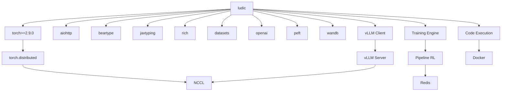

# Ludic Dependencies

> Auto-generated documentation - Last updated: 2026-01-06

## Core Dependencies

| Package | Version | Purpose |
|---------|---------|---------|
| **torch** | >=2.9.0 | Deep learning framework, FSDP, distributed |
| **aiohttp** | >=3.13.2 | Async HTTP client for inference |
| **beartype** | >=0.22.9 | Runtime type checking |
| **jaxtyping** | >=0.3.4 | JAX-style tensor type annotations |
| **datasets** | >=4.4.2 | HuggingFace datasets |
| **openai** | >=2.7.1 | OpenAI API client (vLLM compatibility) |
| **peft** | >=0.18.0 | Parameter-efficient fine-tuning (LoRA) |
| **rich** | >=14.2.0 | Terminal formatting |
| **wandb** | >=0.23.1 | Experiment tracking |
| **vllm** | >=0.12.0 | LLM inference server (Linux only) |

## Optional Dependencies

| Feature | Package | Install Command |
|---------|---------|-----------------|
| Code Execution | docker>=7.1.0 | `pip install 'ludic[code-exec]'` |
| Pipeline RL | redis | Conditional import |
| Offline Training | transformers | Conditional import |

## Development Dependencies

| Group | Packages | Purpose |
|-------|----------|---------|
| test | pytest>=8.4.2, pytest-asyncio>=1.2.0 | Testing |
| lint | ruff>=0.14.5 | Code quality |
| typing | ty>=0.0.5 | Type checking |

## Platform Configuration

PyTorch is installed with platform-specific wheels:

- **Linux**: CUDA 12.8 wheels from `pytorch-cu128` index
- **macOS/Windows**: CPU wheels from `pytorch-cpu` index

vLLM is Linux-only (`sys_platform == 'linux'`).

## Dependency Graph



## External Service Integrations

### vLLM Inference Server
- Location: `src/ludic/inference/vllm_server.py`
- Features: OpenAI API, NCCL weight broadcasting
- Required for: Training with weight updates

### Redis (Pipeline RL)
- Location: `src/ludic/training/batching/pipeline.py`
- Usage: Actor-learner queue
- Conditional import with helpful error

### Docker (Code Execution)
- Location: `src/ludic/envs/code_exec/docker_sandbox.py`
- Extra: `ludic[code-exec]`
- Alternative: Podman backend

### Weights & Biases
- Location: `src/ludic/training/loggers.py`
- Soft dependency with conditional import

## Installation Commands

```bash
# Core library
uv sync

# With code execution
uv sync --extra code-exec

# Development
uv sync --group dev

# Full setup
uv sync --extra code-exec --group dev
```
