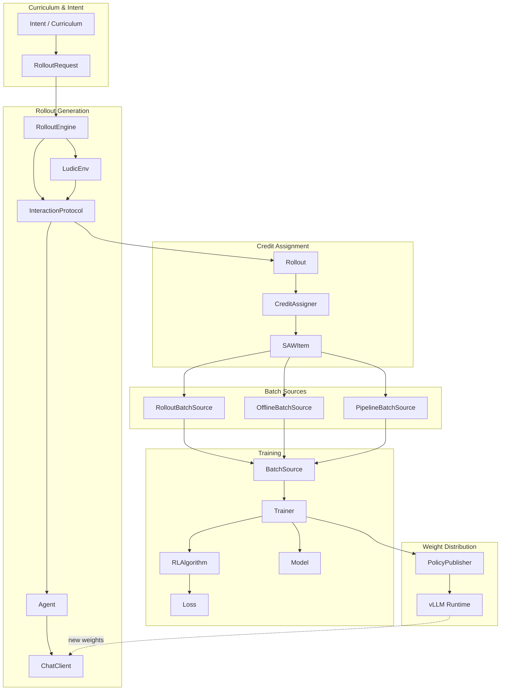

# Ludic Architecture Overview

> Auto-generated documentation - Last updated: 2026-01-06

**Ludic** is an LLM-RL (Reinforcement Learning) library designed for agentic behavior training. It emphasizes clean abstractions, loose coupling, and rapid prototyping of novel RL algorithms.

## System Philosophy

Ludic departs from traditional "RLHF frameworks" (preference optimization / alignment pipelines) and instead embraces **classical policy-gradient RL**:

- The **LLM is the policy**
- The **environment** (plus verifiers/judges/parsers) provides **rewards**
- **Algorithms** are expressed as **credit assignment** + **loss functions**
- **Components are loosely coupled** – swap inference backends, envs, agents, and batching strategies without rewriting the stack

## Directory Structure

```
ludic/
├── src/ludic/                    # Core library
│   ├── types.py                  # Shared type definitions
│   ├── envs/                     # Environment kernel & implementations
│   │   ├── env.py                # LudicEnv abstract base (multi-agent aware)
│   │   ├── single_agent_env.py   # SingleAgentEnv convenience wrapper
│   │   ├── dataset_qa_env.py     # DatasetQAEnv for QA tasks
│   │   └── code_exec/            # Code execution environment
│   ├── agents/                   # Agent implementations
│   │   ├── base_agent.py         # Core Agent
│   │   ├── tool_agent.py         # ToolAgent with tool calling
│   │   └── react_agent.py        # ReActAgent for multi-step reasoning
│   ├── context/                  # Memory & prompt management
│   │   ├── base.py               # Abstract ContextStrategy
│   │   ├── full_dialog.py        # Full history
│   │   └── truncated_thinking.py # Compressed thinking
│   ├── interaction/              # Agent-Environment interaction protocols
│   │   ├── base.py               # InteractionProtocol abstract base
│   │   ├── single_agent.py       # Single-agent synchronous loop
│   │   └── multi_agent.py        # Multi-agent protocol
│   ├── inference/                # LLM inference clients
│   │   ├── client.py             # ChatClient protocol
│   │   ├── vllm_client.py        # vLLM OpenAI-compatible client
│   │   ├── vllm_server.py        # vLLM server with weight-update endpoints
│   │   └── sampling.py           # SamplingConfig
│   ├── training/                 # Training loop & utilities
│   │   ├── trainer.py            # Main Trainer class (FSDP2-aware)
│   │   ├── algorithm.py          # RLAlgorithm = (CreditAssigner + Loss)
│   │   ├── config.py             # TrainerConfig
│   │   ├── checkpoint.py         # Checkpoint management
│   │   ├── credit_assignment.py  # Credit assigners
│   │   ├── loss.py               # Loss functions
│   │   └── batching/             # Batch sources & rollout engine
│   ├── distributed/              # Distributed weight pushing
│   │   ├── interfaces.py         # PolicyPublisher protocol
│   │   └── publisher.py          # BroadcastPolicyPublisher
│   ├── eval/                     # Evaluation system
│   └── parsers.py                # Parser protocol & XML parser factory
├── examples/                     # Reference implementations
│   ├── tic_tac_toe/              # Small game environment
│   ├── gsm8k/                    # GSM8K math problem solving
│   ├── fsdp2_training/           # Multi-GPU FSDP2 + vLLM
│   ├── pipeline_rl/              # Actor/learner split via Redis
│   └── code_exec/                # Code execution environments
└── tests/                        # Pytest suite
```

## Core Abstractions

### Types (`src/ludic/types.py`)

| Type | Purpose |
|------|---------|
| `Message` | Chat message dict: `{"role": "...", "content": "..."}` |
| `ChatResponse` | Normalized LLM output: text, token IDs, logprobs, finish_reason |
| `TokenTrace` | Canonical token-level trace: prompt/completion IDs + logprobs |
| `StepOutcome` | Environment step result: obs, reward, truncated, terminated, info |
| `Step` | Agent-Environment interaction step |
| `Rollout` | Episode trajectory: list of Steps with metadata |

### Environment Layer (`src/ludic/envs/`)

Multi-agent aware environment kernel:

```python
LudicEnv (abstract base)
├── agent_ids: List[AgentID]       # All agent roles
├── active_agents: List[AgentID]   # Who acts this step
├── reset() -> Dict[AgentID, (Obs, Info)]
└── step(actions) -> Dict[AgentID, StepOutcome]
```

### Agent Layer (`src/ludic/agents/`)

Stateful LLM wrapper with inference, memory, parsing:

```python
Agent
├── client: ChatClient         # Inference backend
├── ctx: ContextStrategy       # Memory/prompt management
├── parser: Parser             # Action format extraction
└── act() -> (action, info)
```

### Training Pipeline

```
Intent / Curriculum
        ↓
RolloutRequest (pure data: env config, protocol, seeds)
        ↓
RolloutEngine → Rollout objects
        ↓
CreditAssigner → per-step scalar weight
        ↓
SAWItem (State-Action-Weight + masks + metadata)
        ↓
BatchSource.next_batch() → SAWBatch
        ↓
Trainer → loss computation → weight update
        ↓
PolicyPublisher → inference runtime
```

## Architecture Diagram



## Key Design Patterns

### Loose Coupling
Each component depends on small, well-defined interfaces (protocols):
- `LudicEnv` ↔ `InteractionProtocol` ↔ `Agent`
- `Agent` ↔ `ChatClient` (pluggable inference)
- `BatchSource` ↔ `Trainer` (decoupled rollout generation)

### Protocol-Driven Design
Heavy use of Python `Protocol` for structural typing:
- `ChatClient`, `BatchSource`, `CreditAssigner`, `Loss`, `Evaluator`

### Data vs. Behavior
- **Data classes** for immutable specs: `RolloutRequest`, `EnvSpec`, `ChatResponse`
- **Stateful classes** for behavior: `Agent`, `Trainer`, `RolloutEngine`

### Async-First Inference
- `ChatClient.complete()` is async
- `InteractionProtocol.run()` is async
- `BatchSource.next_batch()` is async

### SAWItem Abstraction
**State-Action-Weight** decouples training from rollout generation:
- Trainer sees only `SAWItem`s, not episodes or environments
- Enables offline RL, replay buffers, curriculum learning

## Algorithm Composition

An RL algorithm = CreditAssigner + Loss:

```python
RLAlgorithm
├── name: str
├── credit_assigner: CreditAssigner
├── loss: Loss
└── preprocess: Optional[PreprocessFn]

# Presets:
make_reinforce()           # MC returns + REINFORCE loss
make_grpo()                # GroupNormalizedReturn + ClippedSurrogate
make_sft()                 # ConstantCredit + CrossEntropy
make_scalerl()             # HybridNormalized + CISPO
```

## Extension Points

### Adding a New Environment
1. Inherit from `LudicEnv` or `SingleAgentEnv`
2. Implement `reset()`, `step()`, properties
3. Register factory in `RolloutEngine`

### Adding a New Agent
1. Extend `Agent` or `ToolAgent`
2. Override `act()` or hook into `ContextStrategy`
3. Compose with custom `Parser`

### Adding a New RL Algorithm
1. Implement `CreditAssigner` (compute per-step weights)
2. Implement or compose `Loss` (gradient signal)
3. Bundle into `RLAlgorithm`
4. Pass to `Trainer`

### Adding a New Inference Backend
1. Implement `ChatClient` protocol
2. Implement `complete()` and `sync_weights()`
3. Pass to agents and `RolloutEngine`

## Technology Stack

| Category | Technology |
|----------|------------|
| Language | Python 3.12+ |
| Deep Learning | PyTorch >= 2.9.0 |
| Inference | vLLM >= 0.12.0 (Linux) |
| Type Checking | jaxtyping + beartype |
| Async HTTP | aiohttp >= 3.13.2 |
| Data Loading | HuggingFace datasets |
| LoRA/PEFT | peft >= 0.18.0 |
| Logging | wandb, rich |
