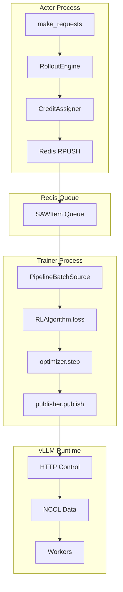
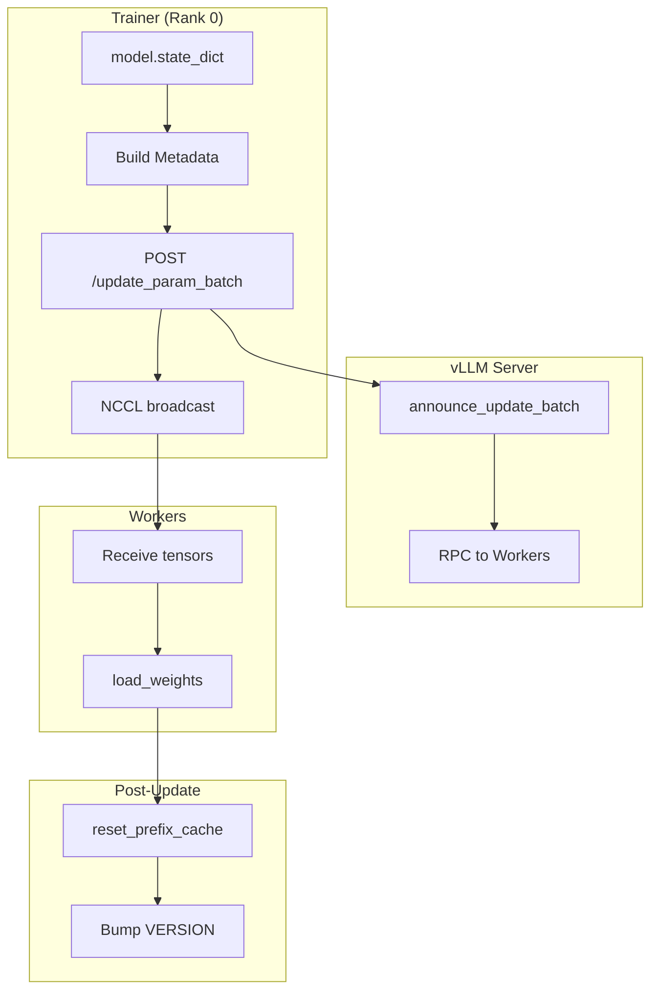

# Ludic Deployment Guide

> Auto-generated documentation - Last updated: 2026-01-06

## Deployment Patterns

1. **Sync Training**: Inline generation + training (debugging)
2. **Pipeline RL**: Actor/learner split via Redis (production)
3. **FSDP2 Distributed**: Multi-GPU training with vLLM

## Pipeline RL Architecture



### Actor Process

```python
await run_pipeline_actor(
    engine=engine,
    requests_fn=make_requests,
    credit_assigner=assigner,
    redis_url="redis://localhost:6379/0",
    queue_key="ludic_queue",
    max_steps=10,
    concurrency=16,
)
```

### Trainer Process

```python
batch_source = PipelineBatchSource(
    redis_url="redis://localhost:6379/0",
    queue_key="ludic_queue",
    batch_size=64,
)

trainer = Trainer(
    model=model,
    algo=algo,
    batch_source=batch_source,
    publisher=publisher,
)
```

## Weight Distribution



## Deployment Steps

### 1. Start vLLM Server

```bash
CUDA_VISIBLE_DEVICES=0 python -m ludic.inference.vllm_server \
  --model Qwen/Qwen2.5-7B-Instruct \
  --gpu_memory_utilization 0.8 \
  --port 8000
```

### 2. Start Redis (Pipeline RL)

```bash
redis-server --port 6379
```

### 3. Start Actor Process

```bash
python examples/pipeline_rl/run_actor.py
```

### 4. Start Trainer Process

```bash
CUDA_VISIBLE_DEVICES=1 python examples/pipeline_rl/run_trainer.py
```

## FSDP2 Multi-GPU Setup

```bash
# GPU0: vLLM
CUDA_VISIBLE_DEVICES=0 uv run python -m ludic.inference.vllm_server \
  --model Qwen/Qwen2.5-7B-Instruct

# GPUs 1-3: Training
CUDA_VISIBLE_DEVICES=1,2,3 PYTHONPATH=. uv run torchrun --nproc_per_node=3 \
  examples/fsdp2_training/train_math_fsdp2.py \
  --model Qwen/Qwen2.5-7B-Instruct \
  --train-steps 50 --group-size 8
```

Key FSDP2 features:
- Rank 0 gathers full state dict for checkpointing
- Gradient sync disabled on non-final micro-batches
- Mixed precision (bf16 params, fp32 reductions)

## Monitoring

```bash
# Policy version
curl http://localhost:8000/runtime_version

# Background tasks
curl http://localhost:8000/get_num_background_tasks

# Redis queue length
redis-cli LLEN ludic_queue
```

## Configuration Reference

### TrainerConfig

```python
TrainerConfig(
    model_device="cuda:0",
    lr=1e-4,
    max_seq_len=1024,
    micro_token_budget=8192,
    sync_every_steps=1,
    max_lag=2,  # Drop stale samples
)
```

### RolloutRequest

```python
RolloutRequest(
    env=EnvSpec(kind="gsm8k", kwargs={...}),
    protocol=ProtocolSpec(kind="single_agent", kwargs={}),
    inference=InferenceSpec(sampling=SamplingConfig(temperature=1.0)),
    num_episodes=8,
    meta={"group_id": sample_id},
)
```

## Troubleshooting

| Issue | Cause | Solution |
|-------|-------|----------|
| NCCL timeout | Port blocked | Check `group_port` availability |
| Redis error | Not running | Start `redis-server` |
| Stale samples | High latency | Reduce `max_lag` |
| Weight mismatch | Key ordering | Ensure sorted keys |
