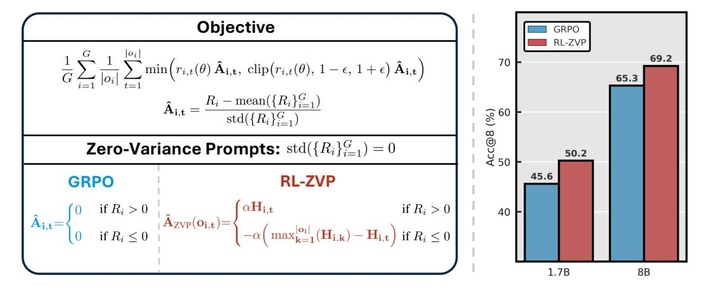
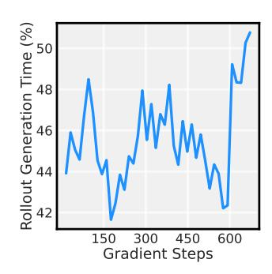
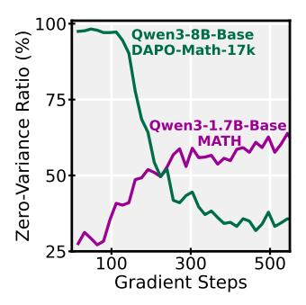
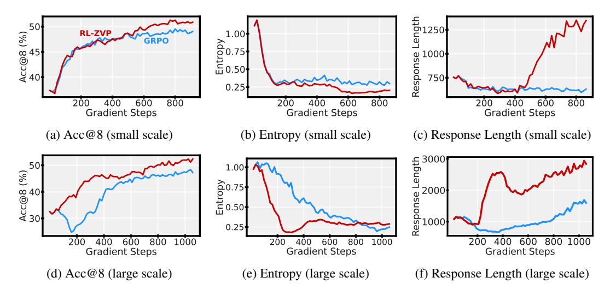
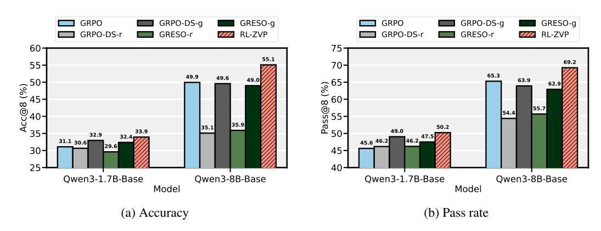

NO PROMPT LEFT BEHIND: EXPLOITING ZERO-VARIANCE PROMPTS IN LLM REINFORCEMENT LEARNING VIA ENTROPY-GUIDED ADVANTAGE SHAP-ING

Thanh-Long V. Le<sup>1</sup>, Myeongho Jeon<sup>2</sup>, Kim Vu<sup>1</sup>, Viet Lai<sup>3</sup>, Eunho Yang<sup>1</sup> KAIST <sup>2</sup> EPFL <sup>3</sup> Adobe Research

#### **ABSTRACT**

Reinforcement Learning with Verifiable Rewards (RLVR) is a powerful framework for improving the reasoning abilities of Large Language Models (LLMs). However, current methods such as GRPO rely only on problems where the model responses to the same input differ in correctness, while ignoring those where all responses receive the same reward—so-called *zero-variance prompts*. In this work, we argue that such prompts are not useless but can, in fact, provide meaningful feedback for policy optimization. To this end, we introduce *RL with Zero-Variance Prompts* (RL-ZVP), a novel algorithm that extract learning signals from zero-variance prompts. RL-ZVP directly rewards correctness and penalizes errors even without contrasting responses, modulating feedback with token-level characteristics to preserve informative, nuanced signals. Across six math reasoning benchmarks, RL-ZVP achieves significant improvements of up to 8.61 points in accuracy and 7.77 points in pass rate over GRPO, while consistently outperforming other baselines that filter out zero-variance prompts. These results highlight the untapped potential of learning from zero-variance prompts in RLVR.



Figure 1: **Left**: RL-ZVP uses an entropy-guided advantage formulation to extract learning signals from zero-variance prompts, while reverting to GRPO on other prompts. **Right**: RL-ZVP demonstrates significantly higher average accuracy than GRPO across six math reasoning benchmarks.

### 1 Introduction

Recent frontier models such as OpenAI of (OpenAI et al., 2024), Claude 3.7 Sonnet (Anthropic, 2025) DeepSeek-R1 (DeepSeek-AI et al., 2025), and Kimi k1.5 (Team et al., 2025) provide compelling proof of concept for leveraging long chain of thought (Wei et al., 2023; Kojima et al., 2023) to enhance the reasoning capabilities of Large Language Models (LLMs).

Following these advances, Reinforcement Learning with Verifiable Rewards (RLVR) techniques such as Group Relative Policy Optimization (GRPO) (Shao et al., 2024) and Dynamic Sampling Policy Optimization (DAPO) (Yu et al., 2025) have emerged as the de facto standard for strengthening LLM reasoning. In RLVR, the policy model is trained by sampling multiple responses (rollouts) to a prompt and then reinforcing correct answers while penalizing incorrect ones. While this approach is effective when responses for the same prompt contains both right and wrong responses, it does not account for scenarios when a group of rollouts are entirely correct or entirely incorrect (with identical rewards), referred to as *zerovariance prompts* (Zheng et al., 2025). In such situations, the normalized rewards (*i.e.*, advantage values) collapse to zero, resulting in no training signal, rendering all rollouts for those prompts uninformative. While it may seem conceptually reasonable to ignore



Figure 2: **Rollout generation overhead** as a percentage of total time of the training step.

these prompts, doing so remains problematic because rollout generation itself is a major bottleneck in RL training (Zhong et al., 2025; Noukhovitch et al., 2025; Sheng et al., 2024). Our preliminary experiments show that response sampling typically takes up about 50% of the total time per training step, which emphasizes the significant throughput overhead introduced by rollouts (Figure 2).

Recent methods acknowledge the inefficiency of zero-variance prompts and attempt to filter them out, either pre-rollout (Zheng et al., 2025; Qu et al., 2025) or post-rollout (Yu et al., 2025). However, to the best of our knowledge, no prior work has investigated whether zero-variance prompts themselves can serve as a valuable source of learning signals for policy optimization.

In this work, we argue that zero-variance prompts could, in fact, provide valuable feedback for policy learning—for example, encouraging the model to exploit all-correct paths while discouraging all-wrong paths and promoting exploration of alternatives. Furthermore, inspired by recent advances in reward shaping (Deng et al., 2025; Lei et al., 2025; Devidze et al., 2022; Ng et al., 1999), we propose that token-level information should be explicitly considered in how such feedback is utilized.

Building on these insights, we introduce **RL-ZVP** (*Reinforcement Learning with Zero-Variance Prompts*), a novel algorithm that extract useful learning signals from zero-variance prompts to improve the effectiveness of RL training. Our approach rests on two key intuitions: (i) the policy model should still be rewarded for correct answers even if no incorrect answers are present in the same group (and penalized analogously), and (ii) the degree of reward or penalty should be determined by the characteristics of sampled tokens. Concretely, we formulate the advantage for zero-variance prompts around two properties: *direction*, which aligns with the correctness of the response, and *magnitude*, which is quantified by the entropy value of each token within the response (Figure 1).

Experiments on six math reasoning benchmarks across two model scales—Qwen3-1.7B-Base and Qwen-8B-Base (Yang et al., 2025b)—show that RL-ZVP significantly outperforms GRPO, with an average improvement of **4.00 points** in accuracy (Acc@8) and **4.28 points** in pass rate (Pass@8). Notably, RL-ZVP achieves gains of up to **8.66 points** in Acc@8 (on AIME25) and **7.77 points** in Pass@8 (on OlympiadBench). RL-ZVP also consistently surpasses other baselines that filter out zero-variance prompts, even under unfavorable settings where these baselines are given  $3\times-5\times$  more rollouts. Moreover, across both scales, RL-ZVP demonstrates a more stable and consistent learning process. These results establish zero-variance prompts as a valuable resource for learning signals and open a new perspective on how to utilize them, rather than discarding them, in RLVR.

### 2 Preliminary: Group Relative Policy Optimization

Group Relative Policy Optimization (GRPO) (Shao et al., 2024) is a variant of Proximal Policy Optimization (PPO) (Schulman et al., 2017) tailored for LLM post-training. Given a question–answer pair (q,a) from a dataset  $\mathcal{D}$ , a group of G responses (rollouts)  $\{o_i\}_{i=1}^G$  is sampled from the old policy  $\pi_{\theta_{\text{old}}}$  (typically the policy from the previous training iteration). Each response is compared against the ground-truth answer a to produce final rewards  $\{R_i\}_{i=1}^G$ . Instead of relying on a costly value model like PPO, GRPO normalizes these rewards to compute the advantage as:

$$\hat{A}_{i,t} = \frac{R_i - \operatorname{mean}(\{R_i\}_{i=1}^G)}{\operatorname{std}(\{R_i\}_{i=1}^G)},\tag{1}$$

where t denotes token position in  $o_i$ . Note that the advantage  $\hat{A}_i$  is computed at the response level and subsequently broadcast to all tokens in the response, *i.e.*,  $\hat{A}_{i,1} = \hat{A}_{i,2} = \cdots = \hat{A}_{i,G} = \hat{A}_i$ . The policy objective<sup>1</sup> for a single prompt is then defined as:

$$\mathcal{J}_{GRPO}\left(\theta \mid q, a, \{o_{i}\}_{i=1}^{G}\right) = \frac{1}{G} \sum_{i=1}^{G} \frac{1}{|o_{i}|} \sum_{t=1}^{|o_{i}|} \min\left(r_{i,t}(\theta) \, \hat{A}_{i,t}, \, \operatorname{clip}\left(r_{i,t}(\theta), \, 1 - \epsilon, \, 1 + \epsilon\right) \, \hat{A}_{i,t}\right), \quad (2)$$
where  $r_{i,t}(\theta) = \frac{\pi_{\theta}(o_{i,t} \mid q, \, o_{i,< t})}{\pi_{\theta_{\text{old}}}(o_{i,t} \mid q, \, o_{i,< t})}.$ 

Here,  $r_{i,t}(\theta)$  represents the importance sampling ratio that adjusts the objective to account for the off-policy distribution of the training batch. The final GRPO objective for the whole dataset is:

$$\mathcal{J}_{GRPO}(\theta, \mathcal{D}) = \mathbb{E}_{(q, a) \sim \mathcal{D}, \{o_i\}_{i=1}^G \sim \pi_{\theta_{old}}(\cdot | q)} \left[ \mathcal{J}_{GRPO}(\theta | q, a, \{o_i\}_{i=1}^G) \right]. \tag{3}$$

### 3 REINFORCEMENT LEARNING WITH ZERO-VARIANCE PROMPTS

In this section, we introduce our algorithm, Reinforcement Learning with Zero-Variance Prompts. We begin by motivating the approach through the advantage vanishing problem in zero-variance prompts (Section 3.1). We then present our entropy-guided advantage formulation (Section 3.2) and conclude with the full training objective and algorithm (Section 3.3).

#### 3.1 MOTIVATION: ADVANTAGE VANISHING IN ZERO-VARIANCE PROMPTS

During GRPO training, the policy model may encounter questions where all sampled responses in a group are either entirely correct or entirely incorrect, resulting in identical rewards. Following Zheng et al. (2025), we call these cases *zero-variance prompts*. They typically arise in two situations: when the dataset is either (i) too difficult or (ii) too easy for the model. From a training perspective, zero-variance prompts appear most frequently (i) at the beginning of training, when the model often fails to solve problems even once across multiple responses, and (ii) near convergence, when the model has become strong enough to solve many questions entirely.

To understand the prevalence of zero-variance prompts, we examine two settings: Qwen3-1.7B-Base trained on MATH, and Qwen3-8B-Base trained on DAPO-Math-17k. We found that zero-variance prompts account for roughly 30% to 99% of each batch during train-



Figure 3: The percentage of zero-variance prompts.

ing (Figure 3). This high proportion suggests that if these prompts could be leveraged effectively, they potentially represent an untapped source of useful learning signal for the policy model.

**Remark 1** (Advantage Vanishing). In Equation (1) and (2), if all responses within a group receive identical rewards, their advantages degenerate to zero. In this case, the GRPO objective reduces to  $\mathcal{J}_{GRPO}(\theta \mid q_{zvp}, a, \{o_i\}_{i=1}^G) = 0$ , effectively discarding all the potential learning signal.

From Equation 2, taking the gradient of both sides<sup>2</sup> gives:

$$\nabla_{\theta} \mathcal{J}_{\text{GRPO}}(q, a, \{o_i\}_{i=1}^G) = \frac{1}{G} \sum_{i=1}^G \frac{1}{|o_i|} \sum_{t=1}^{|o_i|} r_{i,t}(\theta) \, \hat{A}_{i,t} \nabla_{\theta} \log \pi_{\theta} \big(o_{i,t} \mid q, o_{i, < t}\big). \tag{4}$$

From this expression, the gradient of the GRPO objective with respect to the policy parameters can be interpreted as a weighted sum of the log-probability gradients for all tokens in a response. Intuitively, GRPO raises the probabilities of tokens in correct responses while lowering those of tokens in incorrect ones. Under GRPO advantage formulation, however, if we ignore the importance-sampling ratio, each token in a response receives the same weight, regardless of its role or informativeness.

<sup>&</sup>lt;sup>1</sup>We omit the KL penalty here for clarity.

<sup>&</sup>lt;sup>2</sup>We omit the clipping factor before gradient derivation for clarity.

**Remark 2** (The Role of Advantage). The sign of the advantage  $\hat{A}_{i,t}$  determines the **direction** of the gradient update for each token since the importance sampling ratio  $r_{i,t}$  in Equation (4) is strictly positive, while its absolute value  $|\hat{A}_{i,t}|$  governs the **magnitude** of the update in conjunction with  $r_{i,t}$ .

Recently, several methods have excluded zero-variance prompts from RL training (Yu et al., 2025; Zheng et al., 2025; Cheng et al., 2025), viewing them merely as a way to reduce rollout cost and implicitly assuming they offer no value for policy optimization. We challenge this assumption and argue that, when handled appropriately, zero-variance prompts could provide valuable learning signals for RL training.

#### 3.2 ADVANTAGE FORMULATION

We propose *Reinforcement Learning with Zero-Variance Prompts* (RL-ZVP), a novel algorithm designed to exploit zero-variance prompts. The key intuition is to address the limitation noted in Remark 1: the policy should be rewarded or penalized based solely on the correctness of its responses, even when no contrasting answers are present. RL-ZVP behaves identically to GRPO on non-zero-variance prompts, but adopts a different strategy for zero-variance ones, thereby generalizing GRPO. We first classify zero-variance prompts with all correct responses as *positive prompts* and those with all incorrect responses as *negative prompts*. Based on Remark 2, we frame advantage shaping as developing appropriate scaling factors, with a focus on two properties: *direction* and *magnitude*.

**Advantage direction.** The sign of the advantage is straightforward: positive (+) for positive prompts and negative (-) for negative ones. Intuitively, when all sampled responses are correct, the model should increase their probabilities, reinforcing certainty and encouraging exploitation. Conversely, when all responses are incorrect, their probabilities should be reduced, discouraging repeated mistakes and promoting exploration of alternative sampling paths.

Advantage magnitude. Inspired by recent works that incorporate token-level signals to augment verifiable rewards (Cui et al., 2025; Fang et al., 2025; Agarwal et al., 2025; Deng et al., 2025; Lei et al., 2025), we leverage token entropy in the formulation of the advantage magnitude for zero-variance prompts. The key idea is to scale each token's gradient update in proportion to its entropy. For correct responses, high-entropy tokens—typically those crucial for reasoning, such as connectors or branching points(Wang et al., 2025)—receive larger updates than semantically trivial tokens. This encourages reasoning behaviors such as reflection and verification (DeepSeek-AI et al., 2025), while avoiding over-exploitation of trivial text completion patterns. For incorrect responses, the probabilities of all tokens are reduced, but high-entropy tokens (that initiate reasoning paths and behaviors) are penalized less severely, preserving flexibility for the model to revisit and explore those reasoning paths in future iterations.

**Advantage formula.** Combining these two design choices, our final token-level advantage formulation for zero-variance prompts, replacing the zero assigned in GRPO, is:

\( \hat{A}\_{\text{ZVP}}(o\_{i,t}) = \begin{cases} \alpha H\_{i,t}, & \text{if } \text{std}(\{R\_i\}\_{i=1}^G) = 0 \ \land \ R\_i > 0, \\ -\alpha \Big( \max\_{k=1}^{|o\_i|} (H\_{i,k}) - H\_{i,t} \Big), & \text{if } \text{std}(\{R\_i\}\_{i=1}^G) = 0 \ \land \ R\_i \le 0, \end{cases} \) \( \tag{5} \)

with \( H\_{i,t} = -\sum\_{j=1}^{|V|} \pi\_{\theta}(v\_j \mid q, \ o\_{i, < t}) \log \Big[ \pi\_{\theta}(v\_j \mid q, \ o\_{i, < t}) \Big], \)

where  $\alpha$  denotes the scaling factor hyperparameter, and  $H_{i,t}{}^3$  is the entropy of each token  $o_{i,t}$  in the response  $o_i$  given the policy model's vocabulary set  $V = \{v_1, v_2, \cdots\}$ . The term  $\max_{k=1}^{|o_i|}(H_{i,k})$  reverts the effect of token entropy in negative prompts to align with our intuition: tokens with higher entropy incur smaller penalties, while low-entropy tokens are penalized more.

 $<sup>^{3}</sup>$ In the implementation, we detach every occurrence of  $H_{i,t}$  from the computational graph so that it acts as a scalar factor rather than a differentiable parameter.

### Algorithm 1: Reinforcement Learning with Zero-Variance Prompts

```
Input: initial policy model \pi_{\theta}; training dataset \mathcal{D}; for iteration = 1, \dots, M do

Update the previous policy \pi_{\theta_{\text{old}}} \leftarrow \pi_{\theta}; Sample (w/o replacement) a prompt batch \mathcal{B} \subset \mathcal{D}; foreach (q, a) \in \mathcal{B} do

Sample G outputs \{o_i\}_{i=1}^G \sim \pi_{\theta_{\text{old}}}(\cdot \mid q);
Compute rewards \{R_i\}_{i=1}^G by verifying each o_i against a; for gradient\_step = 1, \dots, \mu do

Sample (w/o replacement) a mini-batch \mathcal{B}_{\min} \subset \mathcal{B}; foreach (q, a, \{R_i\}_{i=1}^G) \in \mathcal{B}_{\min} do

if \operatorname{std}(\{R_i\}_{i=1}^G) > 0 then compute advantages \{\hat{A}_{i,t}\} using equation 1; else compute advantages \{\hat{A}_{ZVP}(o_{i,t})\} using equation 5;
Update the policy model \pi_{\theta} by maximizing the RL-ZVP objective 6;
```

**Output:** final policy model  $\pi_{\theta}$ 

#### 3.3 FINAL OBJECTIVE

Let  $\mathcal{D}_{ZVP}$  be the set of zero-variance prompts encountered during training ( $\mathcal{D}_{ZVP} \subset \mathcal{D}$ ). Incorporating our advantage shaping for zero-variance prompts, the RL-ZVP objective becomes:

$$\mathcal{J}_{\text{RL-ZVP}}(\theta|q, a, \{o_i\}_{i=1}^G) = \begin{cases} \frac{1}{G} \sum_{i=1}^G \frac{1}{|o_i|} \sum_{t=1}^{|o_i|} \min \left( r_{i,t}(\theta) \, \hat{A}_{\text{ZVP}}(o_{i,t}), \ \text{clip}(r_{i,t}(\theta), 1 - \epsilon, 1 + \epsilon) \, \hat{A}_{\text{ZVP}}(o_{i,t}) \right), & \text{if } q \in \mathcal{D}_{\text{ZVP}}, \\ \mathcal{J}_{\text{GRPO}}(\theta|q, a, \{o_i\}_{i=1}^G), & \text{otherwise.} \end{cases} \tag{6}$$

**Remark 3** (Relationship to GRPO). *RL-ZVP does not introduce any new loss term beyond the GRPO objective. It simply reformulates the special case where the prompt is zero-variance. In fact, the GRPO objective from Equation (2) can be equivalently expressed in a branching form:* 

$$\mathcal{J}_{GRPO}(\theta \mid q, a, \{o_i\}_{i=1}^G) = \begin{cases} 0, & \text{if } q \in \mathcal{D}_{ZVP}, \\ \mathcal{J}_{GRPO}(\theta \mid q, a, \{o_i\}_{i=1}^G), & \text{otherwise.} \end{cases}$$
(7)

In this regard, our formulation serves as a generalization of GRPO—reducing exactly to GRPO when prompts are non-zero-variance, while resulting in a non-trivial update for zero-variance prompts rather than collapsing to zero.

## 4 EXPERIMENTS

In this section, we first outline our experimental setup, including models, datasets, and implementation details (Section 4.1). We then present validation results and analysis, comparing RL-ZVP with GRPO and prompt filtering baselines (Section 4.2). Finally, we conduct ablation studies to assess the contribution of each sub-component in RL-ZVP (Section 4.3).

### 4.1 EXPERIMENTAL SETTINGS

**Models & Datasets.** We conduct experiments on both Qwen3-1.7B-Base and Qwen3-8B-Base (Yang et al., 2025a; Liu et al., 2025b) to assess performance across model scales. For Qwen3-1.7B-Base, we train on the MATH dataset (Hendrycks et al., 2021; Lightman et al., 2023), which contains 7.5k problems. For Qwen3-8B-Base, we adopt the more challenging DAPO-Math-17k dataset (Yu et al., 2025) to better exploit the capacity of larger models. Within the scope of this work, we refer to these two setups as *small scale* and *large scale*, respectively. We then evaluate the trained models on six standard math reasoning benchmarks: Minerva, AMC23, MATH (Hendrycks

et al., 2021), AIME24, AIME25, and OlympiadBench (He et al., 2024). For each question, we generate eight responses and report both the accuracy (Acc@8) and the pass rate (Pass@8). To further evaluate RL-ZVP, we also report additional results with different training dataset in Appendix A.

**Baselines.** Since RL-ZVP is the first method that attempts to explicitly leverage zero-variance prompts, we compare it against GRPO (Shao et al., 2024) and two representative methods that filter out zero-variance prompts: GRPO with Dynamic Sampling (GRPO-DS) (Yu et al., 2025) and GRESO (Zheng et al., 2025). GRPO-DS repeatedly samples questions, generates group of responses, discards zero-variance cases, and constructs batches containing only non-zero-variance prompts, ensuring that every prompt contributes to the gradient signal. In contrast, GRESO predicts and skips zero-variance prompts without responses sampling, using a probabilistic filtering strategy based on historical training dynamics. For GRPO-DS and GRESO, we report results under two settings: (r) using the *same number of rollouts* as RL-ZVP for a fair comparison, and (g) using the *same number of gradient steps*. The latter favors the prompt filtering baselines, as it allows roughly  $3\times-5\times$  more rollouts than RL-ZVP and GRPO (see Table 5 in Appendix B).

**Implementation Details.** All experiments are implemented using the verl framework (Sheng et al., 2024), following the standard hyperparameter settings from recent works (Yu et al., 2025; Zheng et al., 2025). We train with a batch size of 512 and a mini-batch size of 32, resulting in 16 gradient steps per training iteration. Full implementation details are provided in Appendix C.

#### 4.2 RESULTS & ANALYSIS

Table 1: **Detailed evaluation results on six math reasoning benchmarks.** The best and second best performance across all settings are **bold** and <u>underscored</u>, respectively. Under a fair setup of equal rollout budget, RL-ZVP achieves the best performance across all datasets, heavily outperforming GRPO. (\*) Even in the unfavorable setting where Dynamic Sampling baselines use  $3 \times -5 \times$  more rollouts, RL-ZVP still outperforms them on the majority of benchmarks.

| Method                                                 | Minerva |        | AMC23 |        | MATH500 |        | AIME24 |        | AIME25 |        | OlympiadBench |        |
|--------------------------------------------------------|---------|--------|-------|--------|---------|--------|--------|--------|--------|--------|---------------|--------|
|                                                        | Acc@8   | Pass@8 | Acc@8 | Pass@8 | Acc@8   | Pass@8 | Acc@8  | Pass@8 | Acc@8  | Pass@8 | Acc@8         | Pass@8 |
| Qwen3-1.7B-Base trained with MATH (small scale)        |         |        |       |        |         |        |        |        |        |        |               |        |
| GRPO                                                   | 29.09   | 43.19  | 42.19 | 72.00  | 69.09   | 84.05  | 8.75   | 17.24  | 4.17   | 6.67   | 33.20         | 50.52  |
| GRPO-DS-r                                              | 29.96   | 44.02  | 42.50 | 73.84  | 68.31   | 83.04  | 7.50   | 17.41  | 2.92   | 8.73   | 32.67         | 49.89  |
| GRPO-DS-g*                                             | 29.96   | 44.02  | 46.25 | 73.84  | 70.72   | 84.61  | 7.50   | 25.77  | 7.50   | 12.95  | 35.68         | 53.03  |
| GRESO-r                                                | 27.99   | 43.39  | 40.00 | 70.25  | 67.53   | 83.07  | 7.08   | 18.48  | 3.75   | 12.89  | 31.30         | 49.13  |
| GRESO-g*                                               | 30.19   | 43.39  | 45.00 | 73.86  | 69.77   | 84.77  | 9.58   | 19.51  | 5.00   | 11.00  | 34.68         | 52.43  |
| RL-ZVP (Ours)                                          | 29.96   | 44.76  | 48.75 | 77.19  | 70.98   | 87.35  | 12.50  | 23.99  | 6.25   | 13.23  | 35.11         | 54.84  |
| Δ(w.r.t GRPO)                                          | +0.87   | +1.57  | +6.56 | +5.19  | +1.89   | +3.3   | +3.75  | +6.75  | +2.08  | +6.56  | +1.91         | +4.32  |
| Qwen3-8B-Base trained with DAPO-Math-17k (large scale) |         |        |       |        |         |        |        |        |        |        |               |        |
| GRPO                                                   | 44.99   | 58.42  | 73.75 | 92.48  | 83.00   | 92.40  | 28.33  | 50.64  | 20.00  | 31.59  | 49.59         | 66.20  |
| GRPO-DS-r                                              | 29.96   | 50.85  | 47.19 | 76.70  | 68.20   | 87.26  | 12.08  | 31.33  | 9.17   | 22.02  | 43.88         | 58.16  |
| GRPO-DS-g*                                             | 44.76   | 59.60  | 76.25 | 92.43  | 84.98   | 92.42  | 27.08  | 42.72  | 19.58  | 35.93  | 44.83         | 60.42  |
| GRESO-r                                                | 30.74   | 50.53  | 49.38 | 80.53  | 67.40   | 87.79  | 12.08  | 29.31  | 10.83  | 26.26  | 44.92         | 59.66  |
| GRESO-g*                                               | 45.50   | 58.69  | 78.13 | 92.90  | 83.23   | 92.24  | 25.00  | 41.80  | 17.92  | 32.12  | 44.14         | 59.79  |
| RL-ZVP (Ours)                                          | 45.96   | 58.83  | 78.75 | 94.18  | 89.73   | 96.13  | 33.33  | 54.66  | 24.58  | 39.36  | 58.20         | 72.28  |
| Δ(w.r.t GRPO)                                          | +0.97   | +0.41  | +5.00 | +1.70  | +6.73   | +3.73  | +5.00  | +4.02  | +4.58  | +7.77  | +8.61         | +6.08  |

**RL-ZVP** achieves improvements of up to 8.61 points in accuracy and 7.77 points in pass rate over GRPO. We present our main results in Table 1. Across six benchmarks, RL-ZVP consistently delivers significant gains over GRPO, ranging from 0.87 to 6.75 points on Qwen3-1.7B-Base and from 0.41 to 8.61 points on Qwen3-8B-Base. On small scale, the average improvements are 2.84 points in Acc@8 and 4.62 points in Pass@8, while on large scale, the average gains are 5.15 points in Acc@8 and 3.95 points in Pass@8. These results indicate that leveraging zero-variance prompts provides strong and informative learning signals that substantially enhance reasoning performance, with improvements generalizing across both model scales and datasets.

**RL-ZVP consistently outperforms prompt-filtering baselines, even under disadvantageous settings.** Under the fair setting with the same rollout budget, RL-ZVP substantially surpasses both GRPO-DS-r and GRESO-r across all benchmarks, achieving average gains of 3.28 points in Acc@8 and 4.03 points in Pass@8 on the small scale, 19.20 points in Acc@8 and 13.56 points in Pass@8 on the large scale (See Figure 6 in Appendix B). Even in the less favorable setting with the same number

of gradient steps—where the baselines require  $3\times-5\times$  more rollouts—RL-ZVP still heavily outperforms GRPO-DS-g and GRESO-g on the majority of benchmarks, with average improvements (over their best performance) of 0.99 points in Acc@8 and 1.19 points in Pass@8 on the small scale, and 5.51 points in Acc@8 and 5.32 points in Pass@8 on the large scale. These results not only reaffirm the importance of learning signals from zero-variance prompts, but also provide a new insight: leveraging such prompts brings greater benefits than discarding them, directly challenging the prevailing practice adopted in recent works.



Figure 4: Validation accuracy and training dynamics at different experiment scales. Each row shows Acc@8, entropy, and response length during training for Qwen3-1.7B-Base (top) and Qwen3-8B-Base (bottom). RL-ZVP exhibits more consistent and stable trends than GRPO.

**RL-ZVP demonstrates a more stable and consistent learning process.** Figure 4a and 4d present the average validation accuracy across benchmarks of RL-ZVP and GRPO as training progresses. On 1.7B scale, RL-ZVP initially shows competitive results with GRPO, but after roughly 500 gradient steps, it achieves a clear performance boost, creating a significant performance gap. On 8B scale, the difference is even more pronounced: RL-ZVP exhibits a smooth and steadily improving curve, while GRPO suffers a sharp drop during the first 200 gradient steps, then recovers and but eventually underperforms RL-ZVP. This highlights RL-ZVP's superior effectiveness and stability, which avoids the performance collapses observed at the start of training with GRPO on large scale.

We attribute this robustness to the quantity and quality of learning signals each method receives at different training stages. In small scale experiments, the number of zero-variance prompts increases as training progresses (Figure 3). The model improves and produces more positive prompts (all-correct responses), which RL-ZVP can leverage as useful signals, while GRPO discards them. This leads to a widening gap in later stages of training. For large-scale experiments, the situation is reversed at the start of training: the model initially solves fewer than 5% of problems per batch (Figure 3), leaving GRPO with sparse and noisy feedback. In contrast, RL-ZVP can still exploit the abundance of negative prompts (all-incorrect responses), obtaining denser and thereby resulting in greater training stability in the early stages. Although the proportion of zero-variance prompts decreases as training continues, it remains non-negligible, sustaining a huge advantage for RL-ZVP over GRPO. Overall, across both scales, RL-ZVP consistently benefits from the additional signals provided by zero-variance prompts, ensuring stronger and more stable performance than GRPO.

**RL-ZVP encourages longer and more confident reasoning across model scale.** As training progresses, RL-ZVP steadily reduces entropy while producing increasingly longer responses. Both trends align with significant gains in validation results (Figure 4). These patterns, along with the qualitative demonstration (Appendix D), suggest two complementary effects related to the policy model: (i) enhanced capabilities due to the emergence of long-form reasoning behaviors—the so-called *aha-moment* (DeepSeek-AI et al., 2025; Jin et al., 2024)—and (ii) greater confidence in exploratory decisions, as reflected in the low entropy (Cheng et al., 2025; Kadavath et al., 2022).

On the small scale, models trained with RL-ZVP show a significant increase in response length over training, indicating the ability to generate extensively long chains of reasoning that greatly improves its reasoning abilities (Jin et al., 2024; DeepSeek-AI et al., 2025). In contrast, GRPO-trained models exhibit minimal growth in response length, aligning with their bounded validation performance and potentially their inability to generate multi-step, well-structured solutions. On the large scale, entropy initially drops sharply but then stabilizes after roughly 300 gradient steps rather than collapsing. Combined with the consistent growth in response length and accuracy, this rules out entropy collapse and emphasizes RL-ZVP's ability to promote detailed and confident reasoning (Cui et al., 2025; Wang et al., 2024).

**RL-ZVP** facilitates more sophisticated reasoning even with small policy models. In many cases, especially on 1.7B scale, GRPO-trained models produce simple and direct solutions, jumping straight into problem-solving with little structure. Even when they show glimpses of more complex behaviors such as reflection, these behaviors are shallow and disorganized. In contrast, models trained with RL-ZVP display much more sophisticated and systematic reasoning strategies: they restate and reflect on the key hypotheses, carefully interpret the clues, plan solutions step by step, organize their reasoning into major steps with detailed sub-solutions, and reasonably attempt alternative strategies when encountering dead ends. Illustrative examples are provided in Appendix D.

For instance, during exploration, GRPO-trained models often rely on shallow trial-and-error heuristics (e.g., "let's try another set of values", "let's try a different method"), which resemble second-guessing and lack of direction. In contrast, models trained with RL-ZVP adopt more principled and comprehensive strategies (e.g., "let's double check", "assume symmetry to simplify the problem", "try to factor directly", "let's try to express the sides using the Law of Cosines"), demonstrating focused and systematic exploration. Remarkably, such behaviors emerge even in models as small as 1.7B when trained with RL-ZVP, whereas GRPO fails to elicit them at this scale. On 8B scale, both GRPO and RL-ZVP produce systematic solutions with clear structure. However, GRPO outputs tend to be repetitive and rigid in tone, while RL-ZVP exhibits a more flexible and exploratory style of reasoning, reflecting a deeper ability to search for and evaluate alternative solution paths.

#### 4.3 ABLATION STUDY

To better understand the contribution of each design choice in RL-ZVP, we conduct ablation experiments on Qwen3-1.7B-Base trained with MATH unless stated otherwise.

Impact of zero-variance type and entropy scaling. We examine the contribution of three sub-components in our advantage formulation for RL-ZVP: negative prompts, positive prompts, and the entropy scaling factor. Table 2 reports the performance when each component is removed, comparing against full RL-ZVP and GRPO. The results are consistent across benchmarks: full RL-ZVP achieves the best performance in all evaluations. Ignoring either negative or positive prompts yields comparable performance, confirming that both play similar roles in providing learning signals for the policy models. Importantly, removing the entropy scaling factor (e.g., using only sample-level +1/-1 as the advantage) causes the most severe degradation. This emphasizes the importance of advantage magnitude design for zero-variance prompts learning signal: simply promoting correct answers and penalizing incorrect ones is insufficient. Rewards and penalties must also be weighted appropriately to be effective.

Table 2: **Ablation on the subcomponents of RL-ZVP**. Full RL-ZVP achieves the best average performance, while the second-best results mostly occur when a single component is removed.

| Method                 | Minerva      |              | AMC23        |              | Math500      |              | Average      |              |
|------------------------|--------------|--------------|--------------|--------------|--------------|--------------|--------------|--------------|
|                        | Acc@8        | Pass@8       | Acc@8        | Pass@8       | Acc@8        | Pass@8       | Acc@8        | Pass@8       |
| RL-ZVP (Ours)          | <b>29.96</b> | <b>44.76</b> | <b>48.75</b> | <b>77.19</b> | <b>70.98</b> | <b>87.35</b> | <b>49.90</b> | <b>69.77</b> |
| - w/o negative prompts | 29.92        | 43.87        | 44.69        | 70.51        | 68.64        | 84.40        | 47.75        | 66.26        |
| - w/o positive prompts | 29.50        | 43.88        | 41.56        | 70.40        | 70.70        | 85.81        | 47.25        | 66.70        |
| - w/o entropy scaling  | 28.95        | 43.02        | 42.50        | 70.76        | 69.19        | 84.37        | 46.88        | 66.05        |
| GRPO                   | 29.09        | 43.19        | 42.19        | 72.00        | 69.09        | 84.05        | 46.79        | 66.41        |

**Impact of**  $\alpha$ . At the beginning of training, the top 20% of tokens with the highest entropy often take values between 2 and 10, which can result in very large advantages if left unscaled. To avoid explod-

ing updates and potential training instability, we introduce  $\alpha$  as the scaling factor in the advantage computation. Table 3 shows the performance of RL-ZVP under different  $\alpha$  values. We observe that RL-ZVP achieves its best results with  $\alpha=0.10$  or  $\alpha=0.20$ , while performance drops sharply at both  $\alpha=0.05$  and  $\alpha=0.30$ . This demonstrates that  $\alpha$  plays a critical role in balancing stability and effective learning: overly small values fail to sufficiently utilize learning signal from zero-variance prompts, while overly large values may cause unstable training with large gradient updates. Thus,  $\alpha$  must be tuned carefully to fully realize the benefits of our entropy-guided advantage design.

| Alpha           | Minerva |        | AMC23 |        | Math500 |        | Average |        |
|-----------------|---------|--------|-------|--------|---------|--------|---------|--------|
|                 | Acc@8   | Pass@8 | Acc@8 | Pass@8 | Acc@8   | Pass@8 | Acc@8   | Pass@8 |
| $\alpha = 0.05$ | 29.60   | 43.78  | 42.19 | 69.44  | 68.56   | 82.96  | 46.78   | 65.39  |
| $\alpha = 0.10$ | 29.96   | 44.76  | 48.75 | 77.19  | 70.98   | 87.35  | 49.90   | 69.77  |
| $\alpha = 0.20$ | 29.60   | 44.54  | 43.75 | 74.14  | 71.10   | 86.47  | 48.15   | 68.38  |
| $\alpha = 0.30$ | 28.68   | 42.61  | 41.56 | 71.22  | 67.20   | 83.46  | 45.81   | 65.76  |

Table 3: Validation results under different  $\alpha$ .

#### 5 RELATED WORK

Reinforcement Learning for LLM Reasoning. With the rise of test-time scaling (Muennighoff et al., 2025) and large reasoning models (Team et al., 2025; DeepSeek-AI et al., 2025; OpenAI et al., 2024), the post-training process has increasingly shifted toward Reinforcement Learning with Verifiable Rewards (RLVR), which enhances reasoning ability using rule-based feedback. However, these methods either discard zero-variance prompts implicitly (Shao et al., 2024; Liu et al., 2025a) or explicitly (Yu et al., 2025; Zheng et al., 2025; Qu et al., 2025). This leads to wasted computation and reduced data efficiency during online training as rollouts remains a major bottleneck in RL training (Zhong et al., 2025; Noukhovitch et al., 2025). Our work addresses this gap by extracting useful signals from zero-variance prompts, thereby mitigating useless rollout costs.

Online Prompt Selection. Zero-variance prompts have been identified as a key weakness of GRPO in recent works Yu et al. (2025); Zheng et al. (2025); Qu et al. (2025). DAPO addresses this issue with post-rollout oversampling: repeatedly sampling until a batch containing only non-zero-variance prompts is obtained (Yu et al., 2025). GRESO improves efficiency with a pre-rollout probabilistic filter, leveraging training history to predict whether a prompt is likely to be zero-variance (Zheng et al., 2025). While these approaches can be broadly viewed as online prompt selection methods, our work differs fundamentally: instead of filtering out zero-variance prompts, we propose extracting useful learning signals from them, thereby improving the effectiveness of RL training.

### 6 CLOSING REMARKS

In this paper, we introduced RL-ZVP, a novel algorithm that extracts useful learning signals from zero-variance prompts to enhance policy optimization. Within these prompts, RL-ZVP directly rewards correct responses and penalizes incorrect ones, without requiring contrastive answers within the rollout group. Furthermore, RL-ZVP adopts a fine-grained optimization strategy, scaling updates by token entropy to elicit stronger reasoning behaviors in the policy model. Empirical results show that RL-ZVP delivers significant improvements, outperforming GRPO by up to 8.61 points in accuracy and 7.77 points in pass rate, while also substantially surpassing other prompt filtering baselines. To our best knowledge, this is the first work to demonstrate that zero-variance prompts can be exploited rather than discarded. We believe this perspective opens a new direction for RL training, with possibilities for even larger gains through refined formulations in future work.

Limitations and Future Directions. Due to computational constraints, our experiments are limited to models up to 8B parameters. Future work should investigate how RL-ZVP scales to larger models (e.g., 14B or 32B). Furthermore, we only validate RL-ZVP on verifiable tasks with binary rewards; extending it to settings with graded or ambiguous feedback (e.g., open-ended QA, text summarization, safety alignment) remains an open challenge. Finally, RL-ZVP is sensitive to the fixed scaling hyperparameter  $\alpha$ , and more sophisticated strategies such as adaptive scheduling may provide more robust alternatives.

#### ACKNOWLEDGEMENT

We thank Brano Kveton, Nikos Vlassis, Yoonjeon Kim, Doohyuk Jang, Gyouk Chu, Minh-Hai Nguyen, and Tri Le for their valuable feedback and discussions. We are also grateful to Trung Bui for supporting compute allocation.

This work was supported in part by the National Research Foundation of Korea (NRF) grant funded by the Korean government (MSIT) [RS-2024-00337693] (Myeongho Jeon).

#### REFERENCES

Shivam Agarwal, Zimin Zhang, Lifan Yuan, Jiawei Han, and Hao Peng. The unreasonable effectiveness of entropy minimization in llm reasoning, 2025. URL https://arxiv.org/abs/2505.15134.

Anthropic. Claude 3.7 sonnet, 2025. URL https://www.anthropic.com/news/claude-3-7-sonnet.

Daixuan Cheng, Shaohan Huang, Xuekai Zhu, Bo Dai, Wayne Xin Zhao, Zhenliang Zhang, and Furu Wei. Reasoning with exploration: An entropy perspective. *arXiv preprint arXiv:2506.14758*, 2025. URL https://arxiv.org/pdf/2506.14758.

Ganqu Cui, Yuchen Zhang, Jiacheng Chen, Lifan Yuan, Zhi Wang, Yuxin Zuo, Haozhan Li, Yuchen Fan, Huayu Chen, Weize Chen, et al. The entropy mechanism of reinforcement learning for reasoning language models. *arXiv preprint arXiv:2505.22617*, 2025. URL https://arxiv.org/pdf/2505.22617.

DeepSeek-AI, Daya Guo, Dejian Yang, Haowei Zhang, Junxiao Song, Ruoyu Zhang, Runxin Xu, Qihao Zhu, Shirong Ma, Peiyi Wang, Xiao Bi, Xiaokang Zhang, Xingkai Yu, Yu Wu, Z. F. Wu, Zhibin Gou, Zhihong Shao, Zhuoshu Li, Ziyi Gao, Aixin Liu, Bing Xue, Bingxuan Wang, Bochao Wu, Bei Feng, Chengda Lu, Chenggang Zhao, Chengqi Deng, Chenyu Zhang, Chong Ruan, Damai Dai, Deli Chen, Dongjie Ji, Erhang Li, Fangyun Lin, Fucong Dai, Fuli Luo, Guangbo Hao, Guanting Chen, Guowei Li, H. Zhang, Han Bao, Hanwei Xu, Haocheng Wang, Honghui Ding, Huajian Xin, Huazuo Gao, Hui Qu, Hui Li, Jianzhong Guo, Jiashi Li, Jiawei Wang, Jingchang Chen, Jingyang Yuan, Junjie Qiu, Junlong Li, J. L. Cai, Jiaqi Ni, Jian Liang, Jin Chen, Kai Dong, Kai Hu, Kaige Gao, Kang Guan, Kexin Huang, Kuai Yu, Lean Wang, Lecong Zhang, Liang Zhao, Litong Wang, Liyue Zhang, Lei Xu, Leyi Xia, Mingchuan Zhang, Minghua Zhang, Minghui Tang, Meng Li, Miaojun Wang, Mingming Li, Ning Tian, Panpan Huang, Peng Zhang, Qiancheng Wang, Qinyu Chen, Qiushi Du, Ruiqi Ge, Ruisong Zhang, Ruizhe Pan, Runji Wang, R. J. Chen, R. L. Jin, Ruyi Chen, Shanghao Lu, Shangyan Zhou, Shanhuang Chen, Shengfeng Ye, Shiyu Wang, Shuiping Yu, Shunfeng Zhou, Shuting Pan, S. S. Li, Shuang Zhou, Shaoqing Wu, Shengfeng Ye, Tao Yun, Tian Pei, Tianyu Sun, T. Wang, Wangding Zeng, Wanjia Zhao, Wen Liu, Wenfeng Liang, Wenjun Gao, Wenqin Yu, Wentao Zhang, W. L. Xiao, Wei An, Xiaodong Liu, Xiaohan Wang, Xiaokang Chen, Xiaotao Nie, Xin Cheng, Xin Liu, Xin Xie, Xingchao Liu, Xinyu Yang, Xinyuan Li, Xuecheng Su, Xuheng Lin, X. Q. Li, Xiangyue Jin, Xiaojin Shen, Xiaosha Chen, Xiaowen Sun, Xiaoxiang Wang, Xinnan Song, Xinyi Zhou, Xianzu Wang, Xinxia Shan, Y. K. Li, Y. Q. Wang, Y. X. Wei, Yang Zhang, Yanhong Xu, Yao Li, Yao Zhao, Yaofeng Sun, Yaohui Wang, Yi Yu, Yichao Zhang, Yifan Shi, Yiliang Xiong, Ying He, Yishi Piao, Yisong Wang, Yixuan Tan, Yiyang Ma, Yiyuan Liu, Yongqiang Guo, Yuan Ou, Yuduan Wang, Yue Gong, Yuheng Zou, Yujia He, Yunfan Xiong, Yuxiang Luo, Yuxiang You, Yuxuan Liu, Yuyang Zhou, Y. X. Zhu, Yanhong Xu, Yanping Huang, Yaohui Li, Yi Zheng, Yuchen Zhu, Yunxian Ma, Ying Tang, Yukun Zha, Yuting Yan, Z. Z. Ren, Zehui Ren, Zhangli Sha, Zhe Fu, Zhean Xu, Zhenda Xie, Zhengyan Zhang, Zhewen Hao, Zhicheng Ma, Zhigang Yan, Zhiyu Wu, Zihui Gu, Zijia Zhu, Zijun Liu, Zilin Li, Ziwei Xie, Ziyang Song, Zizheng Pan, Zhen Huang, Zhipeng Xu, Zhongyu Zhang, and Zhen Zhang. Deepseek-r1: Incentivizing reasoning capability in llms via reinforcement learning, 2025.

Jia Deng, Jie Chen, Zhipeng Chen, Wayne Xin Zhao, and Ji-Rong Wen. Decomposing the entropy-performance exchange: The missing keys to unlocking effective reinforcement learning, 2025. URL https://arxiv.org/abs/2508.02260.

- Rati Devidze, Parameswaran Kamalaruban, and Adish Singla. Exploration-guided reward shaping for reinforcement learning under sparse rewards. In S. Koyejo, S. Mohamed, A. Agarwal, D. Belgrave, K. Cho, and A. Oh (eds.), *Advances in Neural Information Processing Systems*, volume 35, pp. 5829–5842. Curran Associates, Inc., 2022. URL https://proceedings.neurips.cc/paper\_files/paper/2022/file/266c0f191b04cbbbe529016d0edc847e-Paper-Conference.pdf.
- Lizhe Fang, Yifei Wang, Zhaoyang Liu, Chenheng Zhang, Stefanie Jegelka, Jinyang Gao, Bolin Ding, and Yisen Wang. What is wrong with perplexity for long-context language modeling?, 2025. URL https://arxiv.org/abs/2410.23771.
- Chaoqun He, Renjie Luo, Yuzhuo Bai, Shengding Hu, Zhen Leng Thai, Junhao Shen, Jinyi Hu, Xu Han, Yujie Huang, Yuxiang Zhang, Jie Liu, Lei Qi, Zhiyuan Liu, and Maosong Sun. Olympiadbench: A challenging benchmark for promoting agi with olympiad-level bilingual multimodal scientific problems, 2024. URL https://arxiv.org/abs/2402.14008.
- Dan Hendrycks, Collin Burns, Saurav Kadavath, Akul Arora, Steven Basart, Eric Tang, Dawn Song, and Jacob Steinhardt. Measuring mathematical problem solving with the math dataset. *arXiv* preprint arXiv:2103.03874, 2021.
- Mingyu Jin, Qinkai Yu, Dong Shu, Haiyan Zhao, Wenyue Hua, Yanda Meng, Yongfeng Zhang, and Mengnan Du. The impact of reasoning step length on large language models, 2024. URL https://arxiv.org/abs/2401.04925.
- Saurav Kadavath, Tom Conerly, Amanda Askell, Tom Henighan, Dawn Drain, Ethan Perez, Nicholas Schiefer, Zac Hatfield-Dodds, Nova DasSarma, Eli Tran-Johnson, Scott Johnston, Sheer El-Showk, Andy Jones, Nelson Elhage, Tristan Hume, Anna Chen, Yuntao Bai, Sam Bowman, Stanislav Fort, Deep Ganguli, Danny Hernandez, Josh Jacobson, Jackson Kernion, Shauna Kravec, Liane Lovitt, Kamal Ndousse, Catherine Olsson, Sam Ringer, Dario Amodei, Tom Brown, Jack Clark, Nicholas Joseph, Ben Mann, Sam McCandlish, Chris Olah, and Jared Kaplan. Language models (mostly) know what they know, 2022. URL https://arxiv.org/abs/2207.05221.
- Takeshi Kojima, Shixiang Shane Gu, Machel Reid, Yutaka Matsuo, and Yusuke Iwasawa. Large language models are zero-shot reasoners, 2023. URL https://arxiv.org/abs/2205.11916.
- Shiye Lei, Zhihao Cheng, Kai Jia, and Dacheng Tao. Revisiting Ilm reasoning via information bottleneck, 2025. URL https://arxiv.org/abs/2507.18391.
- Jia LI, Edward Beeching, Lewis Tunstall, Ben Lipkin, Roman Soletskyi, Shengyi Costa Huang, Kashif Rasul, Longhui Yu, Albert Jiang, Ziju Shen, Zihan Qin, Bin Dong, Li Zhou, Yann Fleureau, Guillaume Lample, and Stanislas Polu. Numinamath. [https://huggingface.co/AI-MO/NuminaMath-CoT] (https://github.com/project-numina/aimo-progress-prize/blob/main/report/numina\_dataset.pdf), 2024.
- Hunter Lightman, Vineet Kosaraju, Yura Burda, Harri Edwards, Bowen Baker, Teddy Lee, Jan Leike, John Schulman, Ilya Sutskever, and Karl Cobbe. Let's verify step by step, 2023. URL https://arxiv.org/abs/2305.20050.
- Zichen Liu, Changyu Chen, Wenjun Li, Penghui Qi, Tianyu Pang, Chao Du, Wee Sun Lee, and Min Lin. Understanding r1-zero-like training: A critical perspective, 2025a. URL https://arxiv.org/abs/2503.20783.
- Zihe Liu, Jiashun Liu, Yancheng He, Weixun Wang, Jiaheng Liu, Ling Pan, Xinyu Hu, Shaopan Xiong, Ju Huang, Jian Hu, Shengyi Huang, Siran Yang, Jiamang Wang, Wenbo Su, and Bo Zheng. Part i: Tricks or traps? a deep dive into rl for llm reasoning, 2025b. URL https://arxiv.org/abs/2508.08221.
- Niklas Muennighoff, Zitong Yang, Weijia Shi, Xiang Lisa Li, Li Fei-Fei, Hannaneh Hajishirzi, Luke Zettlemoyer, Percy Liang, Emmanuel Candès, and Tatsunori Hashimoto. s1: Simple test-time scaling, 2025. URL https://arxiv.org/abs/2501.19393.

Andrew Y. Ng, Daishi Harada, and Stuart J. Russell. Policy invariance under reward transformations: Theory and application to reward shaping. In *Proceedings of the Sixteenth International Conference on Machine Learning*, ICML '99, pp. 278–287, San Francisco, CA, USA, 1999. Morgan Kaufmann Publishers Inc. ISBN 1558606122.

Michael Noukhovitch, Shengyi Huang, Sophie Xhonneux, Arian Hosseini, Rishabh Agarwal, and Aaron Courville. Asynchronous rlhf: Faster and more efficient off-policy rl for language models, 2025. URL https://arxiv.org/abs/2410.18252.

OpenAI, :, Aaron Jaech, Adam Kalai, Adam Lerer, Adam Richardson, Ahmed El-Kishky, Aiden Low, Alec Helyar, Aleksander Madry, Alex Beutel, Alex Carney, Alex Iftimie, Alex Karpenko, Alex Tachard Passos, Alexander Neitz, Alexander Prokofiev, Alexander Wei, Allison Tam, Ally Bennett, Ananya Kumar, Andre Saraiva, Andrea Vallone, Andrew Duberstein, Andrew Kondrich, Andrey Mishchenko, Andy Applebaum, Angela Jiang, Ashvin Nair, Barret Zoph, Behrooz Ghorbani, Ben Rossen, Benjamin Sokolowsky, Boaz Barak, Bob McGrew, Borys Minaiev, Botao Hao, Bowen Baker, Brandon Houghton, Brandon McKinzie, Brydon Eastman, Camillo Lugaresi, Cary Bassin, Cary Hudson, Chak Ming Li, Charles de Bourcy, Chelsea Voss, Chen Shen, Chong Zhang, Chris Koch, Chris Orsinger, Christopher Hesse, Claudia Fischer, Clive Chan, Dan Roberts, Daniel Kappler, Daniel Levy, Daniel Selsam, David Dohan, David Farhi, David Mely, David Robinson, Dimitris Tsipras, Doug Li, Dragos Oprica, Eben Freeman, Eddie Zhang, Edmund Wong, Elizabeth Proehl, Enoch Cheung, Eric Mitchell, Eric Wallace, Erik Ritter, Evan Mays, Fan Wang, Felipe Petroski Such, Filippo Raso, Florencia Leoni, Foivos Tsimpourlas, Francis Song, Fred von Lohmann, Freddie Sulit, Geoff Salmon, Giambattista Parascandolo, Gildas Chabot, Grace Zhao, Greg Brockman, Guillaume Leclerc, Hadi Salman, Haiming Bao, Hao Sheng, Hart Andrin, Hessam Bagherinezhad, Hongyu Ren, Hunter Lightman, Hyung Won Chung, Ian Kivlichan, Ian O'Connell, Ian Osband, Ignasi Clavera Gilaberte, Ilge Akkaya, Ilya Kostrikov, Ilya Sutskever, Irina Kofman, Jakub Pachocki, James Lennon, Jason Wei, Jean Harb, Jerry Twore, Jiacheng Feng, Jiahui Yu, Jiayi Weng, Jie Tang, Jieqi Yu, Joaquin Quiñonero Candela, Joe Palermo, Joel Parish, Johannes Heidecke, John Hallman, John Rizzo, Jonathan Gordon, Jonathan Uesato, Jonathan Ward, Joost Huizinga, Julie Wang, Kai Chen, Kai Xiao, Karan Singhal, Karina Nguyen, Karl Cobbe, Katy Shi, Kayla Wood, Kendra Rimbach, Keren Gu-Lemberg, Kevin Liu, Kevin Lu, Kevin Stone, Kevin Yu, Lama Ahmad, Lauren Yang, Leo Liu, Leon Maksin, Leyton Ho, Liam Fedus, Lilian Weng, Linden Li, Lindsay McCallum, Lindsey Held, Lorenz Kuhn, Lukas Kondraciuk, Lukasz Kaiser, Luke Metz, Madelaine Boyd, Maja Trebacz, Manas Joglekar, Mark Chen, Marko Tintor, Mason Meyer, Matt Jones, Matt Kaufer, Max Schwarzer, Meghan Shah, Mehmet Yatbaz, Melody Y. Guan, Mengyuan Xu, Mengyuan Yan, Mia Glaese, Mianna Chen, Michael Lampe, Michael Malek, Michele Wang, Michelle Fradin, Mike McClay, Mikhail Pavlov, Miles Wang, Mingxuan Wang, Mira Murati, Mo Bavarian, Mostafa Rohaninejad, Nat McAleese, Neil Chowdhury, Neil Chowdhury, Nick Ryder, Nikolas Tezak, Noam Brown, Ofir Nachum, Oleg Boiko, Oleg Murk, Olivia Watkins, Patrick Chao, Paul Ashbourne, Pavel Izmailov, Peter Zhokhov, Rachel Dias, Rahul Arora, Randall Lin, Rapha Gontijo Lopes, Raz Gaon, Reah Miyara, Reimar Leike, Renny Hwang, Rhythm Garg, Robin Brown, Roshan James, Rui Shu, Ryan Cheu, Ryan Greene, Saachi Jain, Sam Altman, Sam Toizer, Sam Toyer, Samuel Miserendino, Sandhini Agarwal, Santiago Hernandez, Sasha Baker, Scott McKinney, Scottie Yan, Shengjia Zhao, Shengli Hu, Shibani Santurkar, Shraman Ray Chaudhuri, Shuyuan Zhang, Siyuan Fu, Spencer Papay, Steph Lin, Suchir Balaji, Suvansh Sanjeev, Szymon Sidor, Tal Broda, Aidan Clark, Tao Wang, Taylor Gordon, Ted Sanders, Tejal Patwardhan, Thibault Sottiaux, Thomas Degry, Thomas Dimson, Tianhao Zheng, Timur Garipov, Tom Stasi, Trapit Bansal, Trevor Creech, Troy Peterson, Tyna Eloundou, Valerie Qi, Vineet Kosaraju, Vinnie Monaco, Vitchyr Pong, Vlad Fomenko, Weiyi Zheng, Wenda Zhou, Wes McCabe, Wojciech Zaremba, Yann Dubois, Yinghai Lu, Yining Chen, Young Cha, Yu Bai, Yuchen He, Yuchen Zhang, Yunyun Wang, Zheng Shao, and Zhuohan Li. Openai of system card, 2024. URL https://arxiv.org/abs/2412.16720.

Yun Qu, Qi Wang, Yixiu Mao, Vincent Tao Hu, Björn Ommer, and Xiangyang Ji. Can prompt difficulty be online predicted for accelerating rl finetuning of reasoning models?, 2025. URL https://arxiv.org/abs/2507.04632.

John Schulman, Filip Wolski, Prafulla Dhariwal, Alec Radford, and Oleg Klimov. Proximal policy optimization algorithms, 2017. URL https://arxiv.org/abs/1707.06347.

- Zhihong Shao, Peiyi Wang, Qihao Zhu, Runxin Xu, Junxiao Song, Xiao Bi, Haowei Zhang, Mingchuan Zhang, Y. K. Li, Y. Wu, and Daya Guo. Deepseekmath: Pushing the limits of mathematical reasoning in open language models, 2024. URL https://arxiv.org/abs/2402.03300.
- Guangming Sheng, Chi Zhang, Zilingfeng Ye, Xibin Wu, Wang Zhang, Ru Zhang, Yanghua Peng, Haibin Lin, and Chuan Wu. Hybridflow: A flexible and efficient rlhf framework. *arXiv* preprint *arXiv*: 2409.19256, 2024.
- Kimi Team, Angang Du, Bofei Gao, Bowei Xing, Changjiu Jiang, Cheng Chen, Cheng Li, Chenjun Xiao, Chenzhuang Du, Chonghua Liao, Chuning Tang, Congcong Wang, Dehao Zhang, Enming Yuan, Enzhe Lu, Fengxiang Tang, Flood Sung, Guangda Wei, Guokun Lai, Haiqing Guo, Han Zhu, Hao Ding, Hao Hu, Hao Yang, Hao Zhang, Haotian Yao, Haotian Zhao, Haoyu Lu, Haoze Li, Haozhen Yu, Hongcheng Gao, Huabin Zheng, Huan Yuan, Jia Chen, Jianhang Guo, Jianlin Su, Jianzhou Wang, Jie Zhao, Jin Zhang, Jingyuan Liu, Junjie Yan, Junyan Wu, Lidong Shi, Ling Ye, Longhui Yu, Mengnan Dong, Neo Zhang, Ningchen Ma, Qiwei Pan, Qucheng Gong, Shaowei Liu, Shengling Ma, Shupeng Wei, Sihan Cao, Siying Huang, Tao Jiang, Weihao Gao, Weimin Xiong, Weiran He, Weixiao Huang, Weixin Xu, Wenhao Wu, Wenyang He, Xianghui Wei, Xianqing Jia, Xingzhe Wu, Xinran Xu, Xinxing Zu, Xinyu Zhou, Xuehai Pan, Y. Charles, Yang Li, Yangyang Hu, Yangyang Liu, Yanru Chen, Yejie Wang, Yibo Liu, Yidao Qin, Yifeng Liu, Ying Yang, Yiping Bao, Yulun Du, Yuxin Wu, Yuzhi Wang, Zaida Zhou, Zhaoji Wang, Zhaowei Li, Zhen Zhu, Zheng Zhang, Zhexu Wang, Zhilin Yang, Zhiqi Huang, Zihao Huang, Ziyao Xu, Zonghan Yang, and Zongyu Lin. Kimi k1.5: Scaling reinforcement learning with Ilms, 2025. URL https://arxiv.org/abs/2501.12599.
- Binghai Wang, Rui Zheng, Lu Chen, Yan Liu, Shihan Dou, Caishuang Huang, Wei Shen, Senjie Jin, Enyu Zhou, Chenyu Shi, Songyang Gao, Nuo Xu, Yuhao Zhou, Xiaoran Fan, Zhiheng Xi, Jun Zhao, Xiao Wang, Tao Ji, Hang Yan, Lixing Shen, Zhan Chen, Tao Gui, Qi Zhang, Xipeng Qiu, Xuanjing Huang, Zuxuan Wu, and Yu-Gang Jiang. Secrets of rlhf in large language models part ii: Reward modeling, 2024. URL https://arxiv.org/abs/2401.06080.
- Shenzhi Wang, Le Yu, Chang Gao, Chujie Zheng, Shixuan Liu, Rui Lu, Kai Dang, Xionghui Chen, Jianxin Yang, Zhenru Zhang, et al. Beyond the 80/20 rule: High-entropy minority tokens drive effective reinforcement learning for llm reasoning. *arXiv preprint arXiv:2506.01939*, 2025. URL https://arxiv.org/pdf/2506.01939.
- Jason Wei, Xuezhi Wang, Dale Schuurmans, Maarten Bosma, Brian Ichter, Fei Xia, Ed Chi, Quoc Le, and Denny Zhou. Chain-of-thought prompting elicits reasoning in large language models, 2023. URL https://arxiv.org/abs/2201.11903.
- An Yang, Anfeng Li, Baosong Yang, Beichen Zhang, Binyuan Hui, Bo Zheng, Bowen Yu, Chang Gao, Chengen Huang, Chenxu Lv, Chujie Zheng, Dayiheng Liu, Fan Zhou, Fei Huang, Feng Hu, Hao Ge, Haoran Wei, Huan Lin, Jialong Tang, Jian Yang, Jianhong Tu, Jianwei Zhang, Jianxin Yang, Jiaxi Yang, Jing Zhou, Jingren Zhou, Junyang Lin, Kai Dang, Keqin Bao, Kexin Yang, Le Yu, Lianghao Deng, Mei Li, Mingfeng Xue, Mingze Li, Pei Zhang, Peng Wang, Qin Zhu, Rui Men, Ruize Gao, Shixuan Liu, Shuang Luo, Tianhao Li, Tianyi Tang, Wenbiao Yin, Xingzhang Ren, Xinyu Wang, Xinyu Zhang, Xuancheng Ren, Yang Fan, Yang Su, Yichang Zhang, Yinger Zhang, Yu Wan, Yuqiong Liu, Zekun Wang, Zeyu Cui, Zhenru Zhang, Zhipeng Zhou, and Zihan Qiu. Qwen3 technical report, 2025a. URL https://arxiv.org/abs/2505.09388.
- An Yang, Anfeng Li, Baosong Yang, Beichen Zhang, Binyuan Hui, Bo Zheng, Bowen Yu, Chang Gao, Chengen Huang, Chenxu Lv, et al. Qwen3 technical report. *arXiv preprint* arXiv:2505.09388, 2025b.
- Qiying Yu, Zheng Zhang, Ruofei Zhu, Yufeng Yuan, Xiaochen Zuo, Yu Yue, Weinan Dai, Tiantian Fan, Gaohong Liu, Lingjun Liu, Xin Liu, Haibin Lin, Zhiqi Lin, Bole Ma, Guangming Sheng, Yuxuan Tong, Chi Zhang, Mofan Zhang, Wang Zhang, Hang Zhu, Jinhua Zhu, Jiaze Chen, Jiangjie Chen, Chengyi Wang, Hongli Yu, Yuxuan Song, Xiangpeng Wei, Hao Zhou, Jingjing Liu, Wei-Ying Ma, Ya-Qin Zhang, Lin Yan, Mu Qiao, Yonghui Wu, and Mingxuan Wang. Dapo: An open-source llm reinforcement learning system at scale, 2025.

- Qingyang Zhang, Haitao Wu, Changqing Zhang, Peilin Zhao, and Yatao Bian. Right question is already half the answer: Fully unsupervised llm reasoning incentivization, 2025. URL https://arxiv.org/abs/2504.05812.
- Haizhong Zheng, Yang Zhou, Brian R. Bartoldson, Bhavya Kailkhura, Fan Lai, Jiawei Zhao, and Beidi Chen. Act only when it pays: Efficient reinforcement learning for llm reasoning via selective rollouts, 2025. URL https://arxiv.org/abs/2506.02177.
- Yinmin Zhong, Zili Zhang, Bingyang Wu, Shengyu Liu, Yukun Chen, Changyi Wan, Hanpeng Hu, Lei Xia, Ranchen Ming, Yibo Zhu, and Xin Jin. Optimizing rlhf training for large language models with stage fusion, 2025. URL https://arxiv.org/abs/2409.13221.

# **APPENDIX**

## A ADDITIONAL EXPERIMENTAL RESULTS

To further validate the effectiveness of RL-ZVP on an alternative training dataset, we conduct experiments using a random 20k-prompt subset of NuminaMath-CoT (LI et al., 2024; Zhang et al., 2025), comparing RL-ZVP with GRPO under the same setup as our main experiments.

The detailed evaluation results are shown in Table 4, and the corresponding average validation accuracy and training dynamics are provided in Figure 5. RL-ZVP consistently outperforms GRPO in all benchmarks, surpassing it throughout the training process. Moreover, RL-ZVP exhibits distinct training dynamics, characterized by lower entropy and longer response lengths. These findings confirm that RL-ZVP is effective not only across evaluation benchmarks but also across different training datasets, further strengthening LLM reasoning capabilities.

Table 4: Additional evaluation results on six math reasoning benchmarks when the model is trained with NuminaMath-CoT.

MATTIFOO

ATMESS

A TMESA

Ol------

| Method                                             | Minerva |        | AMC23 |        | MATH500 |        | AIME24 |        | AIME25 |        | OlympiadBench |        |
|----------------------------------------------------|---------|--------|-------|--------|---------|--------|--------|--------|--------|--------|---------------|--------|
|                                                    | Acc@8   | Pass@8 | Acc@8 | Pass@8 | Acc@8   | Pass@8 | Acc@8  | Pass@8 | Acc@8  | Pass@8 | Acc@8         | Pass@8 |
| Qwen3-1.7B-Base trained with NuminaMath-CoT subset |         |        |       |        |         |        |        |        |        |        |               |        |
| GRPO                                               | 30.01   | 44.88  | 43.75 | 72.20  | 67.53   | 83.12  | 6.67   | 18.59  | 4.58   | 13.64  | 30.45         | 47.68  |
| RL-ZVP                                             | 30.56   | 45.96  | 44.69 | 70.81  | 70.80   | 86.78  | 8.33   | 18.32  | 5.42   | 13.94  | 32.78         | 51.95  |
| Δ(w.r.t GRPO)                                      | +0.55   | +1.08  | +0.94 | -1.39  | +3.17   | +3.66  | +1.66  | -0.27  | +0.84  | +0.30  | +2.33         | +4.27  |
| Qwen3-8B-Base trained with NuminaMath-CoT subset   |         |        |       |        |         |        |        |        |        |        |               |        |
| GRPO                                               | 42.42   | 54.41  | 66.88 | 90.10  | 83.63   | 93.32  | 25.00  | 45.40  | 20.83  | 38.49  | 54.01         | 68.29  |
| RL-ZVP                                             | 44.72   | 56.15  | 73.13 | 93.91  | 87.23   | 95.20  | 28.75  | 51.54  | 22.92  | 40.61  | 55.21         | 69.67  |
| $\Delta$ (w.r.t GRPO)                              | +2.30   | +1.74  | +6.25 | +3.81  | +3.60   | +1.88  | +3.75  | +6.14  | +2.09  | +2.12  | +1.20         | +1.38  |

Figure 5: Validation accuracy and training dynamics at different experiment scales.

## B SUPPLEMENTARY FIGURES AND TABLES



Figure 6: Average **accuracy** (a) and **pass rate** (b) on six math reasoning benchmarks across model scale and training methods. RL-ZVP consistently delivers the strongest performance among all baselines.

Table 5: Number of rollouts and gradient steps of RL-ZVP compared to the baselines. For GRPO-DS-r and GRESO-r on the large scale, the policy initially solves only  $\sim\!2\%$  of problems per training batch. This leads to extremely poor data efficiency, requiring over-sampling of  $\sim\!50\times$  to form a full non-zero-variance batch for each gradient step. As a result, these methods achieve far fewer gradient updates than GRPO and RL-ZVP, despite using nearly  $1.5\times$  more rollouts. This highlights the severe inefficiency of dynamic sampling on challenging training data.

| Method    | Small Scale |                     |            | Large Scale |                     |            |
|-----------|-------------|---------------------|------------|-------------|---------------------|------------|
|           | #Rollouts   | Rollouts<br>(×GRPO) | Grad Steps | #Rollouts   | Rollouts<br>(×GRPO) | Grad Steps |
| GRPO      | 172,032     | 1.00×               | 672        | 540,672     | 1.00×               | 1,056      |
| GRPO-DS-r | 172,032     | 1.00×               | 320        | 827,392     | 1.53×               | 32         |
| GRPO-DS-g | 421,888     | 2.45×               | 672        | 2,859,008   | 5.29×               | 1,056      |
| GRESO-r   | 173,600     | 1.01×               | 320        | 815,232     | 1.51×               | 32         |
| GRESO-g   | 272,030     | 1.58×               | 672        | 2,159,104   | 3.99×               | 1,056      |
| RL-ZVP    | 172,032     | 1.00×               | 672        | 540,672     | 1.00×               | 1,056      |

## C FULL IMPLEMENTATION DETAILS

We present the full experimental setup details here. RL-ZVP and all baselines are implemented on top of the verl framework, ensuring that every experiment is conducted within the same pipeline. Training is performed on 4×RTX 3090 GPUs for Qwen3-1.7B-Base and 8×A100 GPUs for Qwen3-8B-Base.

For evaluation, we initially attempted to measure validation results after every training iteration (16 gradient steps), but this proved extremely inefficient given the size of the validation set (1534 problems with 8 responses each). Instead, on the small scale, we evaluate the model performance on Minerva, AMC23, and MATH after every iteration and report the best result, while for AIME24, AIME25, and OlympiadBench we use the final checkpoint. On the large scale, thanks to greater training efficiency on more powerful GPUs, we evaluate Minerva, AMC23, MATH, AIME24, and AIME25 after every iteration and report the best results, while for OlympiadBench we use only the final checkpoint.

The detailed hyperparameter settings are provided in Table 6. We mostly follow the standard hyperparameter settings from recent works (Yu et al., 2025; Cheng et al., 2025; Zheng et al., 2025). We use the clip-higher scheme with  $\epsilon_{\rm high}=0.28$  and  $\epsilon_{\rm low}=0.2$ , apply token-level loss, and exclude the KL divergence term from the objective.

In addition to the common settings shared across methods, we also adopt the unique hyperparameter configurations of each baseline. For GRESO (Zheng et al., 2025), we follow their probabilistic filtering setup exactly:  $\alpha_{\rm easy} = \frac{1}{12}$ ,  $\alpha_{\rm hard} = \frac{1}{6}$ ,  $p_{\rm easy} = 0.5$ ,  $p_{\rm hard} = 0.5$ ,  $\Delta p = 0.01$ , and  $\beta = 1.25$ . For GRPO-DS, the only deviation from DAPO (Yu et al., 2025) is that we omit the *soft overlong punishment* to ensure a fair comparison with other methods, which also do not include this form of length-based reward shaping.

Table 6: Full hyperparameter setting.

| Hyperparameters        | Qwen3-1.7B-Base + MATH | Qwen3-8B-Base + DAPO-Math-17k |
|------------------------|------------------------|-------------------------------|
| Training batch size    | 512                    | 512                           |
| Mini batch size        | 32                     | 32                            |
| Samples per prompt     | 8                      | 16                            |
| Max response length    | 4096                   | 8192                          |
| Clip ratio             | (0.20, 0.28)           | (0.20, 0.28)                  |
| Training temperature   | 1.0                    | 1.0                           |
| Training top_p         | 1.0                    | 1.0                           |
| Validation temperature | 1.0                    | 1.0                           |
| Validation top_p       | 0.7                    | 0.7                           |
| Number of epochs       | 3                      | 2                             |
| Total gradient steps   | 672                    | 1056                          |
| Optimizer              | AdamW                  | AdamW                         |
| Learning rate          | $3 \times 10^{-6}$     | $1 \times 10^{-6}$            |
| LR warmup steps        | 4                      | 10                            |
| LR scheduler           | cosine                 | constant                      |

## D QUALITIVATE EXAMPLES

This appendix demonstrates some output examples generated by policy models trained with GRPO and RL-ZVP.

### **Minerva: Question and Ground Truth**

**Question:** A particular star has an absolute magnitude M=-7. If this star is observed in a galaxy that is at a distance of  $3 \mathrm{Mpc}$ , what will its apparent magnitude be?

**Ground Truth: 20.39** 

### Minerva: Response from GRPO (Qwen3-1.7B-Base)

To determine the apparent magnitude of a star with an absolute magnitude of M=-7 that is observed at a distance of  $3 \mathrm{Mpc}$ , we can use the distance modulus formula:

$$m - M = 5\log_{10}(d) + 5$$

where:

- m is the apparent magnitude,
- M is the absolute magnitude,
- d is the distance to the star in parsecs.

Given:

- -M = -7
- -d = 3 Mpc

First, we need to convert the distance from Mpc to parsecs. Since  $1 \rm Mpc$  =  $3.2616 \times 10^{18}$  parsecs, we have:

$$d = 3 \times 3.2616 \times 10^{18} \text{ parsecs}$$

Now, we can plug the values into the distance modulus formula:

$$m - (-7) = 5 \log_{10}(3 \times 3.2616 \times 10^{18})$$

Simplify the expression inside the logarithm:

$$3 \times 3.2616 \times 10^{18} = 9.7848 \times 10^{18}$$

Now, calculate the logarithm:

$$\log_{10}(9.7848 \times 10^{18}) = \log_{10}(9.7848) + \log_{10}(10^{18}) \approx 0.9908 + 18 = 18.9908$$

Next, multiply by 5:

$$5 \times 18.9908 = 94.954$$

Now, add 5 to the result:

$$m+7=94.954 \implies m=94.954-7=87.954$$

So, the apparent magnitude m of the star is approximately 87.954. Therefore, the final answer is:

87.95

#### Minerva: Response from RL-ZVP (Qwen3-1.7B-Base)

#### Alright, let's solve the problem step by step.

#### \*\*Problem Statement:\*\*

We have a star with an absolute magnitude M=-7. This star is observed in a galaxy that is at a distance of  $3 \mathrm{Mpc}$ . We need to find its apparent magnitude.

#### \*\*Understanding the Concepts:\*\*

- 1. \*\*Absolute Magnitude (M):\*\* This is the brightness of a star if it were placed at a standard distance of 10 parsecs (pc) from Earth. It gives us a measure of the star's intrinsic brightness.
- 2. \*\*Apparent Magnitude (m):\*\* This is the brightness of a star as seen from Earth. It depends on both the star's intrinsic brightness (absolute magnitude) and the distance to the star.
- 3. \*\*Distance Modulus Formula:\*\* The relationship between absolute magnitude (M), apparent magnitude (m), and distance (d) in parsecs is given by:

$$m - M = 5\log_{10}(d) - 5$$

where d is the distance to the star in parsecs.

- \*\*Given:\*\*
- Absolute magnitude M=-7
- Distance  $d = 3 \mathrm{Mpc}$

#### \*\*Step 1: Convert the Distance to Parsecs\*\*

First, we need to convert the distance from megaparsecs (Mpc) to parsecs (pc) because the distance modulus formula uses parsecs.

$$1 \text{Mpc} = 10^6 \text{ pc}$$

So.

$$d = 3\,\mathrm{Mpc} = 3 \times 10^{6}\,\mathrm{pc}$$

#### \*\*Step 2: Plug the Values into the Distance Modulus Formula\*\*

Using the formula:

$$m - M = 5\log_{10}(d) - 5$$

Substitute M = -7 and  $d = 3 \times 10^6$ :

$$m - (-7) = 5\log_{10}(3 \times 10^6) - 5$$

$$m + 7 = 5\log_{10}(3) + 5\log_{10}(10^6) - 5$$

\*\*Step 3: Simplify the Logarithms\*\*

*(...)* 

#### \*\*Step 5: Substitute and Solve for m\*\*

Now, substitute  $\log_{10}(3)$  into the equation:

$$m+7 = 5 \times 0.4771 + 25$$

$$m+7 = 2.3855 + 25$$

$$m+7 = 27.3855$$

$$m = 27.3855 - 7$$

$$m = 20.3855$$

\*\*Final Answer:\*\*

The apparent magnitude of the star is approximately |20.39|

### **AIME24: Question and Ground Truth**

**Question:** Let  $\mathcal{B}$  be the set of rectangular boxes with surface area 54 and volume 23. Let r be the radius of the smallest sphere that can contain each of the rectangular boxes that are elements of  $\mathcal{B}$ . The value of  $r^2$  can be written as  $\frac{p}{q}$ , where p and q are relatively prime positive integers. Find p+q.

**Ground Truth:** 721

### AIME24: Response from GRPO (Qwen3-1.7B-Base)

To solve the problem, we need to find the radius r of the smallest sphere that can contain each of the rectangular boxes with surface area 54 and volume 23. The radius r of the smallest sphere that can contain a rectangular box is the maximum distance from the center of the box to any of its vertices.

Let's denote the dimensions of the rectangular box by a, b, and c. The volume of the box is given by:

(...)

We need to find the roots of this polynomial. By trial and error or using numerical methods, we can find that one possible set of roots is a=1, b=1, and c=23. Let's check if these values satisfy the equations:

$$abc = 1 \cdot 1 \cdot 23 = 23$$
 
$$ab + bc + ca = 1 \cdot 1 + 1 \cdot 23 + 23 \cdot 1 = 1 + 23 + 23 = 47 \neq 27$$

This set of values does not work. Let's try another set of values. Suppose a=1, b=1, and c=23 is not the solution, let's try another approach. We can use the fact that the box is symmetric and assume a=b. Let's assume a=b and solve for c:

$$a^{2} c = 23$$
$$2a^{2} + 2a c = 54$$

From the first equation:

$$c = \frac{23}{a^2}$$

Substitute into the second equation:

$$2a^2 + 2a\left(\frac{23}{a^2}\right) = 54$$

$$2a^2 + \frac{46}{a} = 54$$

Multiply through by *a*:

$$2a^3 + 46 = 54a$$

$$2a^3 - 54a + 46 = 0$$

**By trial and error**, we find that a = 2 is a root:

*(...)* 

The answer is  $\boxed{673}$ 

### AIME24: Response from RL-ZVP (Qwen3-1.7B-Base)

Alright, I have this problem about rectangular boxes and spheres. Let's break it down step by step.

#### \*\*Problem Statement:\*\*

We have a set of rectangular boxes with:

- 1. Surface area = 54
- 2. Volume = 23

Let  $\mathcal B$  be the set of all such boxes. We need to find the radius r of the smallest sphere that can contain each of these boxes. Finally, we need to express  $r^2$  as a fraction  $\frac{p}{q}$  where p and q are coprime positive integers, and then find p+q.

#### \*\*Understanding the Problem:\*\*

First, let's understand what's given:

- A rectangular box has dimensions a, b, and c.
- The surface area S of a rectangular box is given by:

$$S = 2(ab + bc + ca) = 54$$

- The volume V of the box is:

$$V = abc = 23$$

- We need to find the smallest sphere that can contain any box in  $\mathcal{B}$ . The radius r of this sphere will be the maximum distance from the center of the sphere to any point on the box. So, r is half the length of the space diagonal of the box.

#### \*\*Finding the Space Diagonal:\*\*

The space diagonal d of a rectangular box is given by:

$$d = \sqrt{a^2 + b^2 + c^2}$$

(...)

We need to maximize  $a^2+b^2+c^2$ . Let's see if we can express  $a^2+b^2+c^2$  in terms of ab+bc+ca and abc.

Recall the identity:

$$(a+b+c)^2 = a^2 + b^2 + c^2 + 2(ab+bc+ca)$$

But we don't know a+b+c directly. Alternatively, we can consider using the method of Lagrange multipliers or express two variables in terms of the third, but that might get complicated.

Wait, perhaps we can assume symmetry to simplify the problem. Let's assume that two of the dimensions are equal, and the third is different. Let's set a = b, and express c in terms of a.

(...)

We need to find  $r^2$ :

$$r^2 = \left(\frac{3\sqrt{73}}{8}\right)^2 = \frac{9\times73}{64} = \frac{657}{64}$$

Here, p = 657 and q = 64, which are coprime.

\*\*Final Answer:\*\*

$$p + q = 657 + 64 = 721$$

721

### **AIME25: Ouestion and Ground Truth**

**Question:** Let  $A_1A_2\ldots A_{11}$  be an 11-sided non-convex simple polygon with the following properties: \* The area of  $A_iA_1A_{i+1}$  is 1 for each  $2\leq i\leq 10$ , \*  $\cos(\angle A_iA_1A_{i+1})=\frac{12}{13}$  for each  $2\leq i\leq 10$ , \* The perimeter of  $A_1A_2\ldots A_{11}$  is 20. If  $A_1A_2+A_1A_{11}$  can be expressed as  $\frac{m\sqrt{n}-p}{q}$  for positive integers m,n,p,q with n squarefree and no prime divides all of m,p,q, find m+n+p+q.

**Ground Truth: 19** 

### AIME25: Response from GRPO (Qwen3-8B-Base)

### Step-by-Step Solution:

- 1. \*\*Understanding the Given Information:\*\*
- We have an 11-sided non-convex simple polygon  $A_1 A_2 \dots A_{11}$ .
- The area of triangle  $A_i A_1 A_{i+1}$  is 1 for each  $2 \le i \le 10$ .
- The cosine of angle  $\angle A_i A_1 A_{i+1}$  is  $\frac{12}{13}$  for each  $2 \le i \le 10$ .
- The perimeter of the polygon is 20.
- We need to find  $A_1A_2 + A_1A_{11}$  expressed in the form  $\frac{m\sqrt{n}-p}{q}$  and compute m+n+p+q.
- 2. \*\*Analyzing the Triangles:\*\*
- For each triangle  $A_i A_1 A_{i+1}$ , we know:
- Area = 1
- $\cos(\theta_i) = \frac{12}{13}$ , where  $\theta_i = \angle A_i A_1 A_{i+1}$ .

(...)

- However, this approach seems too complex. Let's try a different method.
- 8. \*\*Using Trigonometry and Perimeter:\*\*
- Let's denote  $x = A_1 A_2$  and  $y = A_1 A_{11}$ .
- The perimeter equation:

$$x + \sum_{i=3}^{10} A_1 A_i + y + A_{11} A_1 = 20$$

(...)

- This seems too complicated. Let's try a different approach.
- 10. \*\*Final Calculation:\*\* Let's assume  $A_1A_i = a$  for  $i = 2, 3, \ldots, 10$ .

(...)

- This approach is too complex. Let's try a different method.
- 11. \*\*Simpler Approach:\*\* Let's denote  $S = A_1A_2 + A_1A_{11}$ .

(...)

- Therefore:

$$m + n + p + q = 80 + 26 + 260 + 19 = 385$$

### Final Answer: 385

### AIME25: Response from RL-ZVP (Qwen3-8B-Base)

Alright, I have this problem about an 11-sided non-convex simple polygon with some specific properties. I need to find the value of  $A_1A_2 + A_1A_{11}$  expressed in a certain form and then compute m + n + p + q. Let's break it down step by step.

```
**Given:**
```

1.  $A_1 A_2 \dots A_{11}$  is an 11-sided non-convex simple polygon.

2. The area of triangle  $A_i A_1 A_{i+1}$  is 1 for each  $2 \le i \le 10$ .

3.  $\cos(\angle A_i A_1 A_{i+1}) = \frac{12}{13}$  for each  $2 \le i \le 10$ .

4. The perimeter of the polygon is 20.

\*\*Goal:\*\* Find  $A_1A_2 + A_1A_{11}$  expressed as  $\frac{m\sqrt{n-p}}{q}$  and then compute m+n+p+q. Alright, let's tackle this step by step.

### Step 1: Understanding the Triangle Areas and Angles

First, we have triangles  $A_iA_1A_{i+1}$  for i=2 to 10. The area of each of these triangles is 1, and we know the cosine of the angle at  $A_1$  in each triangle is  $\frac{12}{12}$ .

(...)

But from the triangles we have relationships between  $x_i$  and  $y_i$ . Let's see how  $x_i$  and  $y_i$  relate to the sides of the polygon.

Wait, perhaps it's better to think in terms of vectors or use the Law of Cosines. Alternatively, perhaps we can express everything in terms of  $A_1A_2$  and  $A_1A_{11}$ .

### Step 3: Expressing the Polygon in Terms of Vectors

(...)

Wait, perhaps we can find  $x_i + y_i$  or another relationship. Alternatively, perhaps we can sum up all the triangles. Wait, let's think differently.

### Step 4: Summing the Areas

(...)

But how do these sides relate to x and y?

Wait, perhaps we can express each side  $A_iA_{i+1}$  in terms of x and y. Let's see.

(...)

Wait, perhaps we can express a and k in terms of x and y. Alternatively, perhaps we can find a+k directly. Let's think differently.

### Step 8: Finding a + k

(...)

Thus,

$$m+n+p+q=9+5+1+4=19$$

\*\*Final Answer:\*\* 19

### **MATH500: Question and Ground Truth**

**Question:** If  $\omega^{1997} = 1$  and  $\omega \neq 1$ , then evaluate

$$\frac{1}{1+\omega} + \frac{1}{1+\omega^2} + \dots + \frac{1}{1+\omega^{1997}}.$$

**Ground Truth:**  $\frac{1997}{2}$ 

### MATH500: Response from GRPO (Qwen3-8B-Base)

### Step-by-Step Solution:

- 1. \*\*Understanding the Problem:\*\*
- We are given that  $\omega^{1997}=1$  and  $\omega\neq 1$ . This means  $\omega$  is a primitive 1997th root of unity.
- We need to evaluate the sum:

$$S = \sum_{k=1}^{1997} \frac{1}{1 + \omega^k}$$

- 2. \*\*Simplify the Sum:\*\*
- Notice that  $\omega^{1997}=1$  implies  $\omega^k$  for  $k=1,2,\ldots,1996$  are all distinct roots of unity, and  $\omega^{1997}=1$  repeats the root 1. - However, since  $\omega\neq 1$ ,  $\omega^{1997}=1$  is already included in the sum.
- 3. \*\*Pairing Terms:\*\*
- Consider the sum:

$$S = \sum_{k=1}^{1997} \frac{1}{1 + \omega^k}$$

- Notice that  $\omega^{1997-k}=\omega^{-k}$  (since  $\omega^{1997}=1$ ). The term  $\frac{1}{1+\omega^k}$  can be paired with  $\frac{1}{1+\omega^{1997-k}}$ :

$$\frac{1}{1+\omega^k} + \frac{1}{1+\omega^{1997-k}} = \frac{1}{1+\omega^k} + \frac{1}{1+\omega^{-k}}$$

- Simplify the pair:

$$\frac{1}{1+\omega^k} + \frac{1}{1+\omega^{-k}} = \frac{(1+\omega^{-k}) + (1+\omega^k)}{(1+\omega^k)(1+\omega^{-k})} = \frac{2+\omega^k + \omega^{-k}}{1+\omega^k + \omega^{-k} + 1} = \frac{2+\omega^k + \omega^{-k}}{2+\omega^k + \omega^{-k}} = 1$$

- Therefore, each pair sums to 1.
- 4. \*\*Counting the Pairs:\*\*
- Since there are 1997 terms in the sum, and each pair consists of 2 terms, there are  $\frac{1997-1}{2} = 998$  complete pairs.
- The remaining term is when k = 999, but since 1997 is odd, there is no unpaired term.
- 5. \*\*Calculating the Total Sum:\*\*
- The sum of 998 pairs, each summing to 1, is:

$$S = 998 \times 1 = 998$$

### Final Answer: | 998

### MATH500: Response from RL-ZVP (Qwen3-8B-Base)

Alright, I have this problem to solve:

\*\*Problem:\*\*

If  $\omega^{1997}=1$  and  $\omega\neq 1$ , then evaluate

$$\frac{1}{1+\omega} + \frac{1}{1+\omega^2} + \dots + \frac{1}{1+\omega^{1997}}.$$

Alright, let's break this down.

### Understanding the Problem

(...)

So, the total sum S is:

$$S = 998 \times 1 + \frac{1}{2} = 998 + \frac{1}{2} = \frac{1996}{2} + \frac{1}{2} = \frac{1997}{2}$$

Wait, that's \$\frac{1997}{9}\$

Wait, that's  $\frac{1997}{2}$ . But let's double-check this.

### Double-Checking the Calculation

(...)

Let's multiply S' by  $(1 - \omega)$ :

$$(1 - \omega)S' = \sum_{k=1}^{1996} \frac{1 - \omega}{1 + \omega^k}$$

This seems complicated. Maybe there's a better approach.

### Using the Identity for the Sum

I recall that for any primitive *n*-th root of unity  $\omega$ , the sum  $\sum_{k=1}^{n-1} \frac{1}{1+\omega^k} = \frac{n-1}{2}$ .

(...)

Final Answer:

But since the problem likely expects an integer, perhaps I missed something. Wait, let's think differently.

### Final Verification

Let's consider the sum:

$$S = \sum_{k=1}^{1997} \frac{1}{1 + \omega^k}$$

（...）

Therefore, the correct answer is indeed  $\frac{1997}{2}$ .

Final Answer: