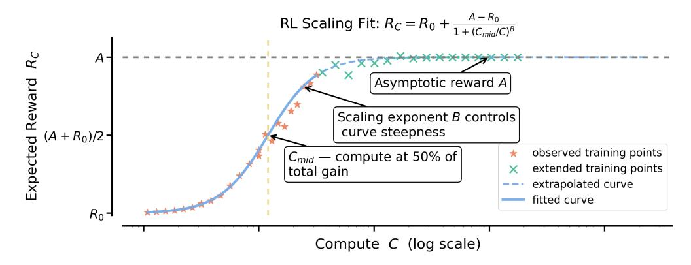
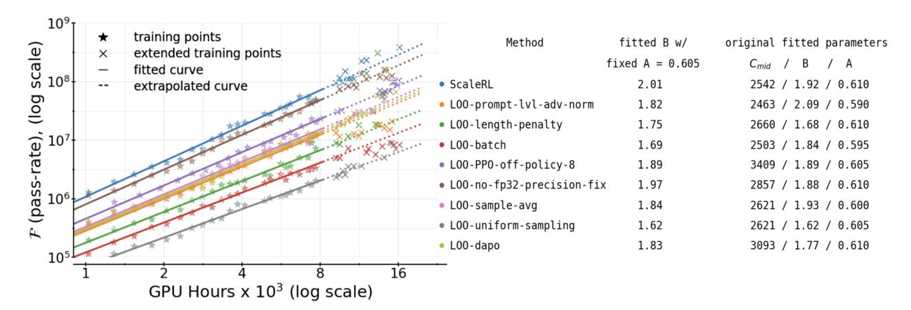
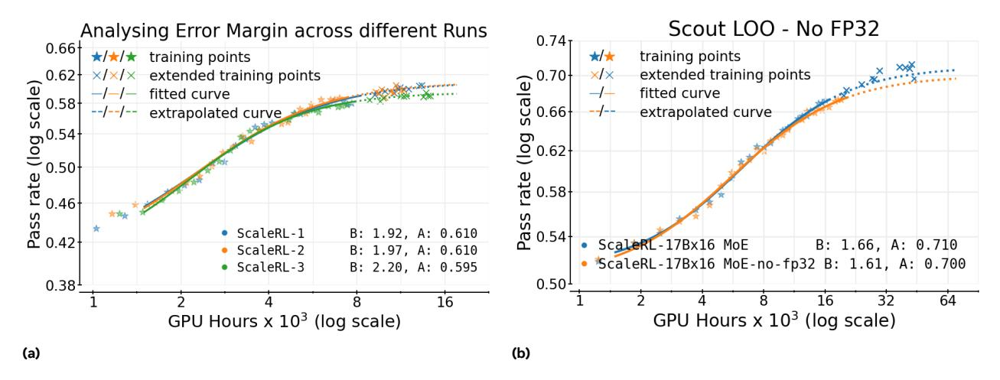
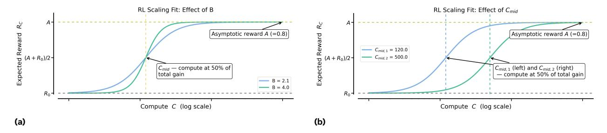
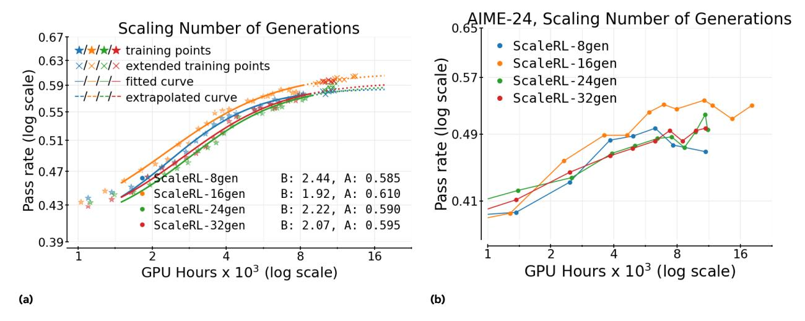
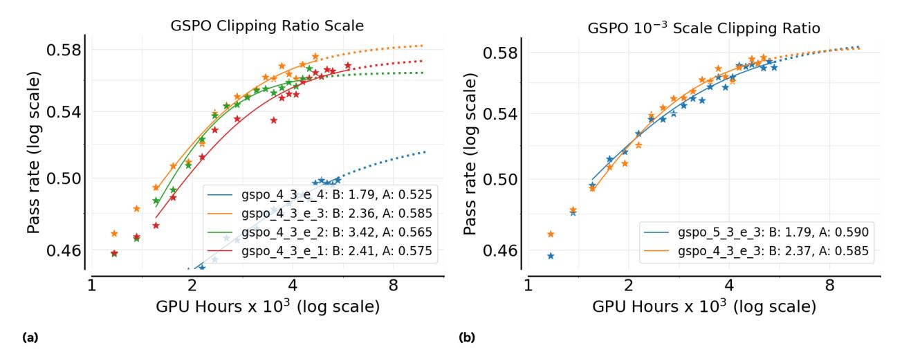

# The Art of Scaling Reinforcement Learning Compute for LLMs

Devvrit Khatri $^{2,*,\dagger}$ , Lovish Madaan $^{1,3,*}$ , Rishabh Tiwari $^{4\dagger}$ , Rachit Bansal $^{5\dagger}$ , Sai Surya Duvvuri $^{2\dagger}$ , Manzil Zaheer $^{1\dagger}$ , Inderjit S. Dhillon $^{2}$ , David Brandfonbrener $^{1}$ , Rishabh Agarwal $^{6,\dagger}$ 

Reinforcement learning (RL) has become central to training large language models (LLMs), yet the field lacks predictive scaling methodologies comparable to those established for pre-training. Despite rapidly rising compute budgets, there is no principled understanding of how to evaluate algorithmic improvements for scaling RL compute. We present the first large-scale systematic study, amounting to more than 400,000 GPU-hours, that defines a principled framework for analyzing and predicting RL scaling in LLMs. We fit sigmoidal compute-performance curves for RL training and ablate a wide range of common design choices to analyze their effects on asymptotic performance and compute efficiency. We observe: (1) Not all recipes yield similar asymptotic performance, (2) Details such as loss aggregation, normalization, curriculum, and off-policy algorithm primarily modulate compute efficiency without materially shifting the asymptote, and (3) Stable, scalable recipes follow predictable scaling trajectories, enabling extrapolation from smaller-scale runs. Combining these insights, we propose a best-practice recipe, ScaleRL, and demonstrate its effectiveness by successfully scaling and predicting validation performance on a single RL run scaled up to 100,000 GPU-hours. Our work provides both a scientific framework for analyzing scaling in RL and a practical recipe that brings RL training closer to the predictability long achieved in pre-training.

Correspondence: {lovish, brandfon}@meta.com, {devvrit.03, rishabhagarwal.467}@gmail.com


Figure 1 Predicatably Scaling RL compute to 100,000 GPU Hours (a) We run ScaleRL for 100k GPU hours on an 8B dense model, and 50k GPU hours on a 17Bx16 MoE (Scout). We fit a sigmoid curve (Equation (1)) on pass rate (mean@16) on *iid* validation dataset up to 50k (and 16k) GPU hours and extrapolate to 100k (and 45k) on the 8B (Scout MoE) models respectively. We trained for 7400 steps for 8B and 7100 steps for Scout, which is 3.5× larger than ProRL (Liu et al., 2025a). The extrapolated curve (× markers) closely follows extended training, demonstrating both stability at large compute and predictive fits—establishing ScaleRL as a reliable candidate for RL scaling. (b) Downstream evaluation on AIME-24 shows a consistent scaling trend for ScaleRL, thus generalizing beyond the training data distribution. Moreover, scaling model size substantially improves the downstream and asymptotic RL performance.

 $<sup>^1\</sup>mathrm{Meta},\,^2\mathrm{UT}$ Austin,  $^3\mathrm{UCL},\,^4\mathrm{UC}$ Berkeley,  $^5\mathrm{Harvard}$  University,  $^6\mathrm{Periodic}$  Labs

<sup>\*</sup>Equal contribution, †Work done at Meta

## 1 Introduction

Scaling reinforcement learning (RL) compute is emerging as a critical paradigm for advancing large language models (LLMs). While pre-training establishes the foundations of a model; the subsequent phase of RL training unlocks many of today's most important LLM capabilities, from test-time thinking (OpenAI, 2024; Guo et al., 2025) to agentic capabilities (Kimi Team et al., 2025a). For instance, Deepseek-R1-Zero used 100,000 H800 GPU hours for RL training – 3.75% of its pre-training compute (Guo et al., 2025). This dramatic increase in RL compute is amplified across frontier LLM generations, with more than 10× increase from o1 to o3 (OpenAI, 2025) and a similar leap from Grok-3 to Grok-4 (xAI Team, 2025).

While RL compute for LLMs has scaled massively, our understanding of how to scale RL has not kept pace; the methodology remains more art than science. Recent breakthroughs in RL are largely driven by isolated studies on novel algorithms (e.g., Yu et al. (DAPO, 2025)) and model-specific training reports, such as, MiniMax et al. (2025) and Magistral (Rastogi et al., 2025). Critically, these studies provide ad-hoc solutions tailored to specific contexts, but not how to develop RL methods that scale with compute. This lack of scaling methodology stifles research progress: with no reliable way to identify promising RL candidates a priori, progress is tied to large-scale experimentation that sidelines most of the academic community.

This work lays the groundwork for science of RL scaling by borrowing from the well-established concept of scaling laws from pre-training. While pre-training has converged to algorithmic recipes that scale predictably with compute (Kaplan et al., 2020; Hoffmann et al., 2022; Owen, 2024), the RL landscape lacks a clear standard. As a result, RL practitioners face an overwhelming array of design choices, leaving the fundamental questions of how to scale and what to scale unanswered. To address these questions, we establish a predictive framework for RL performance using a sigmoid-like saturating curve between the expected reward  $(R_C)$  on an iid validation set and training compute (C):

```html
$$\overbrace{R_C - R_0}^{\text{Reward Gain}} = \overbrace{(A - R_0)}^{\text{Asymptotic Reward Gain}} \times \underbrace{\frac{1}{1 + (C_{\text{mid}}/C)^B}}_{\text{Compute Efficiency}}$$
 $(\text{fixed model and training data})\quad(1)$ 

```

where  $0 \le A \le 1$  represents the asymptotic pass rate, B > 0 is a scaling exponent that determines the compute efficiency, and  $C_{\text{mid}}$  sets the midpoint of the RL performance curve. A schematic interpretation of these parameters is provided in Figure 3.

This framework in Equation (1) allows researchers to extrapolate performance from lower-compute runs to higher compute budgets, enabling them to evaluate scalability of RL methods without incurring the compute cost of running every experiment to its computational limit.

Guided by this framework, we develop **ScaleRL**, an RL recipe that scales *predictably* with compute. In a massive **100,000 GPU-hours training run**, we show that **ScaleRL**'s performance closely matches the scaling curve predicted by our framework (Figure 1). Critically, scaling curves extrapolated from only the initial stages of training closely match the final observed performance, confirming the predictive ability of our framework to extreme compute scales.

The design of **ScaleRL** is grounded in a comprehensive empirical study of RL scaling that spanned over **400,000 GPU-hours** (on Nvidia GB200 GPUs). This study explored numerous design choices at an 8B model parameters scale, where individual runs use up to 16,000 GPU-hours, making them **6**× **cheaper** than experimenting at our largest training run scale. This investigation yielded three key principles:

- RL Performance Ceilings are Not Universal: As we scale training compute for different methods, they encounter different ceilings on their achievable performance (A). This limit can be shifted by choices such as the loss type and batch size.
- Embracing the Bitter Lesson: Methods that appear superior at small compute budgets can be worse when extrapolated to large-compute regimes (Figure 2). We can still identify scalable methods by estimating the scaling parameters (A, B) from the early training dynamics using our framework (Equation (1)).


Figure 2 ScaleRL is more scalable than prevalent RL methods. We fit sigmoid curves (Equation 1) on iid validation dataset to commonly-used training recipes like DeepSeek (GRPO) (Guo et al., 2025), Qwen-2.5 (DAPO) (Yu et al., 2025), Magistral (Rastogi et al., 2025), and Minimax-M1 (MiniMax et al., 2025), and compare them with ScaleRL surpasses all other methods, achieving an asymptotic reward of A = 0.61. Stars denote evaluation points; solid curves show the fitted curve over the range used for fitting; dashed curves extrapolate beyond it. We validate the predictability by running each method for longer ("x" markers), which align closely with the extrapolated curves for stable recipes like ScaleRL and MiniMax. Further description of the individual recipes compared are given in Appendix A.16.

• Re-evaluating Common Wisdom: Common interventions thought to improve peak performance (e.g., loss aggregation, data curriculum, length penalty, advantage normalization) mainly adjust compute efficiency (B), while not changing the performance ceiling considerably.

Based on these insights, **ScaleRL** achieves *predictable* scaling by integrating existing methods, rather than inventing novel methods. Specifically, **ScaleRL** combines asynchronous Pipeline-RL setup (§3.1), forced length interruptions, truncated importance sampling RL loss (CISPO), prompt-level loss averaging, batch-level advantage normalization, FP32 precision at logits, zero-variance filtering, and No-Positive-Resampling – with each component's contribution validated in a leave-one-out ablation, consuming 16,000 GPU-hours per run.

**ScaleRL** not only scales *predictably* but also establishes a new **state-of-the-art** (Figure 2) – it achieves higher asymptotic performance and compute efficiency compared to established RL recipes. Moreover, **ScaleRL** maintains predictable scaling when increasing compute across multiple training axes (§ 5) – including 2.5× larger batch sizes, longer generation lengths up to 32,768 tokens, multi-task RL using math and code, and larger MoE (Llama-4 17B×16); with benefits that consistently transfer to downstream tasks. Overall, this work establishes a rigorous methodology for cost-effectively predicting the scalability of new RL algorithms.

# 2 Preliminaries & Setup

We consider reinforcement learning with LLMs, where prompts x are sampled from a data distribution D. Our setup follows a generator-trainer split across GPUs: a subset of GPUs (generators) use optimized inference kernels for high-throughput rollout generation, while the remaining GPUs (trainers) run the training backend (FSDP) and update parameters. We denote by  $\pi_{\rm gen}^{\theta}$  and  $\pi_{\rm train}^{\theta}$  the model with parameters  $\theta$  on the generator and training backends, respectively. For each prompt, the old policy  $\pi_{\rm gen}^{\theta_{\rm old}}$  on the generator GPUs produces candidate completions, which are then assigned scalar rewards. Policy optimization proceeds by maximizing a clipped surrogate objective, taking expectations over  $x \sim D$  and rollouts from  $\pi_{\rm gen}^{\theta_{\rm old}}$ .

**Training Regimen** All experiments are conducted on the RL for reasoning domain, where the model produces a thinking trace enclosed with special tokens (<think> ... </think>) and a final solution. Unless noted, training uses a sequence length of 16,384 tokens: 12,288 for thinking, 2,048 for the solution, and an additional

2,048 for the input prompt. We adopt the 12,288 thinking budget for faster iteration, and show in Section 5 that ScaleRL extrapolations remain predictive when training with larger thinking budgets (32,768). For math RL experiments, we use the Polaris-53K dataset (An et al., 2025) with a batch size of 768 (48 prompts with 16 generations each). In our setup, scaling RL compute corresponds to running multiple epochs over the training prompts. More details about training, including SFT and hyper-parameters, are in Appendix A.3.

Base RL Algorithm As our starting point in § 3, we start with a "base" algorithm that resembles GRPO (Shao et al., 2024) without any KL regularization term, in line with large-scale training reports (Rastogi et al., 2025; MiniMax et al., 2025). Additionally, we include the asymmetric DAPO clipping (Yu et al., 2025), because of its widespread adoption as a default approach to avoid entropy collapse and maintain output diversity.

For a given prompt x, the old policy  $\pi_{\text{gen}}(\theta_{\text{old}})$  generates G candidate completions  $\{y_i\}_{i=1}^G$ , each assigned a scalar reward  $r_i$ . We compute advantages  $\hat{A}_i$  and group-normalized advantages using:

$$\hat{A}_i = r_i - \mathrm{mean}(\{r_j\}_{j=1}^G), \quad \hat{A}_i^G = \hat{A}_i / (\mathrm{std}(\{r_j\}_{j=1}^G) + \epsilon).$$

Each completion  $y_i$  of length  $|y_i|$  contributes at the token-level importance sampling (IS) ratios  $\rho_{i,t}(\theta)$ , with asymmetric upper and lower clipping thresholds, akin to DAPO (Yu et al., 2025):

$$\rho_{i,t}(\theta) := \frac{\pi_{\text{train}}^{\theta}(y_{i,t} \mid x, y_{i,$$

We aggregate losses at the *sample level*, i.e., averaging per-sample token losses before averaging across samples. The surrogate objective is given by:

$$\mathcal{J}(\theta) = \mathbb{E}_{\substack{x \sim D, \\ \{y_i\}_{i=1}^G \sim \pi_{\text{gen}}^{\theta_{\text{old}}}(\cdot|x)}} \left[ \frac{1}{G} \sum_{i=1}^G \frac{1}{|y_i|} \sum_{t=1}^{|y_i|} \min \left( \rho_{i,t}(\theta) \hat{A}_i^G, \operatorname{clip}_{\text{asym}}(\rho_{i,t}(\theta), \epsilon^-, \epsilon^+) \hat{A}_i^G \right) \right].$$
\n  
\n
$$\tag{3}$$

Controlling Generation Lengths To prevent reasoning output lengths from exploding during training, which harms training stability and efficiency, we use interruptions (GLM-V Team et al., 2025; Yang et al., 2025) that forcibly stop overly long generations by appending an end-of-thinking phrase (e.g., "

 /\* (think>"), signaling the LLM to terminate its reasoning and produce a final answer. We revisit this choice later in Section 4 and compare it with length-penalty that penalizes long generations (Yu et al., 2025; Kimi Team et al., 2025b).

## 2.1 Predictive compute-scaling and fitting curves

Unlike pre-training, which typically uses power-law to fit predictive curves, we model pass rate versus log(compute) with a sigmoidal function (Equation (1)). We do so because we found the sigmoidal fit to be much more robust and stable compared to power law empirically, which we discuss further in Appendix A.4. Moreover, our choice is consistent with prior work that use sigmoid-like power laws to capture bounded metrics such as accuracy (Ruan et al., 2024; Srivastava et al., 2022).

Similar to pre-training studies (Li et al., 2025b; Porian et al., 2025), we find that excluding the very early low-compute regime yields more stable fits, after which training follows a predictable trajectory. Unless noted otherwise, all our scaling fits begin after ~1.5k GPU hours. Further details of the fitting procedure are provided in Appendix A.5 and the robustness of our curve fitting is discussed in Appendix A.7.

Interpreting scaling curves Intuitively, a sigmoidal curve captures saturating returns - grows slowly in the low-compute regime, accelerates sharply through a mid-range of efficient scaling, and then saturates at high compute. We also provide a schematic interpretation of the parameters A, B, and  $C_{mid}$  of the sigmoidal curve in Figure 3. We see that  $B, C_{mid}$  primarily affects the efficiency of the run, and A denotes the asymptotic performance at large compute scale. Further discussion of these parameters is provided in Appendix A.8.



Figure 3 Interpreting equation (1). We provide an example fit illustrating the roles of parameters A, B, and  $C_{\text{mid}}$ .  $C_{\text{mid}}$  determines the compute point at which half of the total gain is achieved - smaller values correspond to faster ascent toward the asymptote. B controls the curve's steepness, with larger values indicating greater efficiency. A represents the asymptotic performance reached at large compute scales. Further discussion is provided in Appendix A.8.

Scaling curve on held-out validation Consistent with pre-training practice (Hoffmann et al., 2022; Porian et al., 2025), we measure predictive performance on in-distribution validation data. Since our training runs span multiple epochs, we hold out randomly selected 1,000 prompts from the Polaris-53k dataset for validation and use the remainder for training. The scaling curves are fitted on the validation points, which measure the average pass rate every 100 training steps, with 16 generations per prompt on the 1,000 held-out prompts.

# 3 An Empirical Study of RL Scaling

In this section, we conduct RL experiments using an 8B dense model on verifiable math problems. Using the setup described in Section 2, we study several design axes in terms of their predictable compute-scaling behavior, namely asymptotic performance (A) and compute efficiency (B), as shown in Figure 3.

We structure our experiments in three stages – we first ablate design choices on top of the baseline at 3.5k to 4k GPU-hours since some experimental choices destabilize beyond this scale (Appendix A.15). Whenever a design change proved stable, we trained it for longer. Then, we combine the best choices into **ScaleRL** and run leave-one-out (LOO) experiments for 16k GPU-hours in Section 4. Here, we assess predictability by fitting on the first 8k GPU-hours and extrapolating the remainder of the run. Finally, to demonstrate predictable scaling with **ScaleRL**, we also consider training setups with larger batch sizes, mixture-of-experts model, multiple tasks (math and code), and longer sequence lengths in Section 5.

## 3.1 Asynchronous RL Setup

We first investigate the choice of asynchronous off-policy RL setup (Noukhovitch et al., 2024), as it governs training stability and efficiency, generally independent of all other design choices. Specifically, we consider two approaches for off-policy learning: PPO-off-policy-k and PipelineRL-k.

**PPO-off-policy-**k is the default approach for asynchronous RL and has been used previously by Qwen3 (Yang et al., 2025) and ProRL (Liu et al., 2025a). In this setup, the old policy  $\pi_{gen}^{\theta_{\text{old}}}$  generates reasoning traces for a batch of B prompts. Each gradient update processes a mini-batch of  $\hat{B}$  prompts, resulting in  $k = B/\hat{B}$  gradient updates per batch. In our experiments, we fix  $\hat{B} = 48$  prompts (with 16 generations each), and vary  $k \in \{1, 8\}$  by setting  $B = k \times 48$ .

**PipelineRL-**k is a recent approach from Piche et al. (2025) and used by Magistral (Rastogi et al., 2025). In this regimen, generators continuously produce reasoning traces in a streaming fashion. Whenever trainers finish a policy update, the new parameters are immediately pushed to the generators, which continue generating with the updated weights but a stale KV cache from the old policy. Once a full batch of traces is generated, it is passed to the trainers for the next update. In our setup we introduce a parameter k: the trainers wait if they


Figure 4 (a) Comparing "compute-scaling" of asynchronous off-policy RL setups. We report only the B (scaling exponent) and A (asymptotic pass rate) parameters of the fitted sigmoid curve (Equation 1). PipelineRL-k is much more efficient and slightly better in the large compute limit. (b) Different max off-policyness with PipelineRL.

get k steps ahead of the generators.

We compare these approaches in Figure 4a. PipelineRL and PPO-off-policy achieve similar asymptotic performance A, but PipelineRL substantially improves the compute efficiency B; thus reaching the ceiling A faster. This is because PipelineRL reduces the amount of idle time in the training process. This choice yields reliable gains with fewer tokens, making larger sweeps at a lower compute budget possible. We also vary the maximum off-policyness for PipelineRL and find k=8 to be optimal as shown in Figure 4b, which we discuss further in Appendix A.11.

## 3.2 Algorithmic Choices

Building on the results above, we adopt PipelineRL-8 as our updated baseline. We then study six additional algorithmic axes: (a) loss aggregation, (b) advantage normalization, (c) precision fixes, (d) data curriculum, (e) batch definition, and (f) loss type. In Section 4, we combine the best options into a unified recipe, termed **ScaleRL(Scale**-able **RL)**, and conduct leave-one-out experiments on a larger scale of 16,000 GPU-Hours.

**Loss type** We compare the asymmetric DAPO loss (Eq. 8) with two recently proposed alternatives: GSPO (Zheng et al., 2025a) and CISPO (MiniMax et al., 2025; Yao et al., 2025). GSPO applies importance sampling at the sequence level as opposed to GRPO's token-level formulation. Specifically, GSPO alters the token-level IS ratio (Eq. 2) to sequence-level ratios:  $\rho_i(\theta) = \frac{\pi_{train}(y_i|x,\theta)}{\pi_{gen}(y_i|x,\theta_{old})}$ . CISPO simply combines truncated IS with vanilla policy gradient (Ionides, 2008), where sg is the stop-gradient function:

$$\mathcal{J}_{\text{CISPO}}(\theta) = \underset{\substack{x \sim D, \\ \{y_i\}_{i=1}^G \sim \pi_{gen}(\cdot|x,\theta_{\text{old}})}}{\mathbb{E}} \left[ \frac{1}{T} \sum_{i=1}^G \sum_{t=1}^{|y_i|} \operatorname{sg}(\min(\rho_{i,t}, \epsilon_{\max})) \hat{A}_i \log(\pi_{\text{train}}(y_{i,t}|x, y_{i(4)$$

Figure 5a shows that both GSPO and CISPO substantially outperform DAPO, improving the asymptotic pass-rate A by a large margin. CISPO exhibits a prolonged near-linear reward increase, and is marginally better than GSPO later in training, so we opt for CISPO as our best loss type. Further discussion on off-policy loss types, and their hyperparameter robustness is detailed in Section 4 and Appendix A.17.

**FP32 Precision for LLM logits** The generators and trainers rely on different kernels for inference and training, leading to small numerical mismatches in their token probabilities (He & Lab, 2025). RL training is highly sensitive to such discrepancies, since they directly affect the IS ratio in the surrogate objective. MiniMax et al. (2025) identified that these mismatches are especially pronounced at the language model head, and


Figure 5 (a) Comparing popular loss functions: DAPO (Yu et al., 2025), GSPO (Zheng et al., 2025a), and CISPO (MiniMax et al., 2025). We find CISPO/GSPO achieve a higher asymptotic reward compared to DAPO. (b) Using FP32 precision in the final layer (LM head) gives a considerable boost in the asymptotic reward.

mitigate this by FP32 computations at the head for both the generator and trainer. As shown in Figure 5b, the precision fix dramatically improves the asymptotic performance A from 0.52 to 0.61. Given this clear benefit, we include the FP32 precision fix in our **ScaleRL** recipe.

**Loss Aggregation** We evaluate three strategies for aggregating the RL loss: (a) *Sample average* where each rollout contributes equally (as in GRPO, Appendix A.2). (b) *Prompt average* where each prompt contributes equally (as in DAPO, Appendix A.2). (c) *Token average* where all token losses in the batch are averaged directly, without intermediate grouping. The comparison results are shown in Appendix A.9 (Figure 14a). We find prompt-average achieves the highest asymptotic performance and therefore use this choice for **ScaleRL**.

Advantage Normalization We compare three variants of advantage normalization: (a) Prompt level where advantages are normalized by the standard deviation of rewards from the rollouts of the same prompt (as in GRPO, Appendix A.2). (b) Batch level where advantages are normalized by the standard deviation across all generations in the batch, as used by Hu et al. (2025a); Rastogi et al. (2025). (c) No normalization where advantages are computed as raw rewards centered by the mean reward of the prompt's generations, without variance scaling (as proposed in Dr. GRPO (Liu et al., 2025b)). A comparison plot is shown in Appendix A.9 (Figure 14b), and all three methods are oberseved to yield similar performance. We therefore adopt batch-level normalization as it is theoretically sound and marginally better. This choice is also further corroborated at a larger scale by the leave-one-out experiments in Section 4.

Zero-Variance Filtering Within each batch, some prompts yield identical rewards across all their generations. These "zero-variance" prompts have zero advantage and therefore contribute zero policy gradient. The default baseline includes such prompts in loss computation, but it is unclear whether they should be included in the effective batch. To test this, we compare the default setting against an effective batch approach, where only prompts with non-zero variance are included in the loss calculation, as done by Seed et al. (2025). Note that zero-variance filtering differs from dynamic sampling in DAPO (Yu et al., 2025). The former merely drop the prompts, while latter resamples more prompts until the batch is full. We show in Figure 6a that using the effective batch performs better asymptotically; and we adopt it in our ScaleRL recipe.

Adaptive Prompt Filtering A number of data curriculum strategies have been proposed for RL training to improve sample efficiency (An et al., 2025; Zhang et al., 2025b; Zheng et al., 2025b). Here we evaluate a simple variant, introduced by An et al. (2025), with the key observation that once a prompt becomes too easy for a policy, it typically remains easy. Since such prompts consume some compute but no longer contribute useful gradient signal (Section 3.2), it is better to exclude them from future training. We implement this


Figure 6 (a) "Zero" variance filtering: We filter out "zero" variance (accuracy 0 or 1) samples in a batch since they contribute zero policy gradient and find it achieves a higher asymptote, and (b) Adaptive prompt sampling: Filtering out prompts with pass rate > 0.9 in subsequent epochs results in a higher asymptotic performance.

by maintaining a history of pass rates and permanently removing any prompt with pass rate  $\geq 0.9$  from subsequent epochs—we call this **No-Positive-Resampling**. In Figure 6b we compare this curriculum against the default setting where all prompts are resampled uniformly throughout training. We see that the curriculum improves scalability and the asymptotic reward A.

# 4 ScaleRL: Scaling RL Compute Effectively & Predictably

From the design axes studied above, we consolidate the best-performing settings into a single recipe, which we term ScaleRL (Scale-able RL). ScaleRL is an asynchronous RL recipe that uses PipelineRL with 8 steps off-policyness, interruption-based length control for truncation, FP32 computation for logits, and optimizes the  $\mathcal{J}_{\text{ScaleRL}}(\theta)$  loss. This loss combines prompt-level loss aggregation, batch-level advantage normalization, truncated importance-sampling REINFORCE loss (CISPO), zero-variance filtering, and no-positive resampling:

$$\mathcal{J}_{\mathrm{ScaleRL}}(\theta) = \mathbb{E}_{\substack{x \sim D, \\ \{y_i\}_{i=1}^G \sim \pi_{gen}^{\theta_{old}}(\cdot|x)}} \left[ \frac{1}{\sum_{g=1}^G |y_g|} \sum_{i=1}^G \sum_{t=1}^{|y_i|} \mathrm{sg}(\min(\rho_{i,t}, \epsilon)) \hat{A}_i^{\mathrm{norm}} \log \pi_{train}^{\theta}(y_{i,t}) \right],$$

$$\rho_{i,t} = \frac{\pi_{train}^{\theta}(y_{i,t})}{\pi_{gen}^{\theta_{old}}(y_{i,t})}, \quad \hat{A}_i^{\mathrm{norm}} = \hat{A}_i / \hat{A}_{\mathrm{std}}, \quad 0 < \mathrm{mean}(\{r_j\}_{j=1}^G) < 1, \quad \mathrm{pass\_rate}(x) < 0.9,$$

where sg is the stop-gradient function,  $\hat{A}_{std}$  is the standard deviation of all advantages  $\hat{A}_i$  in a batch and pass\_rate(x) denotes the historical pass rate of a prompt x. For forced interruptions, we use the end-of-thinking phrase: "Okay, time is up. Let me stop thinking and formulate a final answer now. 

**Leave-One-Out (LOO) Ablations** To validate that these choices remain optimal when combined, we conduct *leave-one-out* (LOO) experiments: starting from **ScaleRL**, we revert one axis at a time to its baseline counterpart from Section 2. This ensures that each design decision contributes positively even in the presence of all others. Figure 7 reports these experiments, each scaled to 16k GPU hours.

Across all axes, **ScaleRL** consistently remains the most effective configuration, slightly outperforming LOO variants either in asymptotic reward or in compute efficiency (refer to the last column in the Figure 7 table). Since most LOO variants reach similar asymptotic pass rates, we transform the sigmoidal fit to a power-law fit, to highlight efficiency differences via the slope B (details in Figure 7). Concretely, we average the asymptotic reward A across all runs, re-fit the curves with this fixed A, and then compare slopes (measuring efficiency) in Figure 7. The corresponding non-transformed pass-rate vs. compute curves are provided in Appendix A.2.



Figure 7 Leave-One-Out (LOO) Experiments: Starting from ScaleRL, we revert one design choice at a time to its baseline counterpart and re-train. Most LOO variants reach a similar asymptotic reward, with ScaleRL outperforming slightly overall. The main difference in these methods lies in efficiency. To highlight this, we re-arrange Equation (1) into  $\mathcal{F}(R_c) = C^B$ , where  $\mathcal{F}(R_c) = C^{B}_{\text{mid}}/(\frac{A-R_0}{R_c-R_0}-1)$ , and plot  $\log \mathcal{F}(R_c)$  vs.  $\log C$ . This form makes slope B directly visible, showing that ScaleRL achieves the highest compute efficiency.

Error margin in fitting scaling curves Since RL training is known to exhibit high variance (Agarwal et al., 2021), we use three independent ScaleRL runs (Figure 8a) to estimate the variability in fitted scaling coefficients. The observed variance in asymptotic reward and efficiency parameters serves as our empirical error margin, used to determine whether changes in compute efficiency or asymptotic performance are statistically meaningful for two different runs (Madaan et al., 2024).

**Extrapolating Scaling Curves** In all our LOO experiments as well as independent **ScaleRL** runs, we fit the sigmoidal curve up to 8000 GPU-hours and extrapolate to 16000 GPU-hours, observing that the predicted curves align closely with both training and extended points. This demonstrates the stability and predictability of **ScaleRL** and other stable, scalable recipes under large-scale RL training.

Are the design choices worth it? In Section 3.2, certain design choices alter asymptotic performance, such as loss type (Figure 5a) and FP32 precision (Figure 5b). However, in our LOO experiments with ScaleRL (Figure 7), these components appear less critical individually (last column in the figure). This raises the question of whether certain design choices can be safely left at their "default" values.

We argue the answer is no. Even when a choice seems redundant in the combined recipe, it can still provide stability or robustness that can become decisive in other regimes. For example, while the FP32 precision fix makes little difference with dense 8B trained with **ScaleRL** (Figure 7), it provides large gains in GRPO/DAPO-style losses by mitigating numerical instabilities. This indicates that its benefits extend beyond the specific **ScaleRL** configuration we study. To further test this, we ran a leave-one-out experiment on the Scout 17Bx16 MoE and observed that FP32 precision improves overall scalability (Figure 8b).

A similar case arises with the loss type. In Figure 7, reverting to DAPO yields similar asymptotic performance to CISPO within **ScaleRL**. Nonetheless, as we discuss in Appendix A.17, CISPO is markedly more robust to the choice of IS-clipping parameter  $\epsilon_{\text{max}}$ , reducing the sensitivity of training to hyperparameter tuning. Moreover, it's also more efficient than DAPO, as seen in LOO experiment (B = 2.01 vs B = 1.77). This justifies preferring CISPO, even if a carefully tuned DAPO variant can perform similar asymptotically.

In summary, even when individual design choices appear redundant within the combined recipe, they often enhance training stability, robustness, or efficiency in ways that generalize across models and setups. **ScaleRL** retains such components not just for marginal gains in a specific configuration, but because they address recurring sources of instability and variance that arise across reinforcement learning regimes.



Figure 8 (a) Variance in scaling fits. We train 3 independent runs of ScaleRL to measure variance. We observe a  $\pm 0.02$  error margin for asymptotic performance A. (b) FP32 LOO on Scout: Comparing ScaleRL on Scout with and without FP32 precision fix at the LM Head. ScaleRL performs better with the FP32 fix.

# 5 Predictable Scaling Returns Across RL Compute Axes

Given a fixed or growing compute budget, which scaling knob –context length, batch size, generations per prompt, and model size – buys the most reliable performance gain, and how early can we predict that return? We answer this by (i) fitting the saturating power-law in equation (1) early in training for each setting (precisely, half the target budget), (ii) extrapolating to the target budget, and (iii) extending training to verify the forecast. Across all axes below we observe clean, predictive fits whose extrapolated curves align with the extended trajectories, mirroring the behavior seen in our 100,000 GPU-hour run (Figure 1), and the cross-recipe comparison in Figure 2.

Model scale (MoE) Does ScaleRL remain predictive and stable on larger models? Training the 17B×16 Llama-4 Scout MoE with ScaleRL exhibits the same predictable scaling behavior as the 8B model, with low truncation rates and no instability pathologies (Appendix A.15, A.17). Figure 1 shows the training curve. The extended points align with the fitted curve, supporting the model-scale invariance of our recipe. Moreover, the larger 17B×16 MoE exhibits much higher asymptotic RL performance than the 8B dense model, outperforming the 8B's performance using only 1/6 of its RL training compute.

**Generation length (context budget)** Increasing the generation length from 14k to 32k tokens slows early progress (lower B and higher  $C_{mid}$ ) but consistently lifts the fitted asymptote (A), yielding higher final performance once sufficient compute is provided (Figure 9). This validates long-context RL as a ceiling-raising knob rather than a mere efficiency trade-off. Extrapolations made from the fit correctly forecast the higher 32k-token trajectory when training is extended.

Global batch size (prompts) Smaller-batch runs show early stagnation on downstream benchmarks even as in-distribution validation performance continues to improve. Larger batches reliably improve the asymptote and avoid the downstream stagnation we observe in smaller-batch runs. Figure 10a shows the same qualitative pattern at mid-scale: small batches may appear better early but are overtaken as compute grows. In our largest math run in Figure 1, moving to batch size of 2048 prompts both stabilized training and yielded a fit that extrapolated from up to 50k GPU hours to the final 100k point.

Generations per prompt (fixed total batch) For a fixed total batch, is it better to allocate more prompts or more generations per prompt? Sweeping generations per prompt 8,16,24,32 and adjusting prompts to keep total batch fixed leaves fitted scaling curves essentially unchanged (Appendix A.13), suggesting that, at


**Figure 9 Scaling RL Generation Length.** While long-context RL is less efficient initially, it eventually surpasses the performance of the smaller-context run. This trend is observed on both the *iid* validation set (left) as well as downstream evaluations (right).


Figure 10 Scaling RL batch size. larger batch size is slower in training but settles at a higher asymptote. Batch size show an inverse trend initially where smaller values seem better at lower compute budget, but reach a higher asymptotic performance at larger scale.

moderate batch, this allocation is a second-order choice for both A and B. Clearer differences may emerge at much larger batches (e.g., 2k+), which we leave for future work.

## 6 Related Work

We detail two most relevant works to our study in this section. ProRL (Liu et al., 2025a) demonstrates that prolonged RL fine-tuning on LLMs ( $\sim 2000$  optimization steps, 64 batch size) for 16K GPU-hours using a mix of reasoning tasks uncovers novel solution strategies beyond a model's base capabilities. This longer training regimen delivered significant gains on a 1.5B model, rivaling the performance of larger models on some benchmarks. ProRL's contributions lie in specific heuristics for stability (KL-regularization, policy resetting, entropy controls, etc.) to achieve high performance out of a 1.5B model.

Liu et al. (2025c) offer a complementary perspective and ablates various design choices under consistent conditions on Qwen-3 4B/8B (Yang et al., 2025), and presents a minimalist combination, LitePPO, that outperforms more complex methods like GRPO (Shao et al., 2024) and DAPO (Yu et al., 2025) on smaller


Figure 11 ScaleRL scales predictably on math and code. We report both the code and math validation set performance on the joint math+code RL run; along with the math only ScaleRL run as a reference. These results demonstrate that our sigmoidal compute-performance relationship holds across task mixtures, and that ScaleRL's scalability generalizes beyond a single domain training.

scale models and compute. This yields valuable algorithmic insights, but the focus is on comparative empirical findings, rather than on scaling behaviour.

None of these work study "scaling" properties of these methods. In fact, the main comparisons are done on downstream evaluations, which may not be not the right metric to study predictable scaling. Rather, as done in pre-training and in our work here, we study performance on in-distribution held out eval set. In contrast to the mentioned related works, our work develops and validates a compute-performance framework with predictive fits, while operating at a much larger compute budget (e.g., 6x larger than ProRL) and model scale compared to the above studies. Additionally, our findings yield a near state-of-the-art RL recipe that can scale predictably to over 100,000 GPU-hours without any stability issues. The rest of the related work is deferred to Appendix A.1.

## 7 Discussion & Conclusion

In this work, we study the scaling properties of different techniques used in RL for LLMs in pursuit of a predictable scalable recipe. With this mission, we derive a method for fitting predictive scaling fits for accuracy on the validation set that allows us to quantify the asymptotic performance and compute efficiency of an RL method. Using this methodology, our primary contribution is to conduct a careful series of ablations of several algorithmic options that go into the RL recipe. For each ablation, we choose the option with higher asymptotic performance when possible and improved efficiency otherwise. Combining these choices yields the **ScaleRL** recipe which scales better than all existing recipes in our experiments.

A few observations are in order:

- Compute scaling extrapolation. An important insight of our scaling methodology is that we can use smaller-scale ablations in a systematic way to predict performance at larger scales. This allows us to create our final scalable recipe.
- Most important decisions. The off-policy algorithm, loss function, and model precision are the most important decisions from our ablations. Each of the other decisions does not have a large individual effect, but as we see from the leave-one-out experiments, they still do have some cumulative impact (in terms of efficiency) when all combined.
- Asymptotic performance vs. efficiency. For many of our ablations, we found the better option to

improve both efficiency and asymptotic performance, but this is not always the case (e.g. for FP32, Figure 5b). When doing the "forward" ablations starting from the baseline method, we opt for asymptotic performance first and foremost. Interestingly, when doing the "backward" leave-one-out ablations from the ScaleRL recipe, we find very little impact on asymptotic performance from each decision, but each component of the algorithm seems to help efficiency. This shows that the cumulative effect of the changes is quite robust.

- Generalization. While we report transfer to downstream evaluations, our primary focus is on studying predictive scaling, which is characterized through in-distribution performance curves on a held-out dataset from training prompts (Li et al., 2025b; Muennighoff et al., 2025). This still leaves the question of how well the LLM would generalize from the training distribution to held out test sets. While a full characterization of generalization is beyond the scope of our work, we do observe correlation between in-distribution validation and downstream generalization performance. However, there are some algorithmic choices that seem to help generalization more, that we want to note here including: larger batch size (Section A.14), reducing truncations (Section A.15), longer generation lengths (Section 5, Figure 9), and larger model scale (Section 5, Figure 1).
- Multi-task RL. While our experiments focus mainly on the math domain, we also evaluate ScaleRL under multi-task RL training. As shown in Figure 11, joint training on math and code yields clean, parallel power-law trends for each domain, with extended runs remaining aligned with the extrapolated curves. While our preliminary results are promising, it would be interesting to thoroughly study predictability of compute scaling for multi-task RL with different training data mixtures.

**Future work** A natural next step is to derive predictive "scaling laws" for RL across pre-training compute, model size, and RL training data. Future studies can also include other axes of RL compute scaling, such as incorporating structured or dense rewards (Setlur et al., 2024) and more compute-intensive generative verifiers (Zhang et al., 2025a), to find optimal compute allocation for RL training. Finally, the methodological framework introduced here can be applied to study the scaling behavior of other post-training regimes, including multi-turn RL, agentic interaction, and long-form reasoning.

There are of course many design choices in RL, so we don't think that our **ScaleRL** recipe is the end of the story. We hope that our focus on scalable RL and methodology for predicting scalability can inspire future work to push the frontier of RL for LLMs even further. To enable future studies to fit compute-performance RL scaling curves, we release a minimal code repository at www.devvrit.com/scalerl curve fitting.

## 8 Acknowledgments

The authors would like to thank Sneha Kudugunta and Niladri Chatterji for helpful discussions on pre-training and scaling laws. Additionally, the authors are grateful to Aviral Kumar, Prateek Jain, Lewis Turnstall, Nathan Lambert, Dzmitry Bahdanau, and John Quan for helpful feedback on earlier drafts. Finally, the authors would also like to thank Jenya Lee and Abhinav Jauhri for infrastructure and compute support.

## References

Rishabh Agarwal, Max Schwarzer, Pablo Samuel Castro, Aaron C Courville, and Marc Bellemare. Deep reinforcement learning at the edge of the statistical precipice. *Advances in Neural Information Processing Systems*, 34:29304–29320, 2021.

Chenxin An, Zhihui Xie, Xiaonan Li, Lei Li, Jun Zhang, Shansan Gong, Ming Zhong, Jingjing Xu, Xipeng Qiu, Mingxuan Wang, and Lingpeng Kong. Polaris: A post-training recipe for scaling reinforcement learning on advanced reasoning models, 2025. URL https://hkunlp.github.io/blog/2025/Polaris.

AoPS. AIME problem set 1983-2025, 2025. URL https://artofproblemsolving.com/wiki/index.php/AIME\_Problems\_and\_Solutions.

Quentin Carbonneaux, Gal Cohen, Jonas Gehring, Jacob Kahn, Jannik Kossen, Felix Kreuk, Emily McMilin, Michel

- Meyer, Yuxiang Wei, David Zhang, et al. Cwm: An open-weights llm for research on code generation with world models. arXiv preprint arXiv:2510.02387, 2025.
- Ganqu Cui, Yuchen Zhang, Jiacheng Chen, Lifan Yuan, Zhi Wang, Yuxin Zuo, Haozhan Li, Yuchen Fan, Huayu Chen, Weize Chen, Zhiyuan Liu, Hao Peng, Lei Bai, Wanli Ouyang, Yu Cheng, Bowen Zhou, and Ning Ding. The entropy mechanism of reinforcement learning for reasoning language models, 2025. URL https://arxiv.org/abs/2505.22617.
- GLM-V Team, Wenyi Hong, Wenmeng Yu, Xiaotao Gu, Guo Wang, Guobing Gan, Haomiao Tang, Jiale Cheng, Ji Qi, Junhui Ji, Lihang Pan, Shuaiqi Duan, Weihan Wang, Yan Wang, Yean Cheng, Zehai He, Zhe Su, Zhen Yang, Ziyang Pan, Aohan Zeng, Baoxu Wang, Bin Chen, Boyan Shi, Changyu Pang, Chenhui Zhang, Da Yin, Fan Yang, Guoqing Chen, Jiazheng Xu, Jiale Zhu, Jiali Chen, Jing Chen, Jinhao Chen, Jinghao Lin, Jinjiang Wang, Junjie Chen, Leqi Lei, Letian Gong, Leyi Pan, Mingdao Liu, Mingde Xu, Mingzhi Zhang, Qinkai Zheng, Sheng Yang, Shi Zhong, Shiyu Huang, Shuyuan Zhao, Siyan Xue, Shangqin Tu, Shengbiao Meng, Tianshu Zhang, Tianwei Luo, Tianxiang Hao, Tianyu Tong, Wenkai Li, Wei Jia, Xiao Liu, Xiaohan Zhang, Xin Lyu, Xinyue Fan, Xuancheng Huang, Yanling Wang, Yadong Xue, Yanfeng Wang, Yanzi Wang, Yifan An, Yifan Du, Yiming Shi, Yiheng Huang, Yilin Niu, Yuan Wang, Yuanchang Yue, Yuchen Li, Yutao Zhang, Yuting Wang, Yu Wang, Yuxuan Zhang, Zhao Xue, Zhenyu Hou, Zhengxiao Du, Zihan Wang, Peng Zhang, Debing Liu, Bin Xu, Juanzi Li, Minlie Huang, Yuxiao Dong, and Jie Tang. Glm-4.5v and glm-4.1v-thinking: Towards versatile multimodal reasoning with scalable reinforcement learning, 2025. URL https://arxiv.org/abs/2507.01006.
- Daya Guo, Dejian Yang, Haowei Zhang, Junxiao Song, Peiyi Wang, Qihao Zhu, Runxin Xu, Ruoyu Zhang, Shirong Ma, Xiao Bi, et al. Deepseek-r1 incentivizes reasoning in llms through reinforcement learning. *Nature*, 645(8081): 633–638, 2025.
- Horace He and Thinking Machines Lab. Defeating nondeterminism in LLM inference. Thinking Machines Lab: Connectionism, 2025. doi: 10.64434/tml.20250910. https://thinkingmachines.ai/blog/defeating-nondeterminism-in-llm-inference/.
- Dan Hendrycks, Collin Burns, Saurav Kadavath, Akul Arora, Steven Basart, Eric Tang, Dawn Song, and Jacob Steinhardt. Measuring mathematical problem solving with the math dataset. arXiv preprint arXiv:2103.03874, 2021.
- Jordan Hoffmann, Sebastian Borgeaud, Arthur Mensch, Elena Buchatskaya, Trevor Cai, Eliza Rutherford, Diego de Las Casas, Lisa Anne Hendricks, Johannes Welbl, Aidan Clark, et al. Training compute-optimal large language models. arXiv preprint arXiv:2203.15556, 2022.
- Jian Hu, Jason Klein Liu, Haotian Xu, and Wei Shen. Reinforce++: An efficient rlhf algorithm with robustness to both prompt and reward models, 2025a. URL https://arxiv.org/abs/2501.03262.
- Jingcheng Hu, Yinmin Zhang, Qi Han, Daxin Jiang, Xiangyu Zhang, and Heung-Yeung Shum. Open-reasoner-zero: An open source approach to scaling up reinforcement learning on the base model. arXiv preprint arXiv:2503.24290, 2025b.
- Edward L Ionides. Truncated importance sampling. Journal of Computational and Graphical Statistics, 17(2):295–311, 2008
- Jared Kaplan, Sam McCandlish, Tom Henighan, Tom B Brown, Benjamin Chess, Rewon Child, Scott Gray, Alec Radford, Jeffrey Wu, and Dario Amodei. Scaling laws for neural language models. arXiv preprint arXiv:2001.08361, 2020.
- Kimi Team, Yifan Bai, Yiping Bao, Guanduo Chen, Jiahao Chen, Ningxin Chen, Ruijue Chen, Yanru Chen, Yuankun Chen, Yutian Chen, et al. Kimi k2: Open agentic intelligence. arXiv preprint arXiv:2507.20534, 2025a.
- Kimi Team, Angang Du, Bofei Gao, Bowei Xing, Changjiu Jiang, Cheng Chen, Cheng Li, Chenjun Xiao, Chenzhuang Du, Chonghua Liao, et al. Kimi k1. 5: Scaling reinforcement learning with llms. arXiv preprint arXiv:2501.12599, 2025b.
- Aonian Li, Bangwei Gong, Bo Yang, Boji Shan, Chang Liu, Cheng Zhu, Chunhao Zhang, Congchao Guo, Da Chen, Dong Li, et al. Minimax-01: Scaling foundation models with lightning attention. arXiv preprint arXiv:2501.08313, 2025a.
- Margaret Li, Sneha Kudugunta, and Luke Zettlemoyer. (mis)fitting: A survey of scaling laws, 2025b. URL https://arxiv.org/abs/2502.18969.
- Hunter Lightman, Vineet Kosaraju, Yuri Burda, Harrison Edwards, Bowen Baker, Teddy Lee, Jan Leike, John Schulman, Ilya Sutskever, and Karl Cobbe. Let's verify step by step. In The Twelfth International Conference on Learning Representations, 2023.

- Mingjie Liu, Shizhe Diao, Ximing Lu, Jian Hu, Xin Dong, Yejin Choi, Jan Kautz, and Yi Dong. Prorl: Prolonged reinforcement learning expands reasoning boundaries in large language models, 2025a. URL https://arxiv.org/abs/2505.24864.
- Zichen Liu, Changyu Chen, Wenjun Li, Penghui Qi, Tianyu Pang, Chao Du, Wee Sun Lee, and Min Lin. Understanding r1-zero-like training: A critical perspective, 2025b. URL https://arxiv.org/abs/2503.20783.
- Zihe Liu, Jiashun Liu, Yancheng He, Weixun Wang, Jiaheng Liu, Ling Pan, Xinyu Hu, Shaopan Xiong, Ju Huang, Jian Hu, Shengyi Huang, Siran Yang, Jiamang Wang, Wenbo Su, and Bo Zheng. Part i: Tricks or traps? a deep dive into rl for llm reasoning, 2025c. URL https://arxiv.org/abs/2508.08221.
- Ilya Loshchilov and Frank Hutter. Decoupled weight decay regularization, 2019. URL https://arxiv.org/abs/1711.05101.
- Michael Luo, Sijun Tan, Roy Huang, Ameen Patel, Alpay Ariyak, Qingyang Wu, Xiaoxiang Shi, Rachel Xin, Colin Cai, Maurice Weber, Ce Zhang, Erran Li Li, Raluca Ada Popa, and Ion Stoica. Deepcoder: A fully open-source 14b coder at o3-mini level, 2025. URL https://www.together.ai/blog/deepcoder. Notion Blog.
- Lovish Madaan, Aaditya K. Singh, Rylan Schaeffer, Andrew Poulton, Sanmi Koyejo, Pontus Stenetorp, Sharan Narang, and Dieuwke Hupkes. Quantifying variance in evaluation benchmarks, 2024. URL https://arxiv.org/abs/2406.10229.
- Aaron Meurer, Christopher P Smith, Mateusz Paprocki, Ondřej Čertík, Sergey B Kirpichev, Matthew Rocklin, AMiT Kumar, Sergiu Ivanov, Jason K Moore, Sartaj Singh, et al. Sympy: symbolic computing in python. *PeerJ Computer Science*, 3:e103, 2017.
- MiniMax, :, Aili Chen, Aonian Li, Bangwei Gong, Binyang Jiang, Bo Fei, Bo Yang, Boji Shan, Changqing Yu, Chao Wang, Cheng Zhu, Chengjun Xiao, Chengyu Du, Chi Zhang, Chu Qiao, Chunhao Zhang, Chunhui Du, Congchao Guo, Da Chen, Deming Ding, Dianjun Sun, Dong Li, Enwei Jiao, Haigang Zhou, Haimo Zhang, Han Ding, Haohai Sun, Haoyu Feng, Huaiguang Cai, Haichao Zhu, Jian Sun, Jiaqi Zhuang, Jiaren Cai, Jiayuan Song, Jin Zhu, Jingyang Li, Jinhao Tian, Jinli Liu, Junhao Xu, Junjie Yan, Junteng Liu, Junxian He, Kaivi Feng, Ke Yang, Kecheng Xiao, Le Han, Leyang Wang, Lianfei Yu, Liheng Feng, Lin Li, Lin Zheng, Linge Du, Lingyu Yang, Lunbin Zeng, Minghui Yu, Mingliang Tao, Mingyuan Chi, Mozhi Zhang, Mujie Lin, Nan Hu, Nongyu Di, Peng Gao, Pengfei Li, Pengyu Zhao, Qibing Ren, Qidi Xu, Qile Li, Qin Wang, Rong Tian, Ruitao Leng, Shaoxiang Chen, Shaoyu Chen, Shengmin Shi, Shitong Weng, Shuchang Guan, Shuqi Yu, Sichen Li, Songquan Zhu, Tengfei Li, Tianchi Cai, Tianrun Liang, Weiyu Cheng, Weize Kong, Wenkai Li, Xiancai Chen, Xiangjun Song, Xiao Luo, Xiao Su, Xiaobo Li, Xiaodong Han, Xinzhu Hou, Xuan Lu, Xun Zou, Xuyang Shen, Yan Gong, Yan Ma, Yang Wang, Yiqi Shi, Yiran Zhong, Yonghong Duan, Yongxiang Fu, Yongyi Hu, Yu Gao, Yuanxiang Fan, Yufeng Yang, Yuhao Li, Yulin Hu, Yunan Huang, Yunji Li, Yunzhi Xu, Yuxin Mao, Yuxuan Shi, Yuze Wenren, Zehan Li, Zelin Li, Zhanxu Tian, Zhengmao Zhu, Zhenhua Fan, Zhenzhen Wu, Zhichao Xu, Zhihang Yu, Zhiheng Lyu, Zhuo Jiang, Zibo Gao, Zijia Wu, Zijian Song, and Zijun Sun. Minimax-m1: Scaling test-time compute efficiently with lightning attention, 2025. URL https://arxiv.org/abs/2506.13585.
- Niklas Muennighoff, Alexander M. Rush, Boaz Barak, Teven Le Scao, Aleksandra Piktus, Nouamane Tazi, Sampo Pyysalo, Thomas Wolf, and Colin Raffel. Scaling data-constrained language models, 2025. URL https://arxiv.org/abs/2305.16264.
- Michael Noukhovitch, Shengyi Huang, Sophie Xhonneux, Arian Hosseini, Rishabh Agarwal, and Aaron Courville. Asynchronous rlhf: Faster and more efficient off-policy rl for language models. arXiv preprint arXiv:2410.18252, 2024.
- OpenAI. Openai o1 system card. arXiv preprint arXiv:2412.16720, 2024.
- OpenAI. Introducing OpenAI o3 and o4-mini. https://openai.com/index/introducing-o3-and-o4-mini/, 2025. Accessed: 22 September 2025.
- David Owen. How predictable is language model benchmark performance? arXiv preprint arXiv:2401.04757, 2024.
- Alex Piche, Rafael Pardinas, Ehsan Kamalloo, and Dzmitry Bahdanau. Pipelinerl. 2025. URL https://huggingface.co/blog/ServiceNow/pipelinerl.
- Tomer Porian, Mitchell Wortsman, Jenia Jitsev, Ludwig Schmidt, and Yair Carmon. Resolving discrepancies in compute-optimal scaling of language models, 2025. URL https://arxiv.org/abs/2406.19146.
- Abhinav Rastogi, Albert Q Jiang, Andy Lo, Gabrielle Berrada, Guillaume Lample, Jason Rute, Joep Barmentlo, Karmesh Yadav, Kartik Khandelwal, Khyathi Raghavi Chandu, et al. Magistral. arXiv preprint arXiv:2506.10910, 2025.

- Yangjun Ruan, Chris J. Maddison, and Tatsunori Hashimoto. Observational scaling laws and the predictability of language model performance, 2024. URL https://arxiv.org/abs/2405.10938.
- John Schulman, Filip Wolski, Prafulla Dhariwal, Alec Radford, and Oleg Klimov. Proximal policy optimization algorithms, 2017. URL https://arxiv.org/abs/1707.06347.
- ByteDance Seed, Jiaze Chen, Tiantian Fan, Xin Liu, Lingjun Liu, Zhiqi Lin, Mingxuan Wang, Chengyi Wang, Xiangpeng Wei, Wenyuan Xu, et al. Seed1. 5-thinking: Advancing superb reasoning models with reinforcement learning. arXiv preprint arXiv:2504.13914, 2025.
- Amrith Setlur, Chirag Nagpal, Adam Fisch, Xinyang Geng, Jacob Eisenstein, Rishabh Agarwal, Alekh Agarwal, Jonathan Berant, and Aviral Kumar. Rewarding progress: Scaling automated process verifiers for llm reasoning, 2024. URL https://arxiv.org/abs/2410.08146.
- Zhihong Shao, Peiyi Wang, Qihao Zhu, Runxin Xu, Junxiao Song, Xiao Bi, Haowei Zhang, Mingchuan Zhang, YK Li, Yang Wu, et al. Deepseekmath: Pushing the limits of mathematical reasoning in open language models. arXiv preprint arXiv:2402.03300, 2024.
- Aarohi Srivastava, Abhinav Rastogi, Abhishek Rao, Abu Awal Md Shoeb, Abubakar Abid, Adam Fisch, Adam R Brown, Adam Santoro, Aditya Gupta, Adrià Garriga-Alonso, et al. Beyond the imitation game: Quantifying and extrapolating the capabilities of language models. arXiv preprint arXiv:2206.04615, 2022.
- Mitchell Wortsman, Tim Dettmers, Luke Zettlemoyer, Ari Morcos, Ali Farhadi, and Ludwig Schmidt. Stable and low-precision training for large-scale vision-language models. *Advances in Neural Information Processing Systems*, 36:10271–10298, 2023.
- xAI Team. Grok 4. 2025. URL https://x.ai/news/grok-4.
- Yuxi Xie, Anirudh Goyal, Wenyue Zheng, Min-Yen Kan, Timothy P Lillicrap, Kenji Kawaguchi, and Michael Shieh. Monte carlo tree search boosts reasoning via iterative preference learning. arXiv preprint arXiv:2405.00451, 2024.
- An Yang, Anfeng Li, Baosong Yang, Beichen Zhang, Binyuan Hui, Bo Zheng, Bowen Yu, Chang Gao, Chengen Huang, Chenxu Lv, Chujie Zheng, Dayiheng Liu, Fan Zhou, Fei Huang, Feng Hu, Hao Ge, Haoran Wei, Huan Lin, Jialong Tang, Jian Yang, Jianhong Tu, Jianwei Zhang, Jianxin Yang, Jiaxi Yang, Jing Zhou, Jingren Zhou, Junyang Lin, Kai Dang, Keqin Bao, Kexin Yang, Le Yu, Lianghao Deng, Mei Li, Mingfeng Xue, Mingze Li, Pei Zhang, Peng Wang, Qin Zhu, Rui Men, Ruize Gao, Shixuan Liu, Shuang Luo, Tianhao Li, Tianyi Tang, Wenbiao Yin, Xingzhang Ren, Xinyu Wang, Xinyu Zhang, Xuancheng Ren, Yang Fan, Yang Su, Yichang Zhang, Yinger Zhang, Yu Wan, Yuqiong Liu, Zekun Wang, Zeyu Cui, Zhenru Zhang, Zhipeng Zhou, and Zihan Qiu. Qwen3 technical report, 2025. URL https://arxiv.org/abs/2505.09388.
- Feng Yao, Liyuan Liu, Dinghuai Zhang, Chengyu Dong, Jingbo Shang, and Jianfeng Gao. Your efficient RL framework secretly brings you off-policy RL training, 2025. URL https://fengyao.notion.site/off-policy-rl. Accessed through a social media reference.
- Qiying Yu, Zheng Zhang, Ruofei Zhu, Yufeng Yuan, Xiaochen Zuo, Yu Yue, Weinan Dai, Tiantian Fan, Gaohong Liu, Lingjun Liu, et al. Dapo: An open-source llm reinforcement learning system at scale. arXiv preprint arXiv:2503.14476, 2025
- Yufeng Yuan, Yu Yue, Ruofei Zhu, Tiantian Fan, and Lin Yan. What's behind PPO's collapse in long-cot? value optimization holds the secret. arXiv preprint arXiv:2503.01491, 2025.
- Yu Yue, Yufeng Yuan, Qiying Yu, Xiaochen Zuo, Ruofei Zhu, Wenyuan Xu, Jiaze Chen, Chengyi Wang, TianTian Fan, Zhengyin Du, et al. Vapo: Efficient and reliable reinforcement learning for advanced reasoning tasks. arXiv preprint arXiv:2504.05118, 2025.
- Lunjun Zhang, Arian Hosseini, Hritik Bansal, Mehran Kazemi, Aviral Kumar, and Rishabh Agarwal. Generative verifiers: Reward modeling as next-token prediction, 2025a. URL https://arxiv.org/abs/2408.15240.
- Ruiqi Zhang, Daman Arora, Song Mei, and Andrea Zanette. SPEED-RL: Faster training of reasoning models via online curriculum learning, 2025b. URL https://arxiv.org/abs/2506.09016.
- Chujie Zheng, Shixuan Liu, Mingze Li, Xiong-Hui Chen, Bowen Yu, Chang Gao, Kai Dang, Yuqiong Liu, Rui Men, An Yang, Jingren Zhou, and Junyang Lin. Group sequence policy optimization, 2025a. URL https://arxiv.org/abs/2507.18071.

Haizhong Zheng, Yang Zhou, Brian R. Bartoldson, Bhavya Kailkhura, Fan Lai, Jiawei Zhao, and Beidi Chen. Act only when it pays: Efficient reinforcement learning for LLM reasoning via selective rollouts, 2025b. URL <a href="https://arxiv.org/abs/2506.02177">https://arxiv.org/abs/2506.02177</a>.

# A Appendix

## A.1 Extended Related Work

A wave of recent work has applied Reinforcement Learning (RL) to improve the reasoning abilities of large language models (LLMs); often achieving state-of-the-art results on challenging tasks (OpenAI, 2024; Guo et al., 2025; Seed et al., 2025; Carbonneaux et al., 2025). OpenAI's of series of models established that large-scale RL can substantially enhance long-horizon reasoning, but did not release any details on how these models were trained. Deepseek R1 (and R1-Zero) (Guo et al., 2025) provided the first comprehensive study on training high-performing and long Chain-of-Thought (CoT) models primarily via RL, documenting emergent behaviours under extended RL without any reliance on reward models (Lightman et al., 2023) or Monte Carlo Tree Search (MCTS) (Xie et al., 2024).

The earliest widely referenced RLVR (verifiable-reward) algorithm underlying this wave of reasoning development is Group Relative Policy Optimization (GRPO), introduced in Shao et al. (2024). GRPO is a critic-free, group-relative policy gradient with PPO-style clipping that replaces a learned value baseline with group baselines to reduce computational cost and stabilize credit assignment for long CoTs. While GRPO catalyzed rapid progress, subsequent work document its limitations (token-level clipping, model collapse risks) and motivate different group- or sequence- level variants (Yu et al., 2025; Yue et al., 2025; Hu et al., 2025b; Zheng et al., 2025a).

Yu et al. (2025) propose the Decoupled clip and Dynamic Sampling Policy Optimization (DAPO), where they decouple  $\epsilon_{\text{low}}$  and  $\epsilon_{\text{high}}$  clipping in the GRPO objective and do Clip-Higher for  $\epsilon_{\text{high}}$  to avoid entropy collapse. Furthermore, they do dynamic sampling of prompts in a given batch to avoid samples with zero variance (or advantage) which contribute zero policy gradients. Finally, they employ token-level loss aggregation unlike GRPO, which uses sample-level loss averaging. With these modifications, they are able to surpass the vanilla GRPO baseline while avoiding entropy collapse in the RL training. In parallel, Yue et al. (2025) develop VAPO; a value-augmented PPO tailored for long CoTs with strong stability and outperforming value-free baselines like GRPO and DAPO. They combine value pre-training and decoupled Generalized Advantage Estimation (GAE) from VC-PPO (Yuan et al., 2025), loss objective modifications from DAPO, and propose length-adaptive GAE to come up with an open recipe, VAPO, that has been used to train large MoE models in Seed et al. (2025). Similarly, other technical report like Magistral (Rastogi et al., 2025), Kimi-k1.5 (Kimi Team et al., 2025b), Minimax-01 (Li et al., 2025a) detail various details on their RL training recipes, but don't share extensive experiments on why their design choices are better than the baselines.

## A.2 RL for LLMs: GRPO and DAPO

Group Relative Policy Optimization (GRPO) GRPO (Shao et al., 2024) adapts PPO Schulman et al. (2017) for LLM fine-tuning with verifiable rewards. For a given prompt x, the old policy  $\pi_{\text{gen}}(\theta_{\text{old}})$  generates G candidate completions  $\{y_i\}_{i=1}^G$ , each assigned a scalar reward  $r_i$ . To emphasize relative quality within the group, rewards are normalized as

$$\hat{A}_i = \frac{r_i - \mathrm{mean}(\{r_j\}_{j=1}^G)}{\mathrm{std}(\{r_j\}_{j=1}^G) + \varepsilon}.$$
 (5)

Each completion  $y_i$  of length  $|y_i|$  contributes at the token level through ratios

$$\rho_{i,t}(\theta) = \frac{\pi_{\text{train}}(y_{i,t} \mid x, y_{i, < t}, \theta)}{\pi_{\text{gen}}(y_{i,t} \mid x, y_{i, < t}, \theta_{\text{old}})} \quad \text{(6)}$$

The GRPO objective averages across both completions and tokens:

$$\mathcal{J}_{\text{GRPO}}(\theta) = \mathbb{E}_{\substack{x \sim D, \\ \{y_i\}_{i=1}^G \sim \pi_{\text{gen}(\cdot|x,\theta_{\text{old}})}}} \left[ \frac{1}{G} \sum_{i=1}^G \frac{1}{|y_i|} \sum_{t=1}^{|y_i|} \min\left(\rho_{i,t}(\theta) \hat{A}_i,\ \text{clip}\left(\rho_{i,t}(\theta),1+\epsilon\right) \hat{A}_i\right) \right]$$
(7)

Thus GRPO preserves token-level policy ratios as in PPO, while using sequence-level, group-normalized advantages to stabilize learning under sparse rewards.

**Decoupled Clip and Dynamic Sampling Policy Optimization (DAPO)** DAPO (Yu et al., 2025) extends GRPO with two key modifications. First, it replaces symmetric clipping with asymmetric clipping, using distinct thresholds for upward and downward deviations:  $\operatorname{clip}_{\operatorname{asym}}(\rho, a) = \operatorname{clip}(\rho, 1 - \epsilon^-, 1 + \epsilon^+)$ , where  $\epsilon^-$  and  $\epsilon^+$  are hyper-parameters.

Second, DAPO changes the aggregation scheme to operate at the *prompt level*. For a given prompt  $x \sim D$ , the old policy produces G completions  $\{y_i\}_{i=1}^G$  with advantages  $\{\hat{A}_i\}$  (Equation (5)). Let  $T = \sum_{i=1}^G |y_i|$  denote the total number of tokens across all completions. With token-level ratios as in Equation (2). The DAPO surrogate objective is

The following is the DAPO objective function:

\n
$$\mathcal{J}_{\text{DAPO}}(\theta) = \mathbb{E}_{\substack{x \sim D, \\\{y_i\}_{i=1}^G \sim \pi_{\text{gen}}(\cdot|x,\theta_{\text{old}})}} \left[ \frac{1}{T} \sum_{i=1}^G \sum_{t=1}^{|y_i|} \min\left(\rho_{i,t}(\theta) \hat{A}_i, \ \text{clip}_{\text{asym}}\left(\rho_{i,t}(\theta)\right) \hat{A}_i\right) \right].$$
\nEquation (8)

This prompt-level normalization ensures that each token contributes equally to the prompt's loss, regardless of the number or length of its sampled completions. DAPO also introduces dynamically dropping 0-variance prompts from the batch during training and filling the batch with more prompts until the batch is full. We skip that change here since its effect is similar to having a larger batch size.

## A.3 Training Setup

**Datasets** For small-scale SFT, we use a curated data mix of reasoning traces. We filter this dataset by removing trivial prompts, discarding solution traces exceeding 12k tokens, and decontaminating with AIME 2024/2025 (AoPS, 2025) and MATH-500 (Hendrycks et al., 2021) benchmarks. For the RL stage, we use the Polaris-53K dataset (An et al., 2025) for most of our runs; additionally using the Deepcoder dataset (Luo et al., 2025) for runs with both math and code.

Supervised Fine-tuning We run SFT using a batch size of 2M tokens, max sequence length of 12288, and a learning rate of  $3 \times 10^{-5}$  using the AdamW optimizer (Loshchilov & Hutter, 2019) on 32 H100 GPU nodes for approximately 4 epochs and 32B tokens in total.

Reinforcement Learning We allocate 14k generation budget during RL training, where 12k tokens are allocated to the intermediate reasoning ("thinking"), followed by 2k tokens for the final solution and answer. We sample 48 prompts in each batch, each with 16 generations per prompt. Thus, we get the total batch size as 768 completions per gradient update step. The rewards are given as  $\pm 1$  to correct and incorrect traces respectively. We use a constant learning rate of  $5 \times 10^{-7}$ , AdamW optimizer (Loshchilov & Hutter, 2019) with  $\epsilon = 10^{-15}$ , weight decay of 0.01 (default in AdamW), and a linear warmup of 100 steps. The lower  $\epsilon$  is to avoid gradient clipping (epsilon underflow) (Wortsman et al., 2023).

We use automated checkers like Sympy (Meurer et al., 2017) or Math-Verify<sup>1</sup> for assessing the correctness of the final answer for math problems after stripping out the thinking trace (<think>...</think>). We use a custom code execution environment for coding problems involving unit tests and desired outputs.

We used 80 Nvidia GB200 GPU for a single run, with a compute budget ranging from 3.5-4K GPU hours for establishing different design choices in Section 3.2, 16K for the leave-one-out experiments (Section 4), and finally 30k-100K GPU hours for our larger scale runs (Section 5). We adopt a generator-trainer split between GPUs. For 80 GPU experiments, we set 64 of those as *generators*, responsible for the generation of reasoning trace using the optimized inference codebase. The remaining 16 GPUs act as *trainers*, which receive generated trajectories, perform policy updates, and periodically broadcast updated parameters back to the generators.

### A.4 What curve to fit?

Pre-training curves are usually fit using power-law equation (Li et al., 2025b; Kaplan et al., 2020; Muennighoff et al., 2025), which in our case would model performance as  $R_C = A - D/C^B$ ,  $C \ge C_0$ , where D is a constant, and  $C_0$  marks the compute threshold beyond which the law holds. Intuitively, this implies that each

<sup>&</sup>lt;sup>1</sup>https://github.com/huggingface/Math-Verify

multiplicative increase in compute yields a constant proportional gain in performance. For RL post-training, however, we find a sigmoidal fit (equation (1)) more appropriate for several reasons. First, for bounded metrics such as accuracy or reward, sigmoidal curves provide better predictive fits (Ruan et al., 2024; Srivastava et al., 2022); we observe the same, with accurate extrapolation to higher compute (Figure 1). Second, power laws are unbounded at low compute and are typically fit only beyond a threshold  $C_0$ . In RL, where total training spans far fewer steps (e.g., only  $\sim$ 75 evaluation points to fit only in Figure 1), discarding early points a lot further reduces the already limited data available for fitting. Third, empirically, sigmoidal fits are substantially more robust and stable than power-law fits. Concretely, consider the 100k GPU-hour run on the 8B dense model shown in Figure 1. When we fit a power-law curve between 1.5k–50k GPU hours, it predicts an asymptotic performance of A=1.0, which is clearly incorrect - the actual curve saturates near 0.65. In contrast, the sigmoidal fit yields an accurate prediction of A=0.645. Moreover, the power-law fit is highly sensitive to the chosen fitting regime: fitting over (5k, 50k) GPU hours instead gives A=0.74, while the sigmoidal fit remains robust and still predicts A=0.645. Power-law models only recover the correct asymptote when fitted exclusively in the high-compute regime (e.g., 30k–60k GPU hours). However, our goal is to predict large-scale performance from lower-compute regimes, where such long runs are unavailable.

Given these considerations, we use the sigmoidal form throughout our analysis. Intuitively, a sigmoidal curve captures saturating returns - grows slowly in the low-compute regime, accelerates sharply through a mid-range of efficient scaling, and then saturates at high compute as it approaches a finite performance ceiling.

One thing to note is that at high compute regime, sigmoidal curve behaves same as power-law. Concretely, we can have the following approximation of sigmoidal curve:

$$R_C = R_0 + \frac{A - R_0}{1 + (C_{mid}/C)^B}$$
 (sigmoidal curve from equation (1))

$$\Rightarrow R_C \approx R_0 + (A - R_0) \left(1 - \frac{C_{mid}^B}{C^B}\right)$$
 (For  $C \gg C_{mid}$ , high compute regime)

$$= A - \frac{(A - R_0)C_{mid}^B}{C^B}$$

$$= A - \frac{D}{C^B}$$

where above  $D = (A - R_0)C_{mid}^B$ . And this is the same form of power-law mentioned at the start of this section.

## A.5 Fitting scaling curves

We fit the sigmoid-law equation in Equation (1) to the mean reward on our held-out validation set. This set consists of 1,000 prompts held out from the Polaris-53k (An et al., 2025) math dataset, with 16 generations sampled every evaluation step performed at 100 steps intervals.

Directly fitting all three parameters  $\{A, B, C_{mid}\}$  is challenging. Instead, we perform a grid search over  $A \in \{0.450, 0.455, 0.460, \dots, 0.800\}$  and  $C_{mid} \in [100, 40000]$  (searching over 100 linearly separated values), and for each candidate  $A, C_{mid}$  fit B. The best fit (measured by sum of squared residuals) across this grid is selected as the final curve. We use SciPy's curve\_fit with default initialization; varying the initialization strategies produced identical results. To enable future studies to fit compute-performance RL scaling curves, we release a minimal code repository at www.devvrit.com/scalerl\_curve\_fitting.

To estimate the error margin of our fits, we trained three independent **ScaleRL** runs with a batch size of 768 and generation length of 14k (as used in Section 4), shown in Figure 8a. We found that the fit values of A varied by at most  $\pm 0.015$ , suggesting 0.02 as a reasonable error margin on the estimates of asymptotic performance. Estimating the error margin for the fitted value B is difficult, as different algorithms with different A values can have different error margins for B. However, for the purpose of comparing algorithms, we can safely deduce that if two methods achieve similar A values (within 0.02), the one with higher B when a refit is done with the average of A values is at least as good in terms of efficient scalability.

## A.6 Comparing algorithms

Consistent with observations in large-scale pre-training, where the loss exhibits a sharp initial drop before settling into a predictable power-law decay (Li et al., 2025b), we observe a similar two-phase behavior in RL. The mean reward increases rapidly, almost linearly, during the  $\sim$ first epoch ( $\sim$  1k steps, or  $\sim$ 1.5k GPU Hours for most runs), after which the curve follows sigmoidal-law behavior (see Figure 15 to see the "sigmoid" like curve). Our sigmoidal-law fits are applied to this latter portion of the training curve.

Unlike pre-training, our main goal is not to predict the performance of a fixed recipe, but to identify which algorithms and design choices scale reliably, and to design algorithm that exhibits predictive nature. Achieving highly robust fits typically requires very large runs with hundreds or thousands of evaluation points, which is impractical in our setting for two reasons. First, running all ablations at such scale would be computationally prohibitive. Second, many RL algorithms we compare are themselves not scalable to such extreme budgets: they often saturate much earlier or even degrade with more compute due to instability. For example, our baseline method (Section 3.2) destabilizes beyond  $\sim 3500$  GPU-hours, since overlong generation truncations exceed 10% of generations - reducing the effective batch size. More discussion on this is in Section A.15.

As we ablate across different axes in Section 3.2, we discover design choices that improve stability at higher compute. Some ablated variants can scale further, e.g.,  $\sim 5 \mathrm{k}$  GPU hours for  $\epsilon = 0.26$  in DAPO,  $\sim 6 \mathrm{k}$  GPU hours with the FP32 precision fix (Section 3.2), and  $\sim 7 \mathrm{k}$  GPU hours for CISPO. Once we combine the best design choices, we obtain a stable and scalable recipe, which allows us to run leave-one-out (LOO) experiments for  $\sim 1600$  GPU hours per run.

### A.7 Robustness of fits

One may wonder how robust our fitted curves are. We address a few relevant points below:

- For stable and scalable experiments, including all runs from Section 4 onward, changing the fitting regime (e.g., including or excluding the initial 1.5k GPU-hour range) yields similar predictable results. For instance, in the 100k GPU-hour run on the 8B dense model, fitting over (1.5k, 50k) gives B = 1.70, A = 0.645, while (0, 100k) gives B = 1.56, A = 0.655, (0, 50k) gets B = 1.7, A = 0.645, and (5k, 50k) gives B = 1.67, A = 0.645. Across these regimes, parameter values remain within the expected error margin (Section 7).
- We nonetheless skip the low-compute regime because early training phases, especially in less stable setups from Section 3.2, often plateau prematurely or deviate from the sigmoidal trend due to transient instabilities (see Appendix A.6, A.15). Excluding this region allows the fit to focus on the mid-to-high compute range where saturation behavior is clearer and more consistent.
- The 1.5k GPU-hour threshold is a heuristic chosen empirically: it approximately corresponds to one epoch for most experiments in Section 3.2. Larger cutoffs reduced the number of fitting points, while smaller ones often introduced noise. We found 1.5k GPU hours to provide the best balance between fit stability and sample coverage, consistent with practices of skipping low-FLOPs regime in pre-training scaling analyses and fitting (Li et al., 2025b).

## A.8 Interpreting Sigmoidal Curves

Figure 3 presented an example fit illustrating the influence of parameters A, B, and  $C_{\rm mid}$ . Here, we extend this with additional illustrations: Figure 12a, Figure 12b, and Figure 13a vary B,  $C_{\rm mid}$ , and A respectively, while keeping the other parameters fixed. We observe that B and  $C_{\rm mid}$  primarily affect the efficiency of scaling, whereas A determines the asymptotic performance achievable at large compute. In Figure 13b we see a case of two runs where one is much more efficient, hence shows initial promising gains, but converges to a lower asymptote, while the other progresses more slowly yet ultimately surpasses it due to a higher A. In practice, scaling strategies should prioritize design choices that raise the asymptotic ceiling A, and only then optimize for efficiency parameters such as B or  $C_{\rm mid}$ .



Figure 12 Keeping all parameters same and only changing (a) B, (b)  $C_{mid}$ . Both these parameters modulate the efficiency of the training run.


Figure 13 (a) Keeping all parameters same and only changing A. (b) A design choice can be less efficient yet reach a higher asymptote. When designing scalable methods, one should prioritize choices that raise the asymptotic ceiling A, since the ultimate goal is maximizing performance at scale.

## A.9 Forward and LOO Ablations

We show additional results for Section 3.2 in Figures 14a-14b. We also plot the pass rate vs compute leave one out experiments from Section 4 in Figure 15.

## A.10 Controlling generation length

One common concern in reasoning RL is to control exploding generation lengths, which harms both training efficiency and stability (Appendix A.15). We consider two approaches: (a) *interruptions*, used in works like GLM-4.1V (GLM-V Team et al., 2025), and Qwen3 (Yang et al., 2025) and (b) *length penalties*, used in works like DAPO (Yu et al., 2025), Kimi (Kimi Team et al., 2025b), Magistral (Rastogi et al., 2025), and Minimax-M1 (MiniMax et al., 2025).

**Interruptions** forcibly stop generation by appending a marker phrase such as "Okay, time is up. Let me stop thinking and formulate a final answer </think>", signaling the model to terminate its reasoning and produce a final answer. In our setup, the interruptions tokens are placed randomly in between [10k, 12k] token length, to induce generalization to different generation lengths.

**Length penalties** instead reshape the reward. Following DAPO (Yu et al., 2025), we penalize overly long completions with a tolerance interval  $L_{\text{cache}}$ :

$$R_{\mathrm{length}}(y) = \mathrm{clip}\left(\frac{L_{\mathrm{max}} - |y|}{L_{\mathrm{cache}}} - 1, -1, 0\right)$$
 (9)

This penalty is added only to the correct traces, discouraging excessively long generations. In the length penalty experiment, we set  $L_{\text{max}} = 14$ k tokens and  $L_{\text{cache}} = 2$ k tokens.

In Section 4, we compare length penalty and interruption at a scale of 16k GPU-Hours. We find that replacing interruption with length penalty in our final **ScaleRL** recipe does not improve performance.


Figure 14 Comparing (a) loss aggregation, (b) different advantage normalization techniques.


Figure 15 Comparison of different leave-one-out strategies using 16k GPU-hours budget. loo-plan refers to using prompt level advantage normalization, loo-lp means using length penalty, loo-batch refers to using the entire batch without any 0-variance prompts filtering. loo-8op refers using PPO-offpolicy-8, loo-fp32 means not using FP32 precision fix, loo-savg means using sample average loss aggregation, loo-dapo means using DAPO loss function instead of CISPO. Table in Figure 7 gives the values of  $C_{min}$  in addition to A and B. We notice that all methods have similar values of A (within  $\pm 0.02$  error margin range). Hence, all methods scale well, but affect efficiency parameters B and  $C_{mid}$ .

## A.11 PipelineRL

Using the baseline setup, we ablated the off-policy parameter in PipelineRL (Figure 4b). Both 4 and 8 off-policyness performed equally well, and we adopt 8 as the default setting when updating the baseline in Section 3.1.

Why does PipelineRL consistently outperform the classic PPO-off-policy approach (Sections 3.1 and 4)? We attribute this to its closer alignment with on-policy training. In PPO-off-policy, generation and training proceed in alternating phases: the trainer operates strictly on batches that are as off-policy as the chosen parameter k, making updates based on stale rollouts. In contrast, PipelineRL operates in a streaming fashion. As soon as a batch is available, it is passed to the trainer; likewise, as soon as a model update is ready, it is shared back to the generators, who immediately use it—including in the continuation of partially generated traces. This tight feedback loop keeps training closer to the on-policy regime, reducing the mismatch between generator and trainer distributions.

Importantly, this distinction affects the asymptotic performance c of the scaling curve, not just the efficiency exponent b. Very few axes shift the asymptote in this way, making the choice of off-policy algorithm one of the most consequential design decisions in RL post-training.

## A.12 Entropy Curves: Scaling Batch Size

We tracked entropy on the held-out validation set throughout training. Across all experiments—spanning variations in batch size, number of tasks, generation length, and model scale—we observed a consistent overall decrease in entropy.

An interesting finding is that entropy may not always offer a predictive insight into the performance, as proposed by some recent works like Cui et al. (2025). In Section A.12, we plot entropy for ScaleRL runs with batch sizes 768 and 2048. Despite the 2048-batch size run achieving much stronger downstream performance at every stage (Figure 10b), both runs followed nearly identical entropy trajectories per step (Section A.12). This highlights an important point - although entropy is sometimes used as a proxy for exploration, simply maintaining higher entropy does not translate into better generalization. Instead, larger batches reduced effective exploration similar to smaller batches, per step, yet still yielded substantially better performance - underscoring batch size as an important decisive factor.


Figure 16 Comparing entropy of large and smaller batch size runs across training steps.

Overall, our findings suggest that while entropy decreases consistently during training, it is not necessarily a reliable predictor of downstream performance. This observation reinforces the need to focus on algorithmic and scaling choices (e.g., batch size, off-policy method) in adddition to entropy dynamics when aiming for improved performance, both on training distribution as well as downstream task distribution.

### A.13 Scaling on multiple axes

We provide the remaining scaling to different axes figure here in Figure 17, and the corresponding downstream evaluation in Figure 18. We also provide the value of  $A, B, C_{mid}$  in Table 1.

## A.14 Downstream performance

In Figure 1, 9, 10b, and 18, we report a representative set of downstream evaluation curves. These include **ScaleRL** runs with batch sizes  $\{512,768,2048\}$ , long-context training run with 32k generation length, the large-model (Scout) training run, a multi-task run (math + code), and different number of generations per prompt (with fixed batch size) run. For each setting we plot performance against compute. Moreover, we see downstream performance better for experiments like larger batch sizes, longer generation length, and large model size - mirroring similar order for validation set curves.

## A.15 Truncations and training instabilities

Across our experiments we found that training instabilities were often linked to truncations. As generation length grew, many RL runs exhibited fluctuating truncation rates that sometimes increased over training.



Figure 17 Scaling to (a) different number of generations per prompt, (b) Downstream performance of different number of generations per prompt

| Experiment                    | C_mid | B    | A     |
|-------------------------------|-------|------|-------|
| ScaleRL                       | 2542  | 1.92 | 0.610 |
| ScaleRL-32k                   | 11272 | 1.89 | 0.645 |
| ScaleRL-8gen                  | 2542  | 2.44 | 0.585 |
| ScaleRL-24gen                 | 3054  | 2.22 | 0.590 |
| ScaleRL-32gen                 | 2936  | 2.07 | 0.595 |
| ScaleRL-Scout                 | 4242  | 1.65 | 0.710 |
| ScaleRL-bs512                 | 2818  | 1.77 | 0.605 |
| ScaleRL-bs2048                | 10909 | 1.70 | 0.645 |
| ScaleRL-math+code, math curve | 2896  | 2.05 | 0.595 |
| ScaleRL-math+code, code curve | 1675  | 1.09 | 0.615 |

**Table 1**  $C_{mid}$ , B, and A values for the large scale runs in Section 5.

At batch size 768, we observed that truncations in the range of 10–15% typically destabilized training, with performance degrading and not recovering without intervention. Examples include the extended GRPO run in Figure 2, where instability correlated with rising truncation rates, and the updated baseline used in Section 3.2.

By contrast, **ScaleRL** runs were more stable. On the 8B model, truncations remained below 5% for over 90% of training. At batch size 2048, truncations were slightly higher, occasionally approaching  $\sim 7\%$ . This increase was largely attributable to longer average generation lengths observed during training, which naturally raise the chance of exceeding the budget. Nevertheless, because the effective batch size (after excluding truncated samples) remained large, training stability was preserved. Intuitively, larger generation length budget should help reduce truncations. Training with 34k generation length (batch 768) remained stable - truncations briefly spiked to  $\sim 4\%$  but quickly fell below 2%.

Larger models were even more robust. On the Scout run, truncations remained consistently below 2%, and for > 90% of training steps were under 1%. This likely reflects both the inherent ability of larger models to regulate generation length and their stronger instruction-following ability, which made interruption signals more effective.


Figure 18 Downstream performance of (a) different number of generations per prompt, on AIME, (b) LiveCodeBench (Jan-June 2025) performance on math+code run, (c) AIME-24 performance on math+code run

Overall, we suggest practitioners monitor truncation rates closely. Our findings indicate that high truncation rates are a reliable warning signal of instability, while larger models, higher generation budgets, and careful design choices (as in **ScaleRL**) substantially mitigate this risk.

## A.16 Comparing Prevalent Methods

In Figure 2 we compared some popular training recipes with **ScaleRL**. We briefly describe these existing recipes here.

**DeepSeek (GRPO)** This recipe mostly follows the DeepSeek Guo et al. (2025) work. We use GRPO as the loss function (Section A.2) with  $\epsilon_{min} = \epsilon_{max} = 0.2$ , sample average loss aggregation, and PPO-offpolicy-8 algorithm. We saw the training became unstable post 6k GPU Hours due to truncations (Section A.15).

Qwen2.5 (DAPO) This recipe follows DAPO Yu et al. (2025). It includes the DAPO loss function (Appendix A.2) with  $\epsilon_{min} = 0.2$ ,  $\epsilon_{max} = 0.26$  (Appendix A.17.1). This recipe uses PPO-offpolicy-8, and prompt average loss aggregation. The only change from the original DAPO paper (Yu et al., 2025) was regarding dynamically filling in the batch. Specifically DAPO drops 0-variance prompts and samples more prompts until the batch is full. In our codebase, this was not efficent because for PPO-offpolicy algorithm, we had generators pre-decide that each generator will generate rollouts for #prompts/#generators. Therefore, if a specific generator had more 0-variance prompts, it sampled further prompts to complete its share of #prompts/#generators. This could lead to other generators being stalled and an overall slowdown. Hence, to get around this issue, we rather kept a larger batch size of 1280 (80 prompts, 16 generations each), and dropped 0-variance prompts from the batch. We noted that post-dropping, the effective batch was still greater than 768, what we used for ScaleRL. Therefore, if at all, we gave some advantage to the DAPO recipe.

Magistral This refers to the recipe used in Rastogi et al. (2025). It includes similar recipe as DAPO with the main difference being PipelineRL used as the off-policy algorithm.

**MiniMax** This refers to the recipe used in MiniMax et al. (2025). It uses CISPO loss, FP32 precision fix at the LM head, PPO-offpolicy algorithm, and prompt average. Similar to DAPO, it drops 0-variance prompts as well and hence we give it a larger batch size of 1280 as well.

## A.17 Loss Type - Stability and Robustness

As discussed below, GRPO/DAPO-style losses are highly sensitive to the choice of clipping ratio hyperparameter  $\epsilon_{\text{max}}$ . In contrast, CISPO and GSPO show far greater robustness. For example, in Appendix A.17.2, varying  $\epsilon_{\text{max}}$  for CISPO between  $\{4,5,8\}$  produced no significant differences in performance. For GSPO, the  $10^{-4}$  clipping scale used in the original paper (Zheng et al., 2025a) did not work well in our setting. We therefore ablated across broader scales and found that once the correct order of magnitude was identified (e.g.,  $4 \times 10^{-3}$ ) and higher), performance was stable and largely insensitive to fine-grained changes (e.g.,  $\{4 \times 10^{-3}, 5 \times 10^{-3}\}$ ).


Figure 19 (a) Comparing upper clipping ratio of DAPO loss function. Change of  $\epsilon_{max}$  fundamentally changes the asymptotic performance value A. (b) CISPO clipping ratio ablations

### A.17.1 DAPO clipping ratios

In this section, we analyze the role of the clipping threshold  $\epsilon_{\text{max}}$  in DAPO Loss Function (equation (8)). The hyper-parameter sensitivity of  $\epsilon_{max}$  has been observed in prior work, for example, GRPO typically sets  $\epsilon_{\text{max}} = 0.2$ , while DAPO uses 0.28. However, beyond tuning sensitivity, we find that  $\epsilon_{\text{max}}$  directly alters the scaling behavior of the algorithm. As  $\epsilon_{\text{max}}$  increases, the terminal reward A increases until an optimal range is reached, after which A decreases again. This is a striking effect: unlike many hyper-parameters that merely shifts the convergence speed,  $\epsilon_{\text{max}}$  governs the asymptotic error itself.

### A.17.2 CISPO Clipping Ratios

We ablate the higher clipping ratio for CISPO, keeping the lower clipping ratio fixed at 0 (Figure 19b). Across a wide range of values, we find little difference in performance, indicating that CISPO is largely insensitive to this hyperparameter. This robustness mirrors our findings for GSPO (Section A.17.3), and stands in contrast to DAPO/GRPO-style objectives, which are highly sensitive to the exact choice of clipping threshold. Such stability under hyperparameter variation makes CISPO a strong candidate for default use in large-scale training.

### A.17.3 GSPO ablations

We ablate the clipping-ratio scale used in GSPO, as shown in Figure 20a. The default  $10^{-4}$  scale as given in the GSPO paper Zheng et al. (2025a) does not scale the best for our 8B model. The  $10^{-3}$  scale performs as well as, or better than, alternatives (Figure 20a) Given this scale, we further varied the upper clipping ratio in  $\{4 \times 10^{-3}, 5 \times 10^{-3}\}$  and found  $\{5 \times 10^{-3}\}$  yielded slightly better fit (Figure 20b).

An important observation is that GSPO is quite robust to the choice of clipping ratio. Once the correct scale is identified, most nearby values or even larger scale perform similarly. This robustness contrasts sharply

with DAPO-style losses, which are highly sensitive to the exact value of the higher clipping ratio, as noted in Section 3.2.



Figure 20 (a) GSPO Scale comparison. gspo $_x_y_e_z$  in the legend means an upper and lower threshold of  $\{x \times 10^{-z} \text{ and } y \times 10^{-z} \}$  respectively. (b) With  $10^{-3}$  scale, we found similar performance for both  $4\_3\_e\_3$  and  $5\_3\_e\_3$ , with latter performing slightly better.

### A.17.4 GSPO vs CISPO

Despite hyperparameter robustness, we encountered stability issues with GSPO. On multiple occasions, GSPO runs diverged mid-training, leading to sudden drops in performance. For 8B models, restarting from a stable checkpoint allowed recovery, but this strategy failed on larger models such as Scout, where instability persisted despite repeated resetting to a stable checkpoint. While we checked to the best of our ability for any implementation bugs, we did not find one.

Overall, while all three loss families can be competitive under tuned settings, CISPO offers the best balance of stability and robustness to hyperparameters, making it our recommended choice.