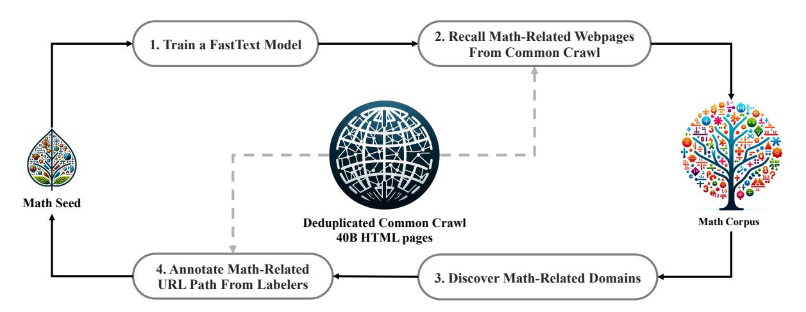

# DeepSeekMath: Pushing the Limits of Mathematical Reasoning in Open Language Models

Zhihong Shao $^{1,2*\dagger}$ , Peiyi Wang $^{1,3*\dagger}$ , Qihao Zhu $^{1,3*\dagger}$ , Runxin Xu $^1$ , Junxiao Song $^1$  Xiao Bi $^1$ , Haowei Zhang $^1$ , Mingchuan Zhang $^1$ , Y.K. Li $^1$ , Y. Wu $^1$ , Daya Guo $^{1*}$ 

<sup>1</sup>DeepSeek-AI, <sup>2</sup>Tsinghua University, <sup>3</sup>Peking University

{zhihongshao,wangpeiyi,zhuqh,guoday}@deepseek.com https://github.com/deepseek-ai/DeepSeek-Math

## **Abstract**

Mathematical reasoning poses a significant challenge for language models due to its complex and structured nature. In this paper, we introduce DeepSeekMath 7B, which continues pretraining DeepSeek-Coder-Base-v1.5 7B with 120B math-related tokens sourced from Common Crawl, together with natural language and code data. DeepSeekMath 7B has achieved an impressive score of 51.7% on the competition-level MATH benchmark without relying on external toolkits and voting techniques, approaching the performance level of Gemini-Ultra and GPT-4. Self-consistency over 64 samples from DeepSeekMath 7B achieves 60.9% on MATH. The mathematical reasoning capability of DeepSeekMath is attributed to two key factors: First, we harness the significant potential of publicly available web data through a meticulously engineered data selection pipeline. Second, we introduce Group Relative Policy Optimization (GRPO), a variant of Proximal Policy Optimization (PPO), that enhances mathematical reasoning abilities while concurrently optimizing the memory usage of PPO.


Figure 1 | Top1 accuracy of open-source models on the competition-level MATH benchmark (Hendrycks et al., 2021) without the use of external toolkits and voting techniques.

<sup>\*</sup> Core contributors.

<sup>†</sup> Work done during internship at DeepSeek-AI.

## 1. Introduction

Large language models (LLM) have revolutionized the approach to mathematical reasoning in artificial intelligence, spurring significant advancements in both the quantitative reasoning benchmark (Hendrycks et al., 2021) and the geometry reasoning benchmark (Trinh et al., 2024). Moreover, these models have proven instrumental in assisting humans in solving complex mathematical problems (Tao, 2023). However, cutting-edge models such as GPT-4 (OpenAI, 2023) and Gemini-Ultra (Anil et al., 2023) are not publicly available, and the currently accessible open-source models considerably trail behind in performance.

In this study, we introduce DeepSeekMath, a domain-specific language model that significantly outperforms the mathematical capabilities of open-source models and approaches the performance level of GPT-4 on academic benchmarks. To achieve this, we create the DeepSeek-Math Corpus, a large-scale high-quality pre-training corpus comprising 120B math tokens. This dataset is extracted from the Common Crawl (CC) using a fastText-based classifier (Joulin et al., 2016). In the initial iteration, the classifier is trained using instances from OpenWebMath (Paster et al., 2023) as positive examples, while incorporating a diverse selection of other web pages to serve as negative examples. Subsequently, we employ the classifier to mine additional positive instances from the CC, which are further refined through human annotation. The classifier is then updated with this enhanced dataset to improve its performance. The evaluation results indicate that the large-scale corpus is of high quality, as our base model DeepSeekMath-Base 7B achieves 64.2% on GSM8K (Cobbe et al., 2021) and 36.2% on the competition-level MATH dataset (Hendrycks et al., 2021), outperforming Minerva 540B (Lewkowycz et al., 2022a). In addition, the DeepSeekMath Corpus is multilingual, so we notice an improvement in Chinese mathematical benchmarks (Wei et al., 2023; Zhong et al., 2023). We believe that our experience in mathematical data processing is a starting point for the research community, and there is significant room for improvement in the future.

DeepSeekMath-Base is initialized with DeepSeek-Coder-Base-v1.5 7B (Guo et al., 2024), as we notice that starting from a code training model is a better choice compared to a general LLM. Furthermore, we observe the math training also improves model capability on MMLU (Hendrycks et al., 2020) and BBH benchmarks (Suzgun et al., 2022), indicating it does not only enhance the model's mathematical abilities but also amplifies general reasoning capabilities.

After pre-training, we apply mathematical instruction tuning to DeepSeekMath-Base with chain-of-thought (Wei et al., 2022), program-of-thought (Chen et al., 2022; Gao et al., 2023), and tool-integrated reasoning (Gou et al., 2023) data. The resulting model DeepSeekMath-Instruct 7B beats all 7B counterparts and is comparable with 70B open-source instruction-tuned models.

Furthermore, we introduce the Group Relative Policy Optimization (GRPO), a variant reinforcement learning (RL) algorithm of Proximal Policy Optimization (PPO) (Schulman et al., 2017). GRPO foregoes the critic model, instead estimating the baseline from group scores, significantly reducing training resources. By solely using a subset of English instruction tuning data, GRPO obtains a substantial improvement over the strong DeepSeekMath-Instruct, including both in-domain (GSM8K: 82.9%  $\rightarrow$  88.2%, MATH: 46.8%  $\rightarrow$  51.7%) and out-of-domain mathematical tasks (e.g., CMATH: 84.6%  $\rightarrow$  88.8%) during the reinforcement learning phase. We also provide a unified paradigm to understand different methods, such as Rejection Sampling Fine-Tuning (RFT) (Yuan et al., 2023a), Direct Preference Optimization (DPO) (Rafailov et al., 2023), PPO and GRPO. Based on such a unified paradigm, we find that all these methods are conceptualized as either direct or simplified RL techniques. We also conduct extensive experiments, e.g., online v.s. offline training, outcome v.s. process supervision, single-turn v.s. iterative RL and so on,

to deeply investigate the essential elements of this paradigm. At last, we explain why our RL boosts the performance of instruction-tuned models, and further summarize potential directions to achieve more effective RL based on this unified paradigm.

#### 1.1. Contributions

### 1.1. Contributions

## Math Pre-Training at Scale

- Our research provides compelling evidence that the publicly accessible Common Crawl data contains valuable information for mathematical purposes. By implementing a meticulously designed data selection pipeline, we successfully construct the DeepSeekMath Corpus, a high-quality dataset of 120B tokens from web pages filtered for mathematical content, which is almost 7 times the size of the math web pages used by Minerva (Lewkowycz et al., 2022a) and 9 times the size of the recently released OpenWebMath (Paster et al., 2023).
- Our pre-trained base model DeepSeekMath-Base 7B achieves comparable performance with Minerva 540B (Lewkowycz et al., 2022a), indicating the number of parameters is not the only key factor in mathematical reasoning capability. A smaller model pre-trained on high-quality data could achieve strong performance as well.
- We share our findings from math training experiments. Code training prior to math training improves models' ability to solve mathematical problems both with and without tool use. This offers a partial answer to the long-standing question: *does code training improve reasoning abilities?* We believe it does, at least for mathematical reasoning.
- Although training on arXiv papers is common, especially in many math-related papers, it brings no notable improvements on all mathematical benchmarks adopted in this paper.

## **Exploration and Analysis of Reinforcement Learning**

- We introduce Group Relative Policy Optimization (GRPO), an efficient and effective reinforcement learning algorithm. GRPO foregoes the critic model, instead estimating the baseline from group scores, significantly reducing training resources compared to Proximal Policy Optimization (PPO).
- We demonstrate that GRPO significantly enhances the performance of our instructiontuned model DeepSeekMath-Instruct, by solely using the instruction-tuning data. Furthermore, we observe enhancements in the out-of-domain performance during the reinforcement learning process.
- We provide a unified paradigm to understand different methods, such as RFT, DPO, PPO, and GRPO. We also conduct extensive experiments, e.g., online v.s. offline training, outcome v.s. process supervision, single-turn v.s. iterative reinforcement learning, and so on to deeply investigate the essential elements of this paradigm.
- Based on our unified paradigm, we explore the reasons behind the effectiveness of reinforcement learning, and summarize several potential directions to achieve more effective reinforcement learning of LLMs.

### 1.2. Summary of Evaluations and Metrics

• English and Chinese Mathematical Reasoning: We conduct comprehensive assessments of our models on English and Chinese benchmarks, covering mathematical problems

from grade-school level to college level. English benchmarks include GSM8K (Cobbe et al., 2021), MATH (Hendrycks et al., 2021), SAT (Azerbayev et al., 2023), OCW Courses (Lewkowycz et al., 2022a), MMLU-STEM (Hendrycks et al., 2020). Chinese benchmarks include MGSM-zh (Shi et al., 2023), CMATH (Wei et al., 2023), Gaokao-MathCloze (Zhong et al., 2023), and Gaokao-MathQA (Zhong et al., 2023). We evaluate models' ability to generate self-contained text solutions without tool use, and also the ability to solve problems using Python.

On English benchmarks, DeepSeekMath-Base is competitive with the closed-source Minerva 540B (Lewkowycz et al., 2022a), and surpasses all open-source base models (e.g., Mistral 7B (Jiang et al., 2023) and Llemma-34B (Azerbayev et al., 2023)), regardless of whether they've undergone math pre-training or not, often by a significant margin. Notably, DeepSeekMath-Base is superior on Chinese benchmarks, likely because we don't follow previous works (Azerbayev et al., 2023; Lewkowycz et al., 2022a) to collect English-only math pre-training data, and also include high-quality non-English ones. With mathematical instruction tuning and reinforcement learning, the resulting DeepSeekMath-Instruct and DeepSeekMath-RL demonstrate strong performance, obtaining an accuracy of over 50% on the competition-level MATH dataset for the first time within the open-source community.

- **Formal Mathematics**: We evaluate DeepSeekMath-Base using the informal-to-formal theorem proving task from (Jiang et al., 2022) on miniF2F (Zheng et al., 2021) with Isabelle (Wenzel et al., 2008) chosen to be the proof assistant. DeepSeekMath-Base demonstrates strong few-shot autoformalization performance.
- Natural Language Understanding, Reasoning, and Code: To build a comprehensive profile of models' general understanding, reasoning, and coding capabilities, we evaluate DeepSeekMath-Base on the Massive Multitask Language Understanding (MMLU) benchmark (Hendrycks et al., 2020) which encompasses 57 multiple-choice tasks covering diverse subjects, BIG-Bench Hard (BBH) (Suzgun et al., 2022) which consists of 23 challenging tasks that mostly require multi-step reasoning to solve, as well as HumanEval (Chen et al., 2021) and MBPP (Austin et al., 2021) which are widely used to evaluate code language models. Math pre-training benefits both language understanding and reasoning performance.

# 2. Math Pre-Training

## 2.1. Data Collection and Decontamination

In this section, we will outline the process of constructing the DeepSeekMath Corpus from Common Crawl. As depicted in Figure 2, we present an iterative pipeline that demonstrates how to systematically gather a large-scale mathematical corpus from Common Crawl, starting with a seed corpus (e.g., a small but high-quality collection of math-related dataset). It's worth noting that this approach is also applicable to other domains, such as coding.

First, we choose OpenWebMath (Paster et al., 2023), a collection of high-quality mathematical web texts, as our initial seed corpus. Using this corpus, we train a fastText model (Joulin et al., 2016) to recall more OpenWebMath-like mathematical web pages. Specifically, we randomly select 500,000 data points from the seed corpus as positive training examples and another 500,000 web pages from Common Crawl as negative ones. We employ an open-source library for training, configuring the vector dimension to 256, learning rate to 0.1, the maximum length

 $<sup>^{1}</sup>$ https://fasttext.cc



Figure 2 | An iterative pipeline that collects mathematical web pages from Common Crawl.

of word n-gram to 3, the minimum number of word occurrences to 3, and the number of training epochs to 3. To reduce the size of the original Common Crawl, we employ URL-based deduplication and near-deduplication techniques, resulting in 40B HTML web pages. We then recall mathematical web pages from deduplicated Common Crawl with the fastText model. To filter out low-quality mathematical content, we rank the collected pages according to their scores predicted by the fastText model, and only preserve the top-ranking ones. The volume of data preserved is assessed through pre-training experiments on the top 40B, 80B, 120B, and 160B tokens. In the first iteration, we choose to keep the top 40B tokens.

After the first iteration of data collection, numerous mathematical web pages remain uncollected, mainly because the fastText model is trained on a set of positive examples that lacks sufficient diversity. We therefore identify additional mathematical web sources to enrich the seed corpus, so that we can optimize the fastText model. Specifically, we first organize the entire Common Crawl into disjoint domains; a domain is defined as web pages sharing the same base URL. For each domain, we calculate the percentage of web pages that are collected in the first iteration. Domains where over 10% of the web pages have been collected are classified as math-related (e.g., mathoverflow.net). Subsequently, we manually annotate the URLs associated with mathematical content within these identified domains (e.g., mathoverflow.net/questions). Web pages linked to these URLs, yet uncollected, will be added to the seed corpus. This approach enables us to gather more positive examples, thereby training an improved fastText model capable of recalling more mathematical data in the subsequent iteration. After four iterations of data collection, we end up with 35.5M mathematical web pages, totaling 120B tokens. In the fourth iteration, we notice that nearly 98% of the data has already been collected in the third iteration, so we decide to cease data collection.

To avoid benchmark contamination, we follow Guo et al. (2024) to filter out web pages containing questions or answers from English mathematical benchmarks such as GSM8K (Cobbe et al., 2021) and MATH (Hendrycks et al., 2021) and Chinese benchmarks such as CMATH (Wei et al., 2023) and AGIEval (Zhong et al., 2023). The filtering criteria are as follows: any text segment containing a 10-gram string that matches exactly with any sub-string from the evaluation benchmarks is removed from our math training corpus. For benchmark texts that are shorter than 10 grams but have at least 3 grams, we employ exact matching to filter out contaminated web pages.

## 2.2. Validating the Quality of the DeepSeekMath Corpus

We run pre-training experiments to investigate how the DeepSeekMath Corpus is compared with the recently released math-training corpora:

- MathPile (Wang et al., 2023c): a multi-source corpus (8.9B tokens) aggregated from textbooks, Wikipedia, ProofWiki, CommonCrawl, StackExchange, and arXiv, with the majority (over 85%) sourced from arXiv;
- **OpenWebMath** (Paster et al., 2023): CommonCrawl data filtered for mathematical content, totaling 13.6B tokens;
- **Proof-Pile-2** (Azerbayev et al., 2023): a mathematical corpus consisting of OpenWeb-Math, AlgebraicStack (10.3B tokens of mathematical code), and arXiv papers (28.0B tokens). When experimenting on Proof-Pile-2, we follow Azerbayev et al. (2023) to use an arXiv:Web:Code ratio of 2:4:1.

### 2.2.1. Training Setting

We apply math training to a general pre-trained language model with 1.3B parameters, which shares the same framework as the DeepSeek LLMs (DeepSeek-AI, 2024), denoted as DeepSeek-LLM 1.3B. We separately train a model on each mathematical corpus for 150B tokens. All experiments are conducted using the efficient and light-weight HAI-LLM (High-flyer, 2023) training framework. Following the training practice of DeepSeek LLMs, we use the AdamW optimizer (Loshchilov and Hutter, 2017) with  $\beta_1 = 0.9$ ,  $\beta_2 = 0.95$ , and weight\_decay = 0.1, along with a multi-step learning rate schedule where the learning rate reaches the peak after 2,000 warmup steps, decreases to its 31.6% after 80% of the training process, and further decreases to 10.0% of the peak after 90% of the training process. We set the maximum value of learning rate to 5.3e-4, and use a batch size of 4M tokens with a 4K context length.

| Math Corpus         | Size   | English Benchmarks |       |      |       |              | Chinese Benchmarks |                     |                  |
|---------------------|--------|--------------------|-------|------|-------|--------------|--------------------|---------------------|------------------|
|                     |        | GSM8K              | MATH  | OCW  | SAT   | MMLU<br>STEM | CMATH              | Gaokao<br>MathCloze | Gaokao<br>MathQA |
| No Math Training    | N/A    | 2.9%               | 3.0%  | 2.9% | 15.6% | 19.5%        | 12.3%              | 0.8%                | 17.9%            |
| MathPile            | 8.9B   | 2.7%               | 3.3%  | 2.2% | 12.5% | 15.7%        | 1.2%               | 0.0%                | 2.8%             |
| OpenWebMath         | 13.6B  | 11.5%              | 8.9%  | 3.7% | 31.3% | 29.6%        | 16.8%              | 0.0%                | 14.2%            |
| Proof-Pile-2        | 51.9B  | 14.3%              | 11.2% | 3.7% | 43.8% | 29.2%        | 19.9%              | 5.1%                | 11.7%            |
| DeepSeekMath Corpus | 120.2B | 23.8%              | 13.6% | 4.8% | 56.3% | 33.1%        | 41.5%              | 5.9%                | 23.6%            |

Table 1 | Performance of DeepSeek-LLM 1.3B trained on different mathematical corpora, evaluated using few-shot chain-of-thought prompting. Corpus sizes are calculated using our tokenizer with a vocabulary size of 100K.

#### 2.2.2. Evaluation Results

The DeepSeekMath Corpus is of high quality, covers multilingual mathematical content, and is the largest in size.

• **High-quality**: We evaluate downstream performance on 8 mathematical benchmarks using few-shot chain-of-thought prompting Wei et al. (2022). As shown in Table 1, there is a clear performance lead of the model trained on the DeepSeekMath Corpus. Figure 3 shows that the model trained on the DeepSeekMath Corpus demonstrates better performance than


Figure 3 | Benchmark curves of DeepSeek-LLM 1.3B trained on different mathematical corpora.

Proof-Pile-2 at 50B tokens (1 full epoch of Proof-Pile-2), indicating the average quality of DeepSeekMath Corpus is higher.

- Multilingual: The DeepSeekMath Corpus encompasses data in multiple languages, predominantly featuring English and Chinese as the two most represented languages. As shown in Table 1, training on the DeepSeekMath Corpus enhances mathematical reasoning performance in both English and Chinese. In contrast, existing mathematical corpora, which are primarily English-centric, show limited improvement and may even hinder performance in Chinese mathematical reasoning.
- Large-scale: The DeepSeekMath Corpus is several times larger than existing mathematical corpora. As depicted in Figure 3, DeepSeek-LLM 1.3B, when trained on the DeepSeek-Math Corpus, shows a steeper learning curve along with more lasting improvements. In contrast, the baseline corpora are much smaller, and have already been repeated multiple rounds during training, with the resulting model performance quickly reaching a plateau.

## 2.3. Training and Evaluating DeepSeekMath-Base 7B

In this section, we introduce DeepSeekMath-Base 7B, a base model with strong reasoning abilities, especially in mathematics. Our model is initialized with DeepSeek-Coder-Base-v1.5 7B

(Guo et al., 2024) and trained for 500B tokens. The distribution of the data is as follows: 56% is from the DeepSeekMath Corpus, 4% from AlgebraicStack, 10% from arXiv, 20% is Github code, and the remaining 10% is natural language data from Common Crawl in both English and Chinese. We mainly adopt the training setting specified in Section 2.2.1, except that we set the maximum value of the learning rate to 4.2e-4 and use a batch size of 10M tokens.

We conduct a comprehensive assessment of the mathematical capabilities of DeepSeekMath-Base 7B, focusing on its ability to produce self-contained mathematical solutions without relying on external tools, solve mathematical problems using tools, and conduct formal theorem proving. Beyond mathematics, we also provide a more general profile of the base model, including its performance of natural language understanding, reasoning, and programming skills.

Mathematical Problem Solving with Step-by-Step Reasoning We evaluate DeepSeekMath-Base's performance of solving mathematical problems using few-shot chain-of-thought prompting (Wei et al., 2022), across eight benchmarks in English and Chinese. These benchmarks encompass quantitative reasoning (e.g., GSM8K (Cobbe et al., 2021), MATH (Hendrycks et al., 2021), and CMATH (Wei et al., 2023)) and multiple-choice problems (e.g., MMLU-STEM (Hendrycks et al., 2020) and Gaokao-MathQA (Zhong et al., 2023)), covering diverse fields of mathematics from elementary to college-level complexity.

As shown in Table 2, DeepSeekMath-Base 7B leads in performance across all eight benchmarks among the open-source base models (including the widely-used general model Mistral 7B (Jiang et al., 2023) and the recently released Llemma 34B (Azerbayev et al., 2023) which underwent math training on Proof-Pile-2 (Azerbayev et al., 2023)). Notably, on the competition-level MATH dataset, DeepSeekMath-Base surpasses existing open-source base models by over 10% absolute, and outperforms Minerva 540B (Lewkowycz et al., 2022a), a closed-source base model 77 times larger which builds on PaLM (Lewkowycz et al., 2022b) and is further trained on mathematical texts.

| Model                    | Size | English Benchmarks |       |       |       |              | Chinese Benchmarks |                     |                  |
|--------------------------|------|--------------------|-------|-------|-------|--------------|--------------------|---------------------|------------------|
|                          |      | GSM8K              | MATH  | OCW   | SAT   | MMLU<br>STEM | CMATH              | Gaokao<br>MathCloze | Gaokao<br>MathQA |
| Closed-Source Base Model |      |                    |       |       |       |              |                    |                     |                  |
| Minerva                  | 7B   | 16.2%              | 14.1% | 7.7%  | -     | 35.6%        | -                  | -                   | -                |
| Minerva                  | 62B  | 52.4%              | 27.6% | 12.0% | -     | 53.9%        | -                  | -                   | -                |
| Minerva                  | 540B | 58.8%              | 33.6% | 17.6% | -     | 63.9%        | -                  | -                   | -                |
| Open-Source Base Model   |      |                    |       |       |       |              |                    |                     |                  |
| Mistral                  | 7B   | 40.3%              | 14.3% | 9.2%  | 71.9% | 51.1%        | 44.9%              | 5.1%                | 23.4%            |
| Llemma                   | 7B   | 37.4%              | 18.1% | 6.3%  | 59.4% | 43.1%        | 43.4%              | 11.9%               | 23.6%            |
| Llemma                   | 34B  | 54.0%              | 25.3% | 10.3% | 71.9% | 52.9%        | 56.1%              | 11.9%               | 26.2%            |
| DeepSeekMath-Base        | 7B   | 64.2%              | 36.2% | 15.4% | 84.4% | 56.5%        | 71.7%              | 20.3%               | 35.3%            |

Table 2 | Comparisons between DeepSeekMath-Base 7B and strong base models on English and Chinese mathematical benchmarks. Models are evaluated with chain-of-thought prompting. Minerva results are quoted from Lewkowycz et al. (2022a).

**Mathematical Problem Solving with Tool Use** We evaluate program-aided mathematical reasoning on GSM8K and MATH using few-shot program-of-thought prompting (Chen et al., 2022; Gao et al., 2023). Models are prompted to solve each problem by writing a Python program where libraries such as *math* and *sympy* can be utilized for intricate computations. The execution result of the program is evaluated as the answer. As shown in Table 3, DeepSeekMath-Base 7B outperforms the prior state-of-the-art Llemma 34B.

| Model             | Size | Problem Solving w/ Tools |             | Informal-to-Formal Proving |              |
|-------------------|------|--------------------------|-------------|----------------------------|--------------|
|                   |      | GSM8K+Python             | MATH+Python | miniF2F-valid              | miniF2F-test |
| Mistral           | 7B   | 48.5%                    | 18.2%       | 18.9%                      | 18.0%        |
| CodeLlama         | 7B   | 27.1%                    | 17.2%       | 16.3%                      | 17.6%        |
| CodeLlama         | 34B  | 52.7%                    | 23.5%       | 18.5%                      | 18.0%        |
| Llemma            | 7B   | 41.0%                    | 18.6%       | 20.6%                      | 22.1%        |
| Llemma            | 34B  | 64.6%                    | 26.3%       | 21.0%                      | 21.3%        |
| DeepSeekMath-Base | 7B   | 66.9%                    | 31.4%       | 25.8%                      | 24.6%        |

Table 3 | Few-shot evaluation of base models' ability to solve mathematical problems using tools and the ability to conduct informal-to-formal theorem proving in Isabelle.

**Formal Mathematics** Formal proof automation is beneficial to ensure the accuracy and reliability of mathematical proofs and enhance efficiency, with increasing attention in recent years. We evaluate DeepSeekMath-Base 7B on the task of informal-to-formal proving from (Jiang et al., 2022) which is to generate a formal proof based on an informal statement, a formal counterpart of the statement, and an informal proof. We evaluate on miniF2F (Zheng et al., 2021), a benchmark for formal Olympiad-level mathematics, and generate a formal proof in Isabelle for each problem with few-shot prompting. Following Jiang et al. (2022), we leverage models to generate proof sketches, and execute the off-the-shelf automated prover Sledgehammer (Paulson, 2010) to fill in the missing details. As shown in Table 3, DeepSeekMath-Base 7B demonstrates strong performance in proof autoformalization.

| Model                     | Size | MMLU  | BBH   | HumanEval (Pass@1) | MBPP (Pass@1) |
|---------------------------|------|-------|-------|--------------------|---------------|
| Mistral                   | 7B   | 62.4% | 55.7% | 28.0%              | 41.4%         |
| DeepSeek-Coder-Base-v1.5† | 7B   | 42.9% | 42.9% | 40.2%              | 52.6%         |
| DeepSeek-Coder-Base-v1.5  | 7B   | 49.1% | 55.2% | 43.2%              | 60.4%         |
| DeepSeekMath-Base         | 7B   | 54.9% | 59.5% | 40.9%              | 52.6%         |

Table 4 | Evaluation on natural language understanding, reasoning, and code benchmarks. DeepSeek-Coder-Base-v1.5 $^{\dagger}$  is the checkpoint right before learning rate decay, which is used to train DeepSeekMath-Base. On MMLU and BBH, we use few-shot chain-of-thought prompting. On HumanEval and MBPP, we evaluate model performance under the zero-shot setting and a few-shot setting, respectively.

Natural Language Understanding, Reasoning, and Code We evaluate model performance of natural language understanding on MMLU (Hendrycks et al., 2020), reasoning on BBH (Suzgun et al., 2022), and coding capabilities on HumanEval (Chen et al., 2021) and MBPP (Austin et al.,

2021). As shown in Table 4, DeepSeekMath-Base 7B exhibits significant enhancements in performance on MMLU and BBH over its precursor, DeepSeek-Coder-Base-v1.5 (Guo et al., 2024), illustrating the positive impact of math training on language understanding and reasoning. Additionally, by including code tokens for continual training, DeepSeekMath-Base 7B effectively maintains the performance of DeepSeek-Coder-Base-v1.5 on the two coding benchmarks. Overall, DeepSeekMath-Base 7B significantly outperforms the general model Mistral 7B (Jiang et al., 2023) on the three reasoning and coding benchmarks.

# 3. Supervised Fine-Tuning

### 3.1. SFT Data Curation

We construct a mathematical instruction-tuning dataset covering English and Chinese problems from different mathematical fields and of varying complexity levels: problems are paired with solutions in chain-of-thought (CoT) (Wei et al., 2022), program-of-thought (PoT) (Chen et al., 2022; Gao et al., 2023), and tool-integrated reasoning format (Gou et al., 2023). The total number of training examples is 776K.

- English mathematical datasets: We annotate GSM8K and MATH problems with tool-integrated solutions, and adopt a subset of MathInstruct (Yue et al., 2023) along with the training set of Lila-OOD (Mishra et al., 2022) where problems are solved with CoT or PoT. Our English collection covers diverse fields of mathematics, e.g., algebra, probability, number theory, calculus, and geometry.
- Chinese mathematical datasets: We collect Chinese K-12 mathematical problems spanning 76 sub-topics such as linear equations, with solutions annotated in both CoT and toolintegrated reasoning format.

## 3.2. Training and Evaluating DeepSeekMath-Instruct 7B

In this section, we introduce DeepSeekMath-Instruct 7B which undergoes mathematical instruction tuning based on DeepSeekMath-Base. Training examples are randomly concatenated until reaching a maximum context length of 4K tokens. We train the model for 500 steps with a batch size of 256 and a constant learning rate of 5e-5.

We evaluate models' mathematical performance both without and with tool use, on 4 quantitative reasoning benchmarks in English and Chinese. We benchmark our model against the leading models of the time:

- Closed-source models include: (1) the GPT family among which GPT-4 (OpenAI, 2023) and GPT-4 Code Interpreter <sup>2</sup> are the most capable ones, (2) Gemini Ultra and Pro (Anil et al., 2023), (3) Inflection-2 (Inflection AI, 2023), (4) Grok-1 <sup>3</sup>, as well as models recently released by Chinese companies including (5) Baichuan-3 <sup>4</sup>, (6) the latest GLM-4 <sup>5</sup> from the GLM family (Du et al., 2022). These models are for general purposes, most of which have undergone a series of alignment procedures.
- Open-source models include: general models like (1) DeepSeek-LLM-Chat 67B (DeepSeek-AI, 2024), (2) Qwen 72B (Bai et al., 2023), (3) SeaLLM-v2 7B (Nguyen et al., 2023), and (4)

<sup>&</sup>lt;sup>2</sup>https://openai.com/blog/chatgpt-plugins#code-interpreter

<sup>3</sup>https://x.ai/model-card

<sup>4</sup>https://www.baichuan-ai.com

<sup>&</sup>lt;sup>5</sup>https://open.bigmodel.cn/dev/api#glm-4

ChatGLM3 6B (ChatGLM3 Team, 2023), as well as models with enhancements in mathematics including (5) InternLM2-Math 20B <sup>6</sup> which builds on InternLM2 and underwent math training followed by instruction tuning, (6) Math-Shepherd-Mistral 7B which applys PPO training (Schulman et al., 2017) to Mistral 7B (Jiang et al., 2023) with a process-supervised reward model, (7) the WizardMath series (Luo et al., 2023) which improves mathematical reasoning in Mistral 7B and Llama-2 70B (Touvron et al., 2023) using evolve-instruct (i.e., a version of instruction tuning that uses AI-evolved instructions) and PPO training with training problems primarily sourced from GSM8K and MATH, (8) MetaMath 70B (Yu et al., 2023) which is Llama-2 70B fine-tuned on an augmented version of GSM8K and MATH, (9) ToRA 34B Gou et al. (2023) which is CodeLlama 34B fine-tuned to do tool-integrated mathematical reasoning, (10) MAmmoTH 70B (Yue et al., 2023) which is Llama-2 70B instruction-tuned on MathInstruct.

As shown in Table 5, under the evaluation setting where tool use is disallowed, DeepSeekMath-Instruct 7B demonstrates strong performance of step-by-step reasoning. Notably, on the competition-level MATH dataset, our model surpasses all open-source models and the majority of proprietary models (e.g., Inflection-2 and Gemini Pro) by at least 9% absolute. This is true even for models that are substantially larger (e.g., Qwen 72B) or have been specifically enhanced through math-focused reinforcement learning (e.g., WizardMath-v1.1 7B). While DeepSeekMath-Instruct rivals the Chinese proprietary models GLM-4 and Baichuan-3 on MATH, it still underperforms GPT-4 and Gemini Ultra.

Under the evaluation setting where models are allowed to integrate natural language reasoning and program-based tool use for problem solving, DeepSeekMath-Instruct 7B approaches an accuracy of 60% on MATH, surpassing all existing open-source models. On the other benchmarks, our model is competitive with DeepSeek-LLM-Chat 67B, the prior state-of-the-art that is 10 times larger.

# 4. Reinforcement Learning

## 4.1. Group Relative Policy Optimization

Reinforcement learning (RL) has been proven to be effective in further improving the mathematical reasoning ability of LLMs after the Supervised Fine-Tuning (SFT) stage (Luo et al., 2023; Wang et al., 2023b). In this section, we introduce our efficient and effective RL algorithm, Group Relative Policy Optimization (GRPO).

#### 4.1.1. From PPO to GRPO

Proximal Policy Optimization (PPO) (Schulman et al., 2017) is an actor-critic RL algorithm that is widely used in the RL fine-tuning stage of LLMs (Ouyang et al., 2022). In particular, it optimizes LLMs by maximizing the following surrogate objective:

$$\mathcal{J}_{\text{PPO}}(\theta) = \mathbb{E}_{\big[ q \sim P(Q),\ o \sim \pi_{\theta_{\text{old}}}(O|q) \big]} \left[ \frac{1}{|o|} \sum_{t=1}^{|o|} \min\left( \frac{\pi_{\theta}(o_t|q, o_{$$

where  $\pi_{\theta}$  and  $\pi_{\theta_{old}}$  are the current and old policy models, and q, o are questions and outputs sampled from the question dataset and the old policy  $\pi_{\theta_{old}}$ , respectively.  $\varepsilon$  is a clipping-related hyper-parameter introduced in PPO for stabilizing training.  $A_t$  is the advantage, which is computed by applying Generalized Advantage Estimation (GAE) (Schulman et al., 2015), based

 $<sup>^6 {\</sup>tt https://github.com/InternLM/InternLM-Math}$ 

| Model                        | Size | English Benchmarks |       | Chinese Benchmarks |       |
|------------------------------|------|--------------------|-------|--------------------|-------|
|                              |      | GSM8K              | MATH  | MGSM-zh            | CMATH |
| Chain-of-Thought Reasoning   |      |                    |       |                    |       |
| Closed-Source Model          |      |                    |       |                    |       |
| Gemini Ultra                 | -    | 94.4%              | 53.2% | -                  | -     |
| GPT-4                        | -    | 92.0%              | 52.9% | -                  | 86.0% |
| Inflection-2                 | -    | 81.4%              | 34.8% | -                  | -     |
| GPT-3.5                      | -    | 80.8%              | 34.1% | -                  | 73.8% |
| Gemini Pro                   | -    | 86.5%              | 32.6% | -                  | -     |
| Grok-1                       | -    | 62.9%              | 23.9% | -                  | -     |
| Baichuan-3                   | -    | 88.2%              | 49.2% | -                  | -     |
| GLM-4                        | -    | 87.6%              | 47.9% | -                  | -     |
| Open-Source Model            |      |                    |       |                    |       |
| InternLM2-Math               | 20B  | 82.6%              | 37.7% | -                  | -     |
| Qwen                         | 72B  | 78.9%              | 35.2% | -                  | -     |
| Math-Shepherd-Mistral        | 7B   | 84.1%              | 33.0% | -                  | -     |
| WizardMath-v1.1              | 7B   | 83.2%              | 33.0% | -                  | -     |
| DeepSeek-LLM-Chat            | 67B  | 84.1%              | 32.6% | 74.0%              | 80.3% |
| MetaMath                     | 70B  | 82.3%              | 26.6% | 66.4%              | 70.9% |
| SeaLLM-v2                    | 7B   | 78.2%              | 27.5% | 64.8%              | -     |
| ChatGLM3                     | 6B   | 72.3%              | 25.7% | -                  | -     |
| WizardMath-v1.0              | 70B  | 81.6%              | 22.7% | 64.8%              | 65.4% |
| <b>DeepSeekMath-Instruct</b> | 7B   | 82.9%              | 46.8% | 73.2%              | 84.6% |
| <b>DeepSeekMath-RL</b>       | 7B   | 88.2%              | 51.7% | 79.6%              | 88.8% |
| Tool-Integrated Reasoning    |      |                    |       |                    |       |
| Closed-Source Model          |      |                    |       |                    |       |
| GPT-4 Code Interpreter       | -    | 97.0%              | 69.7% | -                  | -     |
| Open-Source Model            |      |                    |       |                    |       |
| InternLM2-Math               | 20B  | 80.7%              | 54.3% | -                  | -     |
| DeepSeek-LLM-Chat            | 67B  | 86.7%              | 51.1% | 76.4%              | 85.4% |
| ToRA                         | 34B  | 80.7%              | 50.8% | 41.2%              | 53.4% |
| MAMmoTH                      | 70B  | 76.9%              | 41.8% | -                  | -     |
| <b>DeepSeekMath-Instruct</b> | 7B   | 83.7%              | 57.4% | 72.0%              | 84.3% |
| <b>DeepSeekMath-RL</b>       | 7B   | 86.7%              | 58.8% | 78.4%              | 87.6% |

Table 5 | Performance of Open- and Closed-Source models with both Chain-of-Thought and Tool-Integrated Reasoning on English and Chinese Benchmarks. Scores in gray denote majority votes with 32 candidates; The others are Top1 scores. DeepSeekMath-RL 7B beats all open-source models from 7B to 70B, as well as the majority of closed-source models. Although DeepSeekMath-RL 7B is only further trained on chain-of-thought-format instruction tuning data of GSM8K and MATH, it improves over DeepSeekMath-Instruct 7B on all benchmarks.


Figure 4 | Demonstration of PPO and our GRPO. GRPO foregoes the value model, instead estimating the baseline from group scores, significantly reducing training resources.

on the rewards  $\{r_{\geq t}\}$  and a learned value function  $V_{\psi}$ . Thus, in PPO, a value function needs to be trained alongside the policy model and to mitigate over-optimization of the reward model, the standard approach is to add a per-token KL penalty from a reference model in the reward at each token (Ouyang et al., 2022), i.e.,

$$r_{t} = r_{\varphi}(q, o_{\leq t}) - \beta \log \frac{\pi_{\theta}(o_{t}|q, o_{< t})}{\pi_{ref}(o_{t}|q, o_{< t})},$$
(2)

where  $r_{\varphi}$  is the reward model,  $\pi_{ref}$  is the reference model, which is usually the initial SFT model, and  $\beta$  is the coefficient of the KL penalty.

As the value function employed in PPO is typically another model of comparable size as the policy model, it brings a substantial memory and computational burden. Additionally, during RL training, the value function is treated as a baseline in the calculation of the advantage for variance reduction. While in the LLM context, usually only the last token is assigned a reward score by the reward model, which may complicate the training of a value function that is accurate at each token. To address this, as shown in Figure 4, we propose Group Relative Policy Optimization (GRPO), which obviates the need for additional value function approximation as in PPO, and instead uses the average reward of multiple sampled outputs, produced in response to the same question, as the baseline. More specifically, for each question q, GRPO samples a group of outputs  $\{o_1, o_2, \cdots, o_G\}$  from the old policy  $\pi_{\theta_{old}}$  and then optimizes the policy model by maximizing the following objective:

$$\mathcal{J}_{\text{GRPO}}(\theta) = \mathbb{E}\left[q \sim P(Q), \{o_i\}_{i=1}^G \sim \pi_{\theta_{\text{old}}}(O|q)\right] \\ \frac{1}{G} \sum_{i=1}^{G} \frac{1}{|o_i|} \sum_{t=1}^{|o_i|} \left\{ \min \left[ \frac{\pi_\theta(o_{i,t}|q, o_{i,$$

where  $\varepsilon$  and  $\beta$  are hyper-parameters, and  $\hat{A}_{i,t}$  is the advantage calculated based on relative rewards of the outputs inside each group only, which will be detailed in the following subsections. The group relative way that GRPO leverages to calculate the advantages, aligns well with the comparative nature of rewards models, as reward models are typically trained on datasets of comparisons between outputs on the same question. Also note that, instead of adding KL penalty in the reward, GRPO regularizes by directly adding the KL divergence between the trained policy and the reference policy to the loss, avoiding complicating the calculation of  $\hat{A}_{i,t}$ .

## Algorithm 1 Iterative Group Relative Policy Optimization

```
Input initial policy model \pi_{\theta_{\text{init}}}; reward models r_{\varphi}; task prompts \mathcal{D}; hyperparameters \varepsilon, \beta, \mu
 1: policy model \pi_{\theta} \leftarrow \pi_{\theta_{\text{init}}}
 2: for iteration = 1, ..., I do
          reference model \pi_{ref} \leftarrow \pi_{\theta}
 4:
           for step = 1, \ldots, M do
                Sample a batch \mathcal{D}_b from \mathcal{D}
 5:
                Update the old policy model \pi_{\theta_{old}} \leftarrow \pi_{\theta}
 6:
                Sample G outputs \{o_i\}_{i=1}^G \sim \pi_{\theta_{old}}(\cdot \mid q) for each question q \in \mathcal{D}_b
Compute rewards \{r_i\}_{i=1}^G for each sampled output o_i by running r_{\varphi}
 7:
 8:
                Compute \hat{A}_{i,t} for the t-th token of o_i through group relative advantage estimation.
 9:
10:
                for GRPO iteration = 1, ..., \mu do
                     Update the policy model \pi_{\theta} by maximizing the GRPO objective (Equation 21)
11:
           Update r_{\omega} through continuous training using a replay mechanism.
Output \pi_{\theta}
```

 $\frac{\mathbf{Output}\,\pi_{\theta}}{\mathbf{Output}}$ 

And different from the KL penalty term used in (2), we estimate the KL divergence with the following unbiased estimator (Schulman, 2020):

$$\mathbb{D}_{KL}\left[\pi_{\theta}||\pi_{\text{ref}}\right] = \frac{\pi_{\text{ref}}(o_{i,t}|q,o_{i,$$

which is guaranteed to be positive.

### 4.1.2. Outcome Supervision RL with GRPO

Formally, for each question q, a group of outputs  $\{o_1, o_2, \cdots, o_G\}$  are sampled from the old policy model  $\pi_{\theta_{old}}$ . A reward model is then used to score the outputs, yielding G rewards  $\mathbf{r} = \{r_1, r_2, \cdots, r_G\}$  correspondingly. Subsequently, these rewards are normalized by subtracting the group average and dividing by the group standard deviation. Outcome supervision provides the normalized reward at the end of each output  $o_i$  and sets the advantages  $\hat{A}_{i,t}$  of all tokens in the output as the normalized reward, i.e.,  $\hat{A}_{i,t} = \tilde{r}_i = \frac{r_i - \text{mean}(\mathbf{r})}{\text{std}(\mathbf{r})}$ , and then optimizes the policy by maximizing the objective defined in equation (3).

#### 4.1.3. Process Supervision RL with GRPO

Outcome supervision only provides a reward at the end of each output, which may not be sufficient and efficient to supervise the policy in complex mathematical tasks. Following Wang et al. (2023b), we also explore process supervision, which provides a reward at the end of each reasoning step. Formally, given the question q and G sampled outputs  $\{o_1, o_2, \cdots, o_G\}$ , a process reward model is used to score each step of the outputs, yielding corresponding rewards:  $\mathbf{R} = \{\{r_1^{index(1)}, \cdots, r_1^{index(K_1)}\}, \cdots, \{r_G^{index(1)}, \cdots, r_G^{index(K_G)}\}\}$ , where index(j) is the end token index of the j-th step, and  $K_i$  is the total number of steps in the i-th output. We also normalize these rewards with the average and the standard deviation, i.e.,  $\tilde{r}_i^{index(j)} = \frac{r_i^{index(j)} - \text{mean}(\mathbf{R})}{\text{std}(\mathbf{R})}$ . Subsequently, the process supervision calculates the advantage of each token as the sum of the normalized rewards from the following steps, i.e.,  $\hat{A}_{i,t} = \sum_{index(j) \geq t} \tilde{r}_i^{index(j)}$ , and then optimizes the policy by maximizing the objective defined in equation (3).

#### 4.1.4. Iterative RL with GRPO

As the reinforcement learning training process progresses, the old reward model may not be sufficient to supervise the current policy model. Therefore, we also explore the iterative RL with GRPO. As shown in Algorithm 1, in iterative GRPO, we generate new training sets for the reward model based on the sampling results from the policy model and continually train the old reward model using a replay mechanism that incorporates 10% of historical data. Then, we set the reference model as the policy model, and continually train the policy model with the new reward model.

## 4.2. Training and Evaluating DeepSeekMath-RL

We conduct RL based on DeepSeekMath-Instruct 7B. The training data of RL are chain-of-thought-format questions related to GSM8K and MATH from the SFT data, which consists of around 144K questions. We exclude other SFT questions to investigate the impact of RL on benchmarks that lack data throughout the RL phase. We construct the training set of reward models following (Wang et al., 2023b). We train our initial reward model based on the DeepSeekMath-Base 7B with a learning rate of 2e-5. For GRPO, we set the learning rate of the policy model as 1e-6. The KL coefficient is 0.04. For each question, we sample 64 outputs. The max length is set to 1024, and the training batch size is 1024. The policy model only has a single update following each exploration stage. We evaluate DeepSeekMath-RL 7B on benchmarks following DeepSeekMath-Instruct 7B. For DeepSeekMath-RL 7B, GSM8K and MATH with chain-of-thought reasoning can be regarded as in-domain tasks and all the other benchmarks can be regarded as out-of-domain tasks.

Table 5 demonstrates the performance of open- and closed-source models with both chain-of-thought and tool-integrated reasoning on English and Chinese benchmarks. We find that: 1) DeepSeekMath-RL 7B attains accuracies of 88.2% and 51.7% on GSM8K and MATH, respectively, utilizing chain-of-thought reasoning. This performance surpasses that of all open-source models in the 7B to 70B range, as well as the majority of closed-source models. 2) Crucially, DeepSeekMath-RL 7B is only trained on chain-of-thought-format instruction tuning data of GSM8K and MATH, starting from DeepSeekMath-Instruct 7B. Despite the constrained scope of its training data, it outperforms DeepSeekMath-Instruct 7B across all evaluation metrics, showcasing the effectiveness of reinforcement learning.

### 5. Discussion

In this section, we will share our findings in pre-training and RL experiments.

## 5.1. Lessons Learnt in Pre-Training

We first share our experience in pre-training. Unless otherwise specified, we will adhere to the training settings outlined in Section 2.2.1. It is worth noting that, when referring to the DeepSeekMath Corpus in this section, we use an 89B-token dataset from the second iteration of the data collection process.

#### 5.1.1. Code Training Benefits Mathematical Reasoning

A popular yet unverified hypothesis suggests that code training improves reasoning. We attempt to offer a partial response to this, particularly within the mathematical domain: code training

| Training Setting           | Training Tokens |      |      | w/o Tool Use |       |       | w/ Tool Use  |             |  |
|----------------------------|-----------------|------|------|--------------|-------|-------|--------------|-------------|--|
|                            | General         | Code | Math | GSM8K        | MATH  | CMATH | GSM8K+Python | MATH+Python |  |
| No Continual Training      | –               | –    | –    | 2.9%         | 3.0%  | 12.3% | 2.7%         | 2.3%        |  |
| Two-Stage Training         |                 |      |      |              |       |       |              |             |  |
| Stage 1: General Training  | 400B            | –    | –    | 2.9%         | 3.2%  | 14.8% | 3.3%         | 2.3%        |  |
| Stage 2: Math Training     | –               | –    | 150B | 19.1%        | 14.4% | 37.2% | 14.3%        | 6.7%        |  |
| Stage 1: Code Training     | –               | 400B | –    | 5.9%         | 3.6%  | 19.9% | 12.4%        | 10.0%       |  |
| Stage 2: Math Training     | –               | –    | 150B | 21.9%        | 15.3% | 39.7% | 17.4%        | 9.4%        |  |
| One-Stage Training         |                 |      |      |              |       |       |              |             |  |
| Math Training              | –               | –    | 150B | 20.5%        | 13.1% | 37.6% | 11.4%        | 6.5%        |  |
| Code & Math Mixed Training | –               | 400B | 150B | 17.6%        | 12.1% | 36.3% | 19.7%        | 13.5%       |  |

Table 6 | Investigation of how code affects mathematical reasoning under different training settings. We experiment with DeepSeek-LLM 1.3B, and evaluate its mathematical reasoning performance without and with tool use via few-shot chain-of-thought prompting and few-shot program-of-thought prompting, respectively.

improves models' ability to do mathematical reasoning both with and without tool use.

To study how code training affects mathematical reasoning, we experimented with the following two-stage training and one-stage training settings:

### **Two-Stage Training**

- Code Training for 400B Tokens → Math Training for 150B Tokens: We train DeepSeek-LLM 1.3B for 400B code tokens followed by 150B math tokens;
- General Training for 400B Tokens → Math Training for 150B Tokens: As a control experiment, we also experiment with general tokens (sampled from a large-scale general corpus created by DeepSeek-AI) instead of code tokens in the first stage of training, in an attempt to investigate the advantages of code tokens over general tokens in improving mathematical reasoning.

### **One-Stage Training**

- Math Training for 150B Tokens: We train DeepSeek-LLM 1.3B for 150B math tokens;
- Training on a mixture of 400B Code Tokens and 150B Math Tokens: Math training following code training degrades coding performance. We investigate whether code tokens, when mixed with math tokens for one-stage training, would still improve mathematical reasoning and also alleviate the problem of catastrophic forgetting.

**Results** Table 6 and Table 7 demonstrate the downstream performance under different training settings.

Code training benefits program-aided mathematical reasoning, both under the two-stage training and one-stage training settings. As shown in Table 6, under the two-stage training setting, code training alone already significantly enhances the ability to solve GSM8K and MATH problems using Python. Math training in the second stage yields further improvements. Interestingly, under the one-stage training setting, mixing code tokens and math tokens effectively mitigates the issue of catastrophic forgetting that arises from two-stage training, and also synergizes coding (Table 7) and program-aided mathematical reasoning (Table 6).

| Training Setting           | Training Tokens |      |      | MMLU         | BBH          | HumanEval (Pass@1) | MBPP (Pass@1) |
|----------------------------|-----------------|------|------|--------------|--------------|--------------------|---------------|
|                            | General         | Code | Math |              |              |                    |               |
| No Continual Training      | –               | –    | –    | 24.5%        | 28.1%        | 12.2%              | 13.0%         |
| Two-Stage Training         |                 |      |      |              |              |                    |               |
| Stage 1: General Training  | 400B            | –    | –    | 25.9%        | 27.7%        | 15.2%              | 13.6%         |
| Stage 2: Math Training     | –               | –    | 150B | 33.1%        | 32.7%        | 12.8%              | 13.2%         |
| Stage 1: Code Training     | –               | 400B | –    | 25.0%        | 31.5%        | 25.0%              | <b>40.0%</b>  |
| Stage 2: Math Training     | –               | –    | 150B | <b>36.2%</b> | 35.3%        | 12.2%              | 17.0%         |
| One-Stage Training         |                 |      |      |              |              |                    |               |
| Math Training              | –               | –    | 150B | 32.3%        | 32.5%        | 11.6%              | 13.2%         |
| Code & Math Mixed Training | –               | 400B | 150B | 33.5%        | <b>35.6%</b> | <b>29.3%</b>       | <b>39.4%</b>  |

Table 7 | Investigation of how different settings of code and math training affect model performance of language understanding, reasoning, and coding. We experiment with DeepSeek-LLM 1.3B. We evaluate the models on MMLU and BBH using few-shot chain-of-thought prompting. On HumanEval and MBPP, we conduct zero-shot and few-shot evaluations, respectively.

| Model                    | Size  | ArXiv Corpus     | English Benchmarks |       |       |       |              | Chinese Benchmarks |                     |                  |
|--------------------------|-------|------------------|--------------------|-------|-------|-------|--------------|--------------------|---------------------|------------------|
| DeepSeek-LLM             | 1.3B  |                  | GSM8K              | MATH  | OCW   | SAT   | MMLU<br>STEM | CMATH              | Gaokao<br>MathCloze | Gaokao<br>MathQA |
|                          |       | No Math Training | 2.9%               | 3.0%  | 2.9%  | 15.6% | 19.5%        | 12.3%              | 0.8%                | 17.9%            |
|                          |       | MathPile         | 2.7%               | 3.3%  | 2.2%  | 12.5% | 15.7%        | 1.2%               | 0.0%                | 2.8%             |
| ArXiv-RedPajama          | 3.3%  | 3.4%             | 4.0%               | 9.4%  | 9.0%  | 7.4%  | 0.8%         | 2.3%               |                     |                  |
| DeepSeek-Coder-Base-v1.5 | 7B    |                  | GSM8K              | MATH  | OCW   | SAT   | MMLU<br>STEM | CMATH              | Gaokao<br>MathCloze | Gaokao<br>MathQA |
|                          |       | No Math Training | 29.0%              | 12.5% | 6.6%  | 40.6% | 38.1%        | 45.9%              | 5.9%                | 21.1%            |
|                          |       | MathPile         | 23.6%              | 11.5% | 7.0%  | 46.9% | 35.8%        | 37.9%              | 4.2%                | 25.6%            |
| ArXiv-RedPajama          | 28.1% | 11.1%            | 7.7%               | 50.0% | 35.2% | 42.6% | 7.6%         | 24.8%              |                     |                  |

Table 8 | Effect of math training on different arXiv datasets. Model performance is evaluated with few-shot chain-of-thought prompting.

| ArXiv Corpus     | miniF2F-valid | miniF2F-test |
|------------------|---------------|--------------|
| No Math Training | 20.1%         | 21.7%        |
| MathPile         | 16.8%         | 16.4%        |
| ArXiv-RedPajama  | 14.8%         | 11.9%        |

Table 9 | Effect of math training on different arXiv corpora, the base model being DeepSeek-Coder-Base-v1.5 7B. We evaluate informal-to-formal proving in Isabelle.

Code training also improves mathematical reasoning without tool use. Under the two-stage training setting, the initial stage of code training already results in moderate enhancements. It also boosts the efficiency of the subsequent math training, eventually leading to the best performance. However, combining code tokens and math tokens for one-stage training compromises mathematical reasoning without tool use. One conjecture is that DeepSeek-LLM 1.3B, due to its limited scale, lacks the capacity to fully assimilate both code and mathematical data simultaneously.

## 5.1.2. ArXiv Papers Seem Ineffective in Improving Mathematical Reasoning

ArXiv papers are commonly included as a component of math pre-training data (Azerbayev et al., 2023; Lewkowycz et al., 2022a; Polu and Sutskever, 2020; Wang et al., 2023c). However,

detailed analysis regarding their impact on mathematical reasoning has not been extensively conducted. Perhaps counter-intuitively, according to our experiments, arXiv papers seem ineffective in improving mathematical reasoning. We experiment with models of different sizes, including DeepSeek-LLM 1.3B and DeepSeek-Coder-Base-v1.5 7B (Guo et al., 2024), using arXiv corpora that underwent varied processing pipelines:

- MathPile (Wang et al., 2023c): an 8.9B-token corpus developed with cleaning and filtering heuristic rules, over 85% of which are scientific arXiv papers;
- **ArXiv-RedPajama** (Computer, 2023): the entirety of arXiv LaTeX files with preambles, comments, macros, and bibliographies removed, totaling 28.0B tokens.

In our experiments, we separately train DeepSeek-LLM 1.3B for 150B tokens and DeepSeek-Coder-Base-v1.57B for 40B tokens on each arXiv corpus. It seems that arXiv papers are ineffective in improving mathematical reasoning. When trained on a arXiv-only corpus, both models display no notable improvements or even deterioration across various mathematical benchmarks of different complexities employed in this study. These benchmarks include quantitative reasoning datasets like GSM8K and MATH (Table 8), multiple-choice challenges like MMLU-STEM (Table 8), and formal mathematics like miniF2F (Table 9).

However, this conclusion has its limitations and should be taken with a grain of salt. We have not yet studied:

- The impact of arXiv tokens on specific math-related tasks not included in this research, such as informalization of theorems which is to convert formal statements or proofs to their informal versions;
- The effect of arXiv tokens when combined with other types of data;
- Whether the benefits of arXiv papers would manifest themselves at a larger model scale.

Thus, further exploration is required, which we leave for future studies.

#### 5.2. Insights of Reinforcement Learning

#### 5.2.1. Towards to a Unified Paradigm

In this section, we provide a unified paradigm to analyze different training methods, such as SFT, RFT, DPO, PPO, GRPO, and further conduct experiments to explore the factors of the unified paradigm. Generally, the gradient with respect to the parameter  $\theta$  of a training method can be written as:

$$\nabla_{\theta} \mathcal{J}_{\mathcal{A}}(\theta) = \mathbb{E}\left[\underbrace{(q, o) \sim \mathcal{D}}_{\text{Data Source}}\right] \left(\frac{1}{|o|} \sum_{t=1}^{|o|} \underbrace{GC_{\mathcal{A}}(q, o, t, \pi_{rf})}_{\text{Gradient Coefficient}} \nabla_{\theta} \log \pi_{\theta}(o_{t}|q, o_{< t})\right). \tag{5}$$

There exist three key components: 1) *Data Source*  $\mathcal{D}$ , which determines the training data; 2) *Reward Function*  $\pi_{rf}$ , which is the source of the training reward signal; 3) *Algorithm*  $\mathcal{A}$ : which processes the training data and the reward signal to the gradient coefficient GC that determines the magnitude of the penalty or reinforcement for the data. We analyze several representative methods based on such a unified paradigm:

• **Supervised Fine-tuning (SFT)**: SFT fine-tunes pretrained model on human selected SFT data.

| Methods    | Data Source                                                 | Reward Function | Gradient Coefficient |
|------------|-------------------------------------------------------------|-----------------|----------------------|
| SFT        | $q,o \sim P_{sft}(Q,O)$                                     | -               | 1                    |
| RFT        | $q \sim P_{sft}(Q), o \sim \pi_{sft}(O q)$                  | Rule            | Equation 10          |
| DPO        | $q \sim P_{sft}(Q), o^+, o^- \sim \pi_{sft}(O q)$           | Rule            | Equation 14          |
| Online RFT | $q \sim P_{sft}(Q), o \sim \pi_{\theta}(O q)$               | Rule            | Equation 10          |
| PPO        | $q \sim P_{sft}(Q), o \sim \pi_{\theta}(O q)$               | Model           | Equation 18          |
| GRPO       | $q \sim P_{sft}(Q), \{o_i\}_{i=1}^G \sim \pi_{\theta}(O q)$ | Model           | Equation 21          |

Table 10 | The data source and gradient coefficient of different methods.  $P_{sft}$  denotes the data distribution of supervised fine-tuning datasets.  $\pi_{\theta_{sft}}$  and  $\pi_{\theta}$  denote the supervised fine-tuned model and the real-time policy model during the online training process, respectively.


Figure 5 | Performance of the DeepSeekMath-Instruct 1.3B model, which was further trained using various methods, on two benchmarks.

- **Rejection Sampling Fine-tuning (RFT)**: RFT further fine-tunes the SFT model on the filtered outputs sampled from the SFT model based on SFT questions. RFT filters the outputs based on the correctness of their answers.
- **Direct Preference Optimization (DPO)**: DPO further refines the SFT model by fine-tuning it on augmented outputs sampled from the SFT model, using pair-wise DPO loss.
- Online Rejection Sampling Fine-tuning (Online RFT): Different from RFT, Online RFT initiates the policy model using the SFT model and refines it by fine-tuning with the augmented outputs sampled from the real-time policy model.
- **PPO/GRPO**: PPO/GRPO initializes the policy model using the SFT model and reinforces it with the outputs sampled from the real-time policy model.

We summarize the components of these methods in Table 10. Please refer to Appendix A.1 for a more detailed derivation process.

**Observation about Data Source** We divide the data source into two categories, online sampling, and offline sampling. Online sampling denotes that the training data is from the exploration results of the real-time training policy model, while offline sampling denotes that the


Figure 6 | Performance of iterative reinforcement learning with DeepSeekMath-Instruct 7B on two benchmarks.

training data is from the sampling results of the initial SFT model. RFT and DPO follow the offline style, while Online RFT and GRPO follow the online style.

As shown in Figure 5, we find that the Online RFT significantly outperforms RFT on two benchmarks. Specifically, Online RFT is comparable to RFT in the early stage of training but gains an absolute advantage in the later stage, demonstrating the superiority of online training. This is intuitive, as in the initial stage, the actor and the SFT model exhibit close resemblance, with the sampled data revealing only minor differences. In the later stage, however, the data sampled from the actor will exhibit more significant differences, and real-time data sampling will offer greater advantages.

**Observation about Gradient Coefficient** The algorithm processes the reward signal to the gradient coefficient to update the model parameter. We divide the reward function as 'Rule' and 'Model' in our experiments. Rule refers to judging the quality of a response based on the correctness of the answer, and Model denotes that we train a reward model to score each response. The training data of the reward model is based on the rule judgment. Equations 10 and 21 highlight a key difference between GRPO and Online RFT: GRPO uniquely adjusts its gradient coefficient based on the reward value provided by the reward model. This allows for differential reinforcement and penalization of responses according to their varying magnitudes. In contrast, Online RFT lacks this feature; it does not penalize incorrect responses and uniformly reinforces all responses with correct answers at the same level of intensity.

As demonstrated in Figure 5, GRPO surpasses online RFT, thereby highlighting the efficiency of altering positive and negative gradient coefficients. In addition, GRPO+PS shows superior performance compared to GRPO+OS, indicating the benefits of using fine-grained, step-aware gradient coefficients. Furthermore, we explore the iterative RL, in our experiments, we conduct two rounds of iteration. As shown in Figure 6, we notice that the iterative RL significantly improves the performance, especially at the first iteration.


Figure 7 | The Maj@K and Pass@K of SFT and RL DeepSeekMath 7B on GSM8K and MATH (temperature 0.7). It was noted that RL enhances Maj@K but not Pass@K.

### 5.2.2. Why RL Works?

In this paper, we conduct reinforcement learning based on a subset of instruction tuning data, and it achieves significant performance enhancement upon the instruction tuning model. To further explain why reinforcement learning works. We evaluate the Pass@K and Maj@K accuracy of the Instruct and RL models on two benchmarks. As shown in Figure 7, RL enhances Maj@K's performance but not Pass@K. These findings indicate that RL enhances the model's overall performance by rendering the output distribution more robust, in other words, it seems that the improvement is attributed to boosting the correct response from TopK rather than the enhancement of fundamental capabilities. Similarly, (Wang et al., 2023a) identified a misalignment problem in reasoning tasks within the SFT model, showing that the reasoning performance of SFT models can be improved through a series of preference alignment strategies (Song et al., 2023; Wang et al., 2023a; Yuan et al., 2023b).

#### 5.2.3. How to Achieve More Effective RL?

We demonstrate RL works pretty well in mathematical reasoning tasks. We also provide a unified paradigm to understand different representative training methods. Within this paradigm, all methods are conceptualized as either direct or simplified RL techniques. As summarized in Equation 5, there exist three key components: Data Source, Algorithm, and Reward Function. We provide some potential future directions about the three components.

**Data Source** Data source is the raw material of all training methods. In the context of RL, we specifically refer to the data source as the unlabeled questions with the outputs sampled from the policy model. In this paper, we only use the questions from the instruction tuning stage and a naive nucleus sampling to sample outputs. We think this is a potential reason that our RL pipeline only improves the Maj@K performance. In the future, we will explore our RL pipeline on out-of-distribution question prompts, in conjunction with **advanced sampling (decoding) strategies**, like those based on tree-search methods (Yao et al., 2023). Also, the **efficient inference techniques** (Kwon et al., 2023; Leviathan et al., 2023; Xia et al., 2023, 2024), which determines

the exploration efficiency of policy models, also play an exceedingly important role.

Algorithms Algorithms process the data and reward signal to the gradient coefficient to update the model parameter. Based on Equation 5, to some extent, all methods now fully **TRUST** the signal of the reward function to increase or decrease the conditional probability of a certain token. However, it is impossible to ensure the reward signal is always reliable, especially in extremely complex tasks. For example, even the PRM800K datasets (Lightman et al., 2023), which have been carefully annotated by well-trained annotators, still contain approximately 20% of incorrectly annotations<sup>7</sup>. To this end, we will explore the reinforcement learning algorithm that is robust against noisy reward signals. We believe such **WEAK-TO-STRONG** (Burns et al., 2023) alignment methods will bring a fundamental change to the learning algorithms.

Reward Function Reward function is the source of the training signal. In RL, the reward function is usually the neural reward model. We think there exist three important directions for reward models: 1) How to enhance the generalization ability of the reward model. The reward model must be effectively generalized to handle out-of-distribution questions and advanced decoding outputs; otherwise, reinforcement learning may merely stabilize the distribution of LLMs rather than improve their fundamental capabilities; 2) How to reflect the uncertainty of reward model. The uncertainty could potentially act as a linking bridge between the weak reward model and the weak-to-strong learning algorithms; 3) How to efficiently build high-quality process reward models that can provide fine-grained training signals for the reasoning process (Lightman et al., 2023; Wang et al., 2023b).

# 6. Conclusion, Limitation, and Future Work

We present DeepSeekMath, which outperforms all open-source models on the competition-level MATH benchmark and approaches the performance of closed models. DeepSeekMath is initialized with DeepSeek-Coder-v1.5 7B and undergoes continual training for 500B tokens, with a significant component of the training data being 120B math tokens sourced from Common Crawl. Our extensive ablation study shows web pages offer significant potential for high-quality mathematical data, while arXiv may not as beneficial as we expected. We introduce Group Relative Policy Optimization (GRPO), a variant of Proximal Policy Optimization (PPO), which can notably improve mathematical reasoning capabilities with less memory consumption. The experiment results show that GRPO is effective even if DeepSeekMath-Instruct 7B has reached a high score on benchmarks. We also provide a unified paradigm to understand a series of methods and summarize several potential directions for more effective reinforcement learning.

Although DeepSeekMath achieves impressive scores on quantitative reasoning benchmarks, its capability on geometry and theorem-proof are relatively weaker than closed models. For instance, in our dry run, the model cannot handle problems related to triangles and ellipses, which may indicate data selection bias in pre-training and fine-tuning. In addition, restricted by the model scale, DeepSeekMath is worse than GPT-4 on few-shot capability. GPT-4 could improve its performance with few-shot inputs, while DeepSeekMath shows similar performance in zero-shot and few-shot evaluation. In the future, we will further improve our engineered data selection pipeline to construct more high-quality pre-trained corpus. In addition, we will explore the potential directions (Section 5.2.3) for more effective reinforcement learning of LLMs.

<sup>7</sup>https://github.com/openai/prm800k/issues/12#issuecomment-1728491852

## References

- R. Anil, S. Borgeaud, Y. Wu, J. Alayrac, J. Yu, R. Soricut, J. Schalkwyk, A. M. Dai, A. Hauth, K. Millican, D. Silver, S. Petrov, M. Johnson, I. Antonoglou, J. Schrittwieser, A. Glaese, J. Chen, E. Pitler, T. P. Lillicrap, A. Lazaridou, O. Firat, J. Molloy, M. Isard, P. R. Barham, T. Hennigan, B. Lee, F. Viola, M. Reynolds, Y. Xu, R. Doherty, E. Collins, C. Meyer, E. Rutherford, E. Moreira, K. Ayoub, M. Goel, G. Tucker, E. Piqueras, M. Krikun, I. Barr, N. Savinov, I. Danihelka, B. Roelofs, A. White, A. Andreassen, T. von Glehn, L. Yagati, M. Kazemi, L. Gonzalez, M. Khalman, J. Sygnowski, and et al. Gemini: A family of highly capable multimodal models. <a href="CoRR">CORR</a>, abs/2312.11805, 2023. doi: 10.48550/ARXIV.2312.11805. URL https://doi.org/10.48550/arXiv.2312.11805.
- J. Austin, A. Odena, M. Nye, M. Bosma, H. Michalewski, D. Dohan, E. Jiang, C. Cai, M. Terry, Q. Le, et al. Program synthesis with large language models. <a href="arXiv:2108.07732">arXiv:preprint arXiv:2108.07732</a>, 2021.
- Z. Azerbayev, H. Schoelkopf, K. Paster, M. D. Santos, S. McAleer, A. Q. Jiang, J. Deng, S. Biderman, and S. Welleck. Llemma: An open language model for mathematics. <a href="arXiv:2310.10631"><u>arXiv:2310.10631</u></a>, 2023.
- J. Bai, S. Bai, Y. Chu, Z. Cui, K. Dang, X. Deng, Y. Fan, W. Ge, Y. Han, F. Huang, et al. Qwen technical report. arXiv preprint arXiv:2309.16609, 2023.
- C. Burns, P. Izmailov, J. H. Kirchner, B. Baker, L. Gao, L. Aschenbrenner, Y. Chen, A. Ecoffet, M. Joglekar, J. Leike, et al. Weak-to-strong generalization: Eliciting strong capabilities with weak supervision. arXiv preprint arXiv:2312.09390, 2023.
- ChatGLM3 Team. Chatglm3 series: Open bilingual chat llms, 2023. URL https://github.com/THUDM/ChatGLM3.
- M. Chen, J. Tworek, H. Jun, Q. Yuan, H. P. de Oliveira Pinto, J. Kaplan, H. Edwards, Y. Burda, N. Joseph, G. Brockman, A. Ray, R. Puri, G. Krueger, M. Petrov, H. Khlaaf, G. Sastry, P. Mishkin, B. Chan, S. Gray, N. Ryder, M. Pavlov, A. Power, L. Kaiser, M. Bavarian, C. Winter, P. Tillet, F. P. Such, D. Cummings, M. Plappert, F. Chantzis, E. Barnes, A. Herbert-Voss, W. H. Guss, A. Nichol, A. Paino, N. Tezak, J. Tang, I. Babuschkin, S. Balaji, S. Jain, W. Saunders, C. Hesse, A. N. Carr, J. Leike, J. Achiam, V. Misra, E. Morikawa, A. Radford, M. Knight, M. Brundage, M. Murati, K. Mayer, P. Welinder, B. McGrew, D. Amodei, S. McCandlish, I. Sutskever, and W. Zaremba. Evaluating large language models trained on code. <a href="CoRR"><u>CoRR</u></a>, abs/2107.03374, 2021. URL https://arxiv.org/abs/2107.03374.
- W. Chen, X. Ma, X. Wang, and W. W. Cohen. Program of thoughts prompting: Disentangling computation from reasoning for numerical reasoning tasks. <u>CoRR</u>, abs/2211.12588, 2022. doi: 10.48550/ARXIV.2211.12588. URL https://doi.org/10.48550/arXiv.2211.12588.
- K. Cobbe, V. Kosaraju, M. Bavarian, M. Chen, H. Jun, L. Kaiser, M. Plappert, J. Tworek, J. Hilton, R. Nakano, et al. Training verifiers to solve math word problems. <u>arXiv preprint</u> arXiv:2110.14168, 2021.
- T. Computer. Redpajama: an open dataset for training large language models, Oct. 2023. URL https://github.com/togethercomputer/RedPajama-Data.
- DeepSeek-AI. Deepseek LLM: scaling open-source language models with longtermism. <u>CoRR</u>, abs/2401.02954, 2024. doi: 10.48550/ARXIV.2401.02954. URL https://doi.org/10.48550/arXiv.2401.02954.

- Z. Du, Y. Qian, X. Liu, M. Ding, J. Qiu, Z. Yang, and J. Tang. Glm: General language model pretraining with autoregressive blank infilling. In Proceedings of the 60th Annual Meeting of the Association for Computational Linguistics (Volume 1: Long Papers), pages 320–335, 2022.
- L. Gao, A. Madaan, S. Zhou, U. Alon, P. Liu, Y. Yang, J. Callan, and G. Neubig. PAL: programaided language models. In A. Krause, E. Brunskill, K. Cho, B. Engelhardt, S. Sabato, and J. Scarlett, editors, International Conference on Machine Learning, ICML 2023, 23-29 July 2023, Honolulu, Hawaii, USA, volume 202 of Proceedings of Machine Learning Research, pages 10764–10799. PMLR, 2023. URL https://proceedings.mlr.press/v202/gao23f.html.
- Z. Gou, Z. Shao, Y. Gong, Y. Shen, Y. Yang, M. Huang, N. Duan, and W. Chen. Tora: A toolintegrated reasoning agent for mathematical problem solving. <u>CoRR</u>, abs/2309.17452, 2023. doi: 10.48550/ARXIV.2309.17452. URL https://doi.org/10.48550/arXiv.2309.1745
- D. Guo, Q. Zhu, D. Yang, Z. Xie, K. Dong, W. Zhang, G. Chen, X. Bi, Y. Wu, Y. K. Li, F. Luo, Y. Xiong, and W. Liang. Deepseek-coder: When the large language model meets programming the rise of code intelligence, 2024.
- D. Hendrycks, C. Burns, S. Basart, A. Zou, M. Mazeika, D. Song, and J. Steinhardt. Measuring massive multitask language understanding. arXiv preprint arXiv:2009.03300, 2020.
- D. Hendrycks, C. Burns, S. Kadavath, A. Arora, S. Basart, E. Tang, D. Song, and J. Steinhardt. Measuring mathematical problem solving with the math dataset. <a href="mailto:arXiv:2103.03874">arXiv:2103.03874</a>, 2021.
- High-flyer. Hai-llm: 高效且轻量的大模型训练工具, 2023. URL https://www.high-flyer.c n/en/blog/hai-llm.
- Inflection AI. Inflection-2, 2023. URL https://inflection.ai/inflection-2.
- A. Q. Jiang, S. Welleck, J. P. Zhou, W. Li, J. Liu, M. Jamnik, T. Lacroix, Y. Wu, and G. Lample. Draft, sketch, and prove: Guiding formal theorem provers with informal proofs. <a href="arXiv:2210.12283"><u>arXiv:2210.12283</u></a>, 2022.
- A. Q. Jiang, A. Sablayrolles, A. Mensch, C. Bamford, D. S. Chaplot, D. d. l. Casas, F. Bressand, G. Lengyel, G. Lample, L. Saulnier, et al. Mistral 7b. arXiv preprint arXiv:2310.06825, 2023.
- A. Joulin, E. Grave, P. Bojanowski, M. Douze, H. Jégou, and T. Mikolov. Fasttext. zip: Compressing text classification models. arXiv preprint arXiv:1612.03651, 2016.
- W. Kwon, Z. Li, S. Zhuang, Y. Sheng, L. Zheng, C. H. Yu, J. E. Gonzalez, H. Zhang, and I. Stoica. Efficient memory management for large language model serving with pagedattention. In Proceedings of the ACM SIGOPS 29th Symposium on Operating Systems Principles, 2023.
- Y. Leviathan, M. Kalman, and Y. Matias. Fast inference from transformers via speculative decoding. In <u>International Conference on Machine Learning</u>, pages 19274–19286. PMLR, 2023.
- A. Lewkowycz, A. Andreassen, D. Dohan, E. Dyer, H. Michalewski, V. Ramasesh, A. Slone, C. Anil, I. Schlag, T. Gutman-Solo, et al. Solving quantitative reasoning problems with language models. Advances in Neural Information Processing Systems, 35:3843–3857, 2022a.

- A. Lewkowycz, A. Andreassen, D. Dohan, E. Dyer, H. Michalewski, V. V. Ramasesh, A. Slone, C. Anil, I. Schlag, T. Gutman-Solo, Y. Wu, B. Neyshabur, G. Gur-Ari, and V. Misra. Solving quantitative reasoning problems with language models. In S. Koyejo, S. Mohamed, A. Agarwal, D. Belgrave, K. Cho, and A. Oh, editors, Advances in Neural Information Processing Systems 35: Annual Conference on Neural Information Processing Systems 2022, NeurIPS 2022, New Orleans, LA, USA, November 28 December 9, 2022, 2022b. URL http://papers.nips.cc/paper\_files/paper/2022/hash/18abbeef8cfe9203fdf9053c9c4fe191-Abstract-Conference.html.
- H. Lightman, V. Kosaraju, Y. Burda, H. Edwards, B. Baker, T. Lee, J. Leike, J. Schulman, I. Sutskever, and K. Cobbe. Let's verify step by step. arXiv preprint arXiv:2305.20050, 2023.
- I. Loshchilov and F. Hutter. Decoupled weight decay regularization. <u>arXiv preprint</u> arXiv:1711.05101, 2017.
- H. Luo, Q. Sun, C. Xu, P. Zhao, J. Lou, C. Tao, X. Geng, Q. Lin, S. Chen, and D. Zhang. Wizardmath: Empowering mathematical reasoning for large language models via reinforced evol-instruct. arXiv preprint arXiv:2308.09583, 2023.
- S. Mishra, M. Finlayson, P. Lu, L. Tang, S. Welleck, C. Baral, T. Rajpurohit, O. Tafjord, A. Sabharwal, P. Clark, and A. Kalyan. LILA: A unified benchmark for mathematical reasoning. In Y. Goldberg, Z. Kozareva, and Y. Zhang, editors, Proceedings of the 2022 Conference on Empirical Methods in Natural Language Processing, EMNLP 2022, Abu Dhabi, United Arab Emirates, December 7-11, 2022, pages 5807–5832. Association for Computational Linguistics, 2022. doi: 10.18653/V1/2022.EMNLP-MAIN.392. URL https://doi.org/10.18653/v1/2022.emnlp-main.392.
- X. Nguyen, W. Zhang, X. Li, M. M. Aljunied, Q. Tan, L. Cheng, G. Chen, Y. Deng, S. Yang, C. Liu, H. Zhang, and L. Bing. Seallms large language models for southeast asia. <a href="Maintenance-color: Corr. ARXIV.2312.00738">Corr. Liu, H. Zhang, and L. Bing. Seallms large language models for southeast asia. <a href="Corr. Corr. ARXIV.2312.00738">Corr. Liu, H. Zhang, and L. Bing. Seallms large language models for southeast asia. <a href="Corr. Corr. Corr. Corr. ARXIV.2312.00738">Corr. Corr. Corr. Corr. Corr. Corr. Corr. Corr. Corr. Corr. Corr. Corr. Corr. Corr. Corr. Corr. Corr. Corr. Corr. Corr. Corr. Corr. Corr. Corr. Corr. Corr. Corr. Corr. Corr. Corr. Corr. Corr. Corr. Corr. Corr. Corr. Corr. Corr. Corr. Corr. Corr. Corr. Corr. Corr. Corr. Corr. Corr. Corr. Corr. Corr. Corr. Corr. Corr. Corr. Corr. Corr. Corr. Corr. Corr. Corr. Corr. Corr. Corr. Corr. Corr. Corr. Corr. Corr. Corr. Corr. Corr. Corr. Corr. Corr. Corr. Corr. Corr. Corr. Corr. Corr. Corr. Corr. Corr. Corr. Corr. Corr. Corr. Corr. Corr. Corr. Corr. Corr. Corr. Corr. Corr. Corr. Corr. Corr. Corr. Corr. Corr. Corr. Corr. Corr. Corr. Corr. Corr. Corr. Corr. Corr. Corr. Corr. Corr. Corr. Corr. Corr. Corr. Corr. Corr. Corr. Corr. Corr. Corr. Corr. Corr. Corr. Corr. Corr. Corr. Corr. Corr. Corr. Corr. Corr. Corr. Corr. Corr. Corr. Corr. Corr. Corr. Corr. Corr. Corr. Corr. Corr. Corr. Corr. Corr. Corr. Corr. Corr. Corr. Corr. Corr. Corr. Corr. Corr. Corr. Corr. Corr. Corr. Corr. Corr. Corr. Corr. Corr. Corr. Corr. Corr. Corr. Corr. Corr. Corr. Corr. Corr. Corr. Corr. Corr. Corr. Corr. Corr. Corr. Corr. Corr. Corr. Corr. Corr. Corr. Corr. Corr. Corr. Corr. Corr. Corr. Corr. Corr. Corr. Corr. Corr. Corr. Corr. Corr. Corr. Corr. Corr. Corr. Corr. Corr. Corr. Corr. Corr. Corr. Corr. Corr. Corr. Corr. Corr. Corr. Corr. Corr. Corr. Corr. Corr. Corr. Corr. Corr. Corr. Corr. Corr. Corr. Corr. Corr. Corr. Corr. Corr. Corr. Corr. Corr. Corr. Corr. Corr. Corr. Corr. Corr. Corr. Corr. Corr. Corr. Corr. Corr. Corr. Corr. Corr. Corr. Corr. Corr. Corr. Corr. Corr.
- OpenAI. GPT4 technical report. arXiv preprint arXiv:2303.08774, 2023.
- L. Ouyang, J. Wu, X. Jiang, D. Almeida, C. Wainwright, P. Mishkin, C. Zhang, S. Agarwal, K. Slama, A. Ray, et al. Training language models to follow instructions with human feedback. Advances in Neural Information Processing Systems, 35:27730–27744, 2022.
- K. Paster, M. D. Santos, Z. Azerbayev, and J. Ba. Openwebmath: An open dataset of high-quality mathematical web text. <u>CoRR</u>, abs/2310.06786, 2023. doi: 10.48550/ARXIV.2310.06786. URL https://doi.org/10.48550/arXiv.2310.06786.
- L. C. Paulson. Three years of experience with sledgehammer, a practical link between automatic and interactive theorem provers. In R. A. Schmidt, S. Schulz, and B. Konev, editors, Proceedings of the 2nd Workshop on Practical Aspects of Automated Reasoning, PAAR-2010, Edinburgh, Scotland, UK, July 14, 2010, volume 9 of EPiC Series in Computing, pages 1–10. EasyChair, 2010. doi: 10.29007/TNFD. URL https://doi.org/10.29007/tnfd.
- S. Polu and I. Sutskever. Generative language modeling for automated theorem proving. <u>CoRR</u>, abs/2009.03393, 2020. URL https://arxiv.org/abs/2009.03393.
- R. Rafailov, A. Sharma, E. Mitchell, S. Ermon, C. D. Manning, and C. Finn. Direct preference optimization: Your language model is secretly a reward model. 2023.

- J. Schulman. Approximating kl divergence, 2020. URL http://joschu.net/blog/kl-approx.html.
- J. Schulman, P. Moritz, S. Levine, M. Jordan, and P. Abbeel. High-dimensional continuous control using generalized advantage estimation. arXiv preprint arXiv:1506.02438, 2015.
- J. Schulman, F. Wolski, P. Dhariwal, A. Radford, and O. Klimov. Proximal policy optimization algorithms. arXiv preprint arXiv:1707.06347, 2017.
- F. Shi, M. Suzgun, M. Freitag, X. Wang, S. Srivats, S. Vosoughi, H. W. Chung, Y. Tay, S. Ruder, D. Zhou, D. Das, and J. Wei. Language models are multilingual chain-of-thought reasoners. In <a href="https://creativecommons.org/learning-new-net-pdf">The Eleventh International Conference on Learning Representations, ICLR 2023, Kigali, Rwanda, May 1-5, 2023</a>. OpenReview.net, 2023. URL https://openreview.net/pdf?id=fR3wGCk-IXp.
- F. Song, B. Yu, M. Li, H. Yu, F. Huang, Y. Li, and H. Wang. Preference ranking optimization for human alignment. arXiv preprint arXiv:2306.17492, 2023.
- M. Suzgun, N. Scales, N. Schärli, S. Gehrmann, Y. Tay, H. W. Chung, A. Chowdhery, Q. V. Le, E. H. Chi, D. Zhou, et al. Challenging big-bench tasks and whether chain-of-thought can solve them. arXiv preprint arXiv:2210.09261, 2022.
- T. Tao. Embracing change and resetting expectations, 2023. URL https://unlocked.microsoft.com/ai-anthology/terence-tao/.
- H. Touvron, L. Martin, K. Stone, P. Albert, A. Almahairi, Y. Babaei, N. Bashlykov, S. Batra, P. Bhargava, S. Bhosale, D. Bikel, L. Blecher, C. Canton-Ferrer, M. Chen, G. Cucurull, D. Esiobu, J. Fernandes, J. Fu, W. Fu, B. Fuller, C. Gao, V. Goswami, N. Goyal, A. Hartshorn, S. Hosseini, R. Hou, H. Inan, M. Kardas, V. Kerkez, M. Khabsa, I. Kloumann, A. Korenev, P. S. Koura, M. Lachaux, T. Lavril, J. Lee, D. Liskovich, Y. Lu, Y. Mao, X. Martinet, T. Mihaylov, P. Mishra, I. Molybog, Y. Nie, A. Poulton, J. Reizenstein, R. Rungta, K. Saladi, A. Schelten, R. Silva, E. M. Smith, R. Subramanian, X. E. Tan, B. Tang, R. Taylor, A. Williams, J. X. Kuan, P. Xu, Z. Yan, I. Zarov, Y. Zhang, A. Fan, M. Kambadur, S. Narang, A. Rodriguez, R. Stojnic, S. Edunov, and T. Scialom. Llama 2: Open foundation and fine-tuned chat models. <a href="CoRR">CoRR</a>, abs/2307.09288, 2023. doi: 10.48550/arXiv.2307.09288. URL https://doi.org/10.48550/arXiv.2307.09288.
- T. H. Trinh, Y. Wu, Q. V. Le, H. He, and T. Luong. Solving olympiad geometry without human demonstrations. Nature, 625(7995):476–482, 2024.
- P. Wang, L. Li, L. Chen, F. Song, B. Lin, Y. Cao, T. Liu, and Z. Sui. Making large language models better reasoners with alignment. arXiv preprint arXiv:2309.02144, 2023a.
- P. Wang, L. Li, Z. Shao, R. Xu, D. Dai, Y. Li, D. Chen, Y. Wu, and Z. Sui. Math-shepherd: Verify and reinforce llms step-by-step without human annotations. CoRR, abs/2312.08935, 2023b.
- Z. Wang, R. Xia, and P. Liu. Generative AI for math: Part I mathpile: A billion-token-scale pretraining corpus for math. <u>CoRR</u>, abs/2312.17120, 2023c. doi: 10.48550/ARXIV.2312.17120. URL https://doi.org/10.48550/arXiv.2312.17120.
- J. Wei, X. Wang, D. Schuurmans, M. Bosma, B. Ichter, F. Xia, E. H. Chi, Q. V. Le, and D. Zhou. Chain-of-thought prompting elicits reasoning in large language models. In <u>NeurIPS</u>, 2022. URL http://papers.nips.cc/paper\_files/paper/2022/hash/9d5609613524ecf 4f15af0f7b31abca4-Abstract-Conference.html.

- T. Wei, J. Luan, W. Liu, S. Dong, and B. Wang. Cmath: Can your language model pass chinese elementary school math test?, 2023.
- M. Wenzel, L. C. Paulson, and T. Nipkow. The isabelle framework. In O. A. Mohamed, C. A. Muñoz, and S. Tahar, editors, Theorem Proving in Higher Order Logics, 21st International Conference, TPHOLs 2008, Montreal, Canada, August 18-21, 2008. Proceedings, volume 5170 of Lecture Notes in Computer Science, pages 33–38. Springer, 2008. doi: 10.1007/978-3-540-7 1067-7\\_7. URL https://doi.org/10.1007/978-3-540-71067-7\_7.
- H. Xia, T. Ge, P. Wang, S.-Q. Chen, F. Wei, and Z. Sui. Speculative decoding: Exploiting speculative execution for accelerating seq2seq generation. In H. Bouamor, J. Pino, and K. Bali, editors, Findings of the Association for Computational Linguistics: EMNLP 2023, pages 3909–3925, Singapore, Dec. 2023. Association for Computational Linguistics. doi: 10.18653/v1/2023.findings-emnlp.257. URL https://aclanthology.org/2023.findings-emnlp.257.
- H. Xia, Z. Yang, Q. Dong, P. Wang, Y. Li, T. Ge, T. Liu, W. Li, and Z. Sui. Unlocking efficiency in large language model inference: A comprehensive survey of speculative decoding. <a href="arXiv:2401.07851"><u>arXiv</u></a> preprint arXiv:2401.07851, 2024.
- S. Yao, D. Yu, J. Zhao, I. Shafran, T. L. Griffiths, Y. Cao, and K. Narasimhan. Tree of thoughts: Deliberate problem solving with large language models. <a href="arXiv:2305.10601">arXiv:2305.10601</a>, 2023.
- L. Yu, W. Jiang, H. Shi, J. Yu, Z. Liu, Y. Zhang, J. T. Kwok, Z. Li, A. Weller, and W. Liu. Metamath: Bootstrap your own mathematical questions for large language models. <u>CoRR</u>, abs/2309.12284, 2023. doi: 10.48550/ARXIV.2309.12284. URL https://doi.org/10.48550/arXiv.2309.12284.
- Z. Yuan, H. Yuan, C. Li, G. Dong, C. Tan, and C. Zhou. Scaling relationship on learning mathematical reasoning with large language models. arXiv preprint arXiv:2308.01825, 2023a.
- Z. Yuan, H. Yuan, C. Tan, W. Wang, S. Huang, and F. Huang. Rrhf: Rank responses to align language models with human feedback without tears. arXiv preprint arXiv:2304.05302, 2023b.
- X. Yue, X. Qu, G. Zhang, Y. Fu, W. Huang, H. Sun, Y. Su, and W. Chen. Mammoth: Building math generalist models through hybrid instruction tuning. <u>CoRR</u>, abs/2309.05653, 2023. doi: 10.48550/ARXIV.2309.05653. URL https://doi.org/10.48550/arXiv.2309.05653.
- K. Zheng, J. M. Han, and S. Polu. Minif2f: a cross-system benchmark for formal olympiad-level mathematics. arXiv preprint arXiv:2109.00110, 2021.
- W. Zhong, R. Cui, Y. Guo, Y. Liang, S. Lu, Y. Wang, A. Saied, W. Chen, and N. Duan. AGIEval: A human-centric benchmark for evaluating foundation models. <u>CoRR</u>, abs/2304.06364, 2023. doi: 10.48550/arXiv.2304.06364. URL https://doi.org/10.48550/arXiv.2304.06364.

# A. Appendix

### A.1. Analysis of Reinforcement Learning

We provide the detailed derivation of the data source and gradient coefficient (algorithm and reward function) across various methods, including SFT, RFT, Online RFT, DPO, PPO, and GRPO.

#### A.1.1. Supervised Fine-tuning

The objective of Supervised Fine-tuning is maximizing the following objective:

$$\mathcal{J}_{SFT}(\theta) = \mathbb{E}[q, o \sim P_{sft}(Q, O)] \left( \frac{1}{|o|} \sum_{t=1}^{|o|} \log \pi_{\theta}(o_t | q, o_{< t}) \right). \tag{6}$$

The gradient of  $\mathcal{J}_{SFT}(\theta)$  is:

$$\nabla_{\theta} \mathcal{J}_{SFT} = \mathbb{E}\left[ q, o \sim P_{\text{sft}}(Q, O) \right] \left( \frac{1}{|o|} \sum_{t=1}^{|o|} \nabla_{\theta} \log \pi_{\theta}(o_t \mid q, o_{< t}) \right). \tag{7}$$

Data Source: The dataset employed for SFT. Reward Function: This can be regarded as human selection. Gradient Coefficient: always set to 1.

#### A.1.2. Rejection Sampling Fine-tuning

Rejection Sampling Fine-tuning first samples multiple outputs from the supervised fine-tuned LLMs for each question, and then trains LLMs on the sampled outputs with the correct answer. Formally, the objective of RFT is to maximize the following objectives:

$$\mathcal{J}_{\text{RFT}}(\theta) = \mathbb{E}_{q \sim P_{\text{sft}}(Q),\, o \sim \pi_{\text{sft}}(O|q)} \left( \frac{1}{|o|} \sum_{t=1}^{|o|} \mathbb{I}(o) \log \pi_{\theta}(o_t | q, o_{$$

The gradient of  $\mathcal{J}_{RFT}(\theta)$  is:

$$\nabla_{\theta} \mathcal{J}_{RFT}(\theta) = \mathbb{E}\left[q \sim P_{sft}(Q), o \sim \pi_{sft}(O|q)\right] \left(\frac{1}{|o|} \sum_{t=1}^{|o|} \mathbb{I}(o) \nabla_{\theta} \log \pi_{\theta}(o_t|q, o_{< t})\right). \tag{9}$$

Data Source: question in SFT dataset with outputs sampled from SFT model. Reward Function: Rule (whether the answer is correct or not). Gradient Coefficient:

$$GC_{RFT}(q, o, t) = \mathbb{I}(o) = \begin{cases} 1 & \text{the answer of o is correct} \\ 0 & \text{the answer of o is incorrect} \end{cases}$$
 (10)

#### A.1.3. Online Rejection Sampling Fine-tuning

The only difference between RFT and Online RFT is that the outputs of Online RFT are sampled from the real-time policy model  $\pi_{\theta}$ , rather than from the SFT model  $\pi_{\theta_{sft}}$ . Therefore, the gradient of online RFT is:

$$\nabla_{\theta} \mathcal{J}_{OnRFT}(\theta) = \mathbb{E}[q \sim P_{sft}(Q), o \sim \pi_{\theta}(O|q)] \left(\frac{1}{|o|} \sum_{t=1}^{|o|} \mathbb{I}(o) \nabla_{\theta} \log \pi_{\theta}(o_{t}|q, o_{< t})\right). \tag{11}$$

#### A.1.4. Direct Preference Optimization (DPO)

The objective of DPO is:

$$\mathcal{J}_{DPO}(\theta) = \mathbb{E}[q \sim P_{sft}(Q), o^{+}, o^{-} \sim \pi_{sft}(O|q)] \log \sigma \left(\beta \frac{1}{|o^{+}|} \sum_{t=1}^{|o^{+}|} \log \frac{\pi_{\theta}(o_{t}^{+}|q, o_{< t}^{+})}{\pi_{\text{ref}}(o_{t}^{+}|q, o_{< t}^{+})} - \beta \frac{1}{|o^{-}|} \sum_{t=1}^{|o^{-}|} \log \frac{\pi_{\theta}(o_{< t}^{-}|q, o_{< t}^{-})}{\pi_{\text{ref}}(o_{< t}^{-}|q, o_{< t}^{-})}\right)$$
(12)

The gradient of  $\mathcal{J}_{DPO}(\theta)$  is:

$$\nabla_{\theta} \mathcal{J}_{DPO}(\theta) = \mathbb{E}[q \sim P_{sft}(Q), o^{+}, o^{-} \sim \pi_{sft}(O|q)] \left( \frac{1}{|o^{+}|} \sum_{t=1}^{|o^{+}|} GC_{DPO}(q, o, t) \nabla_{\theta} \log \pi_{\theta}(o_{t}^{+}|q, o_{< t}^{+}) \right.\ \nabla_{\theta} \mathcal{J}_{DPO}(\theta) = \mathbb{E}[q \sim P_{sft}(Q), o^{+}, o^{-} \sim \pi_{sft}(O|q)] \left( \frac{1}{|o^{+}|} \sum_{t=1}^{|o^{+}|} GC_{DPO}(q, o, t) \nabla_{\theta} \log \pi_{\theta}(o_{t}^{+}|q, o_{< t}^{+}) - \frac{1}{|o^{-}|} \sum_{t=1}^{|o^{-}|} GC_{DPO}(q, o, t) \nabla_{\theta} \log \pi_{\theta}(o_{t}^{-}|q, o_{< t}^{-}) \right) \tag{13}$$

Data Source: question in SFT dataset with outputs sampled from SFT model. Reward Function: human preference in the general domain (can be 'Rule' in mathematical tasks). Gradient Coefficient:

$$GC_{DPO}(q, o, t) = \sigma \left( \beta \log \frac{\pi_{\theta}(o_t^- | q, o_{< t}^-)}{\pi_{ref}(o_t^- | q, o_{< t}^-)} - \beta \log \frac{\pi_{\theta}(o_t^+ | q, o_{< t}^+)}{\pi_{ref}(o_t^+ | q, o_{< t}^+)} \right)$$
(14)

#### A.1.5. Proximal Policy Optimization (PPO)

The objective of PPO is:

$$\mathcal{J}_{PPO}(\theta) = \mathbb{E}\left[q \sim P_{sft}(Q), o \sim \pi_{\theta_{old}}(O|q)\right] \frac{1}{|o|} \sum_{t=1}^{|o|} \min\left[\frac{\pi_{\theta}(o_t|q, o_{< t})}{\pi_{\theta_{old}}(o_t|q, o_{< t})} A_t, \operatorname{clip}\left(\frac{\pi_{\theta}(o_t|q, o_{< t})}{\pi_{\theta_{old}}(o_t|q, o_{< t})}, 1 - \varepsilon, 1 + \varepsilon\right) A_t\right]. \tag{15}$$

To simplify the analysis, it is assumed that the model only has a single update following each exploration stage, thereby ensuring that  $\pi_{\theta_{old}} = \pi_{\theta}$ . In this case, we can remove the min and clip operation:

$$\mathcal{J}_{PPO}(\theta) = \mathbb{E}[q \sim P_{sft}(Q), o \sim \pi_{\theta_{old}}(O|q)] \frac{1}{|o|} \sum_{t=1}^{|o|} \frac{\pi_{\theta}(o_t|q, o_{< t})}{\pi_{\theta_{old}}(o_t|q, o_{< t})} A_t.$$
 (16)

The gradient of  $\mathcal{J}_{PPO}(\theta)$  is:

$$\nabla_{\theta} \mathcal{J}_{PPO}(\theta) = \mathbb{E}[q \sim P_{sft}(Q),\ o \sim \pi_{\theta_{\text{old}}}(O|q)]\ \frac{1}{|o|} \sum_{t=1}^{|o|} A_t \nabla_{\theta} \log \pi_{\theta}(o_t|q, o_{< t})$$
(17)

Data Source: question in SFT dataset with outputs sampled from policy model. Reward Function: reward model. Gradient Coefficient:

$$GC_{\text{PPO}}(q, o, t, \pi_{\theta_{\text{rm}}}) = A_t, \tag{18}$$

where  $A_t$  is the advantage, which is computed by applying Generalized Advantage Estimation (GAE) (Schulman et al., 2015), based on the rewards  $\{r_{\geq t}\}$  and a learned value function  $V_{\psi}$ .

#### A.1.6. Group Relative Policy Optimization (GRPO)

The objective of GRPO is (assume  $\pi_{\theta_{old}} = \pi_{\theta}$  for simplified analysis):

$$\mathcal{J}_{GRPO}(\theta) = \mathbb{E}[q \sim P_{sft}(Q), \{o_i\}_{i=1}^G \sim \pi_{\theta_{old}}(O|q)] \quad 
\frac{1}{G} \sum_{i=1}^G \frac{1}{|o_i|} \sum_{t=1}^{|o_i|} \left[ \frac{\pi_{\theta}(o_{i,t}|q, o_{i,(19)$$

The gradient of  $\mathcal{J}_{GRPO}(\theta)$  is:

$$\nabla_{\theta} \mathcal{J}_{GRPO}(\theta) = \mathbb{E}\left[q \sim P_{sft}(Q), \{o_{i}\}_{i=1}^{G} \sim \pi_{\theta_{old}}(O|q)\right] \\ \frac{1}{G} \sum_{i=1}^{G} \frac{1}{|o_{i}|} \sum_{t=1}^{|o_{i}|} \left[\hat{A}_{i,t} + \beta \left(\frac{\pi_{\text{ref}}(o_{i,t}|o_{i,< t})}{\pi_{\theta}(o_{i,t}|o_{i,< t})} - 1\right)\right] \nabla_{\theta} \log \pi_{\theta}(o_{i,t}|q, o_{i,< t}). \quad\text{(20)}$$

Data Source: question in SFT dataset with outputs sampled from policy model. Reward Function: reward model. Gradient Coefficient:

$$GC_{GRPO}(q, o, t, \pi_{\theta_{\text{rm}}}) = \hat{A}_{i,t} + \beta \left( \frac{\pi_{\text{ref}}(o_{i,t}|o_{i,$$

where  $\hat{A}_{i,t}$  is computed based on the group reward scores.